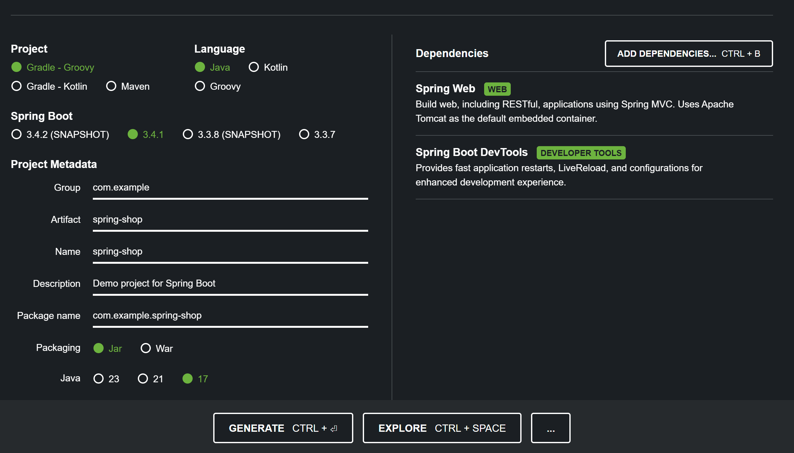

# 개발환경 셋팅 / Spring Boot 3 프로젝트 생성

## 1. IntelliJ community edition 에디터 설치

- 구글에 검색해서 IntelliJ community edition 설치

  - 개발환경 셋팅을 덜해도 되고 디자인 깔끔한 에디터

- 무료버전이라 프로젝트 생성도 귀찮게 해야하고 HTML, CSS, JavaScript 하이라이트가 안되고 코드변경시 자동 재실행 기능도 빠져있음

    - 한달에 20달러 내고 ultimate edition 유료버전 사용 가능

<br>

---

<br>


## 2. Spring initializr 에서 프로젝트 만들기
- 에디터 유료버전이면 에디터에서 Spring boot 프로젝트 생성 가능

- [Spring initializr 사이트](https://start.spring.io/) 들어가면 셋팅완료된 프로젝트 생성 가능

|spring initializr|
|-|
||

1. Gradle과 Spring Boot 3.x 버전 선택
   
   - 소괄호 붙어있는 버전 피하기

2. 오른쪽에 기본 라이브러리 설치 가능

    - Spring Web / Spring Boot DevTools 선택

3. Group에는 회사명, Name에는 프로젝트명 자유롭게 작명

4. Java 17 이나 21 사용

    - 너무 신버전 쓰면 AWS 배포시 신버전 지원안해서 문제 발생 가능성 有 
   
    - 에디터에서도 뭔가 이상할 수 있음

5. 다운받아서 압축푼 후 에디터에서 프로젝트 폴더 오픈

<br>

---

<br>

## 3. 에디터에서 프로젝트 오픈

|에디터|
|-|
||

- 에디터의 폴더 오픈메뉴

    - 다운받아서 압축푼 스프링 프로젝트 폴더 오픈

<br>

---

<br>

## 4. 셋팅
### 4-1. SDK 버전 확인

|SDK 버전|
|-|
||

- 상단 메뉴에서 파일 - project structure 메뉴

  - SDK가 프로젝트의 자바 버전 이상인지 확인

        - 프로젝트 자바 버전을 17로 골랐으면 SDK 버전도 17 이상

<br>

### 4-2. build tool 선택

- 선택사항

- 상단 메뉴에서 파일 - Settings 메뉴 열어서 `gradle` 메뉴 검색


|Build and run|
|-|
||

- Build and run 할 때 뭘 쓸지 선택가능

    - Gradle 말고 IntelliJ IDEA 선택하면 약간 더 빠르고 버그가 적을 수 있음

    - 코드짤 때 뭔가 이상하면 원래대로 Gradle 사용

<br>

|Java Compiler|
|-|
||

- IntelliJ IDEA로 바꿔놓을거면 Java Compiler 메뉴에서 -parameters 추가

  - 스프링 부트 3.2 버전 이상부터 진행

- 프로젝트 폴더에 out 폴더가 이미 있으면 안될 수 있으니 삭제

- 에디터에 Java Compiler 항목이 없으면 build.gradle 파일에 코드 추가

> build.gradle
```java
compileJava {
options.compilerArgs << '-parameters'
}
```

<br>

### 4-3. 테마
- One Dark Theme 등 원하는 테마 다운받아 적용

- 파일 - Settings - Plugin 메뉴에서 새로운 테마 설치 가능

<br>

---

<br>

프로젝트 파일들 설명
---
- src 폴더 : 실제로 코드 짜는 곳

- resources 폴더 : HTML CSS JavaScript 이미지 등 하찮은 파일 보관소

- application.properties 파일 : 환경변수나 프로젝트 설정 보관하는 곳

- build.gradle 파일 : 프로젝트 이름, 버전, 라이브러리 등 기록용 파일

- gradle ~ : gradle이라는 작업자동화 프로그램 돌리는거 도와주는 파일들

  - 건드릴 일 없음

<br>

---

<br>

변경사항 발견시 자동 재실행
---
- 원래는 코드짠걸 매번 컴파일을 다시 해야 반영됨

  - 에디터 왼쪽 하단에 터미널 버튼 클릭하여 터미널 오픈

      - 터미널 창에 + 버튼 눌러서 터미널을 2개 오픈

      - 명령어를 각각 터미널에 입력하고 엔터

          - `./gradlew build --continuous` : 실시간으로 빌드하라는 명령

          - `./gradlew bootRun` : 프로젝트 실행하는 명령어

- 터미널에서 실행중인 것들 중지 : `ctrl + c`

<br>

---

<br>

문제 해결
---
### Q. 에디터에서 코드가 전부 회색

- 에디터 설정에서 자바 SDK 버전을 변경

  - SDK 버전을 낮춰보거나 프로젝트 버전과 SDK 버전을 동일하게 맞추기

- 스프링 프로젝트 생성시 자바 버전 낮추기

<br>

### Q. 프로젝트 실행이 안돼요
- 자바 SDK 버전이 낮거나 너무 최신이라 생기는 문제

- 프로젝트를 onedrive 폴더나 이름 이상한 폴더에 두면 안됨

- 보안프로그램 종료

<br>

### Q. gradle plugin api version 에러 발생
- Settings 메뉴 들어가서 Gradle 메뉴 - Gradle JVM 부분의 SDK 버전 높이기

<br>
