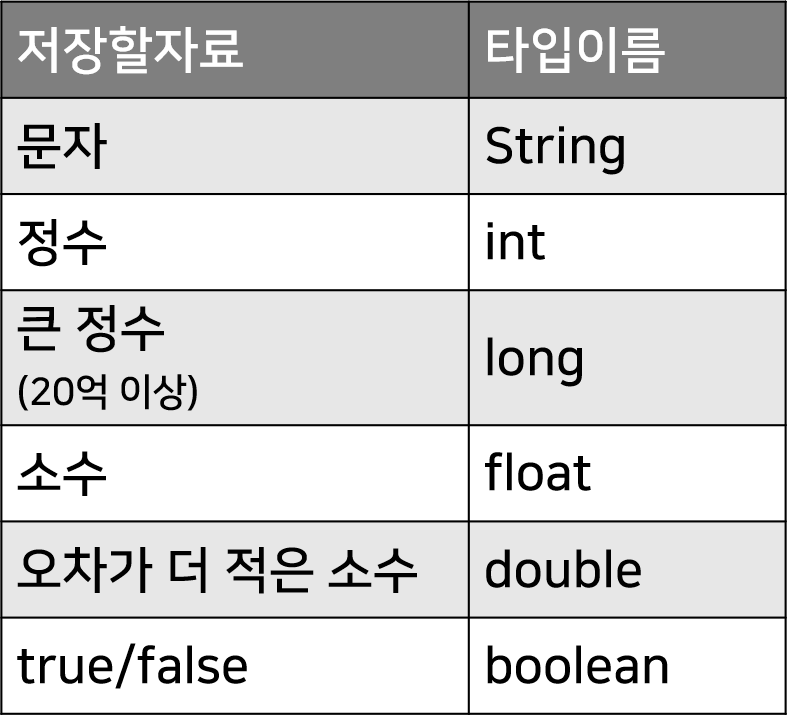
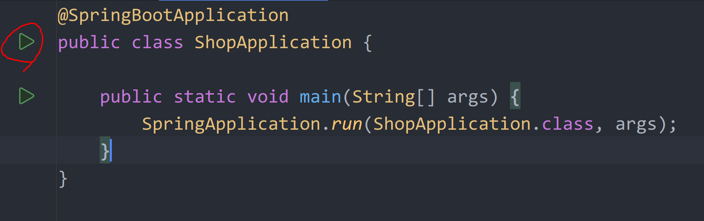

# 자바 기본 문법 1 (변수, 함수, if, for)

코드 작성 위치
---
> ~Application.java
```java
public static void main(String[] args) {
    SpringApplication.run(ShopApplication.class, args);
    코드~~
}
```
- ~Application.java 파일에 있는 main 함수안에 적으면 실행됨

- 자바프로젝트 실행하면 main 함수안의 코드 자동 실행

<br>

---

<br>

변수 문법
---
- 어떤 자료를 잠깐 저장해두고 쓰고싶을 때 변수 사용

> 사용법
```java
타입 변수명 = 변수에넣을값;
```

<br>

> ex1
```java
String name = "kim";
int age = 20;
float num = 1.5;
```
- 문자는 항상 큰 따옴표 안에 넣기

- 한 줄 끝나면 세미콜론을 붙이기

- 타입은 변수에 들어갈 자료의 타입 기재

<br>

| 기본 타입                |
|----------------------|
|  |

<br>

_> ex2
```java
String lover = "김말자";
System.out.println(lover);
```
- 변수나 자료를 출력하고 싶으면 `System.out.println()` 안에 입력

- IntelliJ 에디터에선 `sout` 라고 쓰고 엔터치면 `System.out.println()` 자동완성_

<br>

|코드 실행|
|-|
||

- 코드 실행하려면 class 옆에 있는 재생버튼 클릭

- 한번 클릭 후엔 에디터 상단에 있는 재생버튼 클릭해도 OK

    - Debug 버튼 눌러도 OK

- 코드 내용을 수정했으면 다시 정지하고 재생

    - 실시간으로 다시 컴파일해주는 기능 : `ctrl + F9` 

      - 맥은 `command + F9`

<br>

---

<br>

var 키워드
---
- 무슨 타입 적어야할지 모르겠으면 var 키워드를 사용

    - Java 10버전 이상부터 사용가능

<br>

> ex
```java
var name = "kim";
var age = 20;
```
- 타입 자리에 var 적으면 알아서 타입을 유추해서 적용

  - 코드스타일 같은건 같이 일하는 팀원들이랑 맞추는게 좋음

- 자바 대용품으로 Kotlin 언어를 많이 도입

  - 타입유추기능 쓰는 경우 많음

<br>

---

<br>

final 키워드
---
- final을 왼쪽에 붙인 변수 : 변수에 들어있는 값을 나중에 바꿀 수 없음

<br>

> ex
```java
final int fingerCount = 10;
fingerCount = 20; //에러남
```
- 바꾸려고 하면 에러로 잡아줌

- 바뀌면 큰일나는 값들을 저장할 때 주로 사용

<br>

---

<br>

if 조건문
---
> 사용법
```java
if (조건) {
    조건이 참일 때 실행할 코드~~
}
```
- if 조건문 안에 코드 작성

    - 특정 조건이 맞을 때만 코드를 실행

<br>

> ex1
```java
int fingerCount = 10;

if (fingerCount == 10) {
    System.out.println("정상");
}
```
- 손가락 개수가 10일 때만 특정 코드를 실행하고 싶은 경우

- 조건자리에는 ==, !=, >, < 사용하는 조건식을 주로 입력

<br>

---

<br>

for 반복문
---
- 비슷한 코드를 여러번 복붙하고 싶으면 for 

> 사용법
```java
for (int i = 0; i < 3; i++) {
    복붙할 코드~~
}
```
- 3번 복붙

  - i를 0부터 시작해서

  - i가 3이 되기 전까지

  - i에 +1하면서 계속 복붙하라는 뜻

<br>

---

<br>

함수
---
- 긴 코드 덩어리를 자주 재사용하고 싶을 때 함수 사용

> 사용법
```java
public class ShopApplication {

    void 함수(){
        System.out.println("안녕");
    }

    public static void main(String[] args) {
        SpringApplication.run(ShopApplication.class, args);
    }
}
```
- 함수 만들고 싶으면 보통 class 안에 만들어서 가져다쓰면 됨

- `함수이름(){}` 으로 함수 정의

- 함수정의 왼쪽에 return 타입 넣기

    - 함수 안에 return이 있을 경우 return 하고 있는 자료가 무슨 타입인지 미리 작성

    - return이 없으면 void 

- 함수를 가져다가 쓰려면 new 키워드로 object를 뽑아서 쓰는게 일반적

<br>