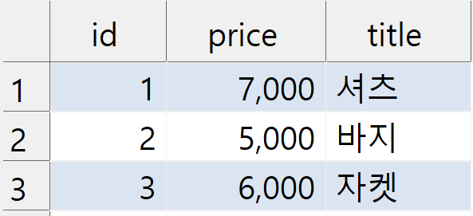
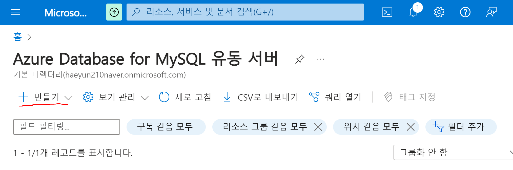
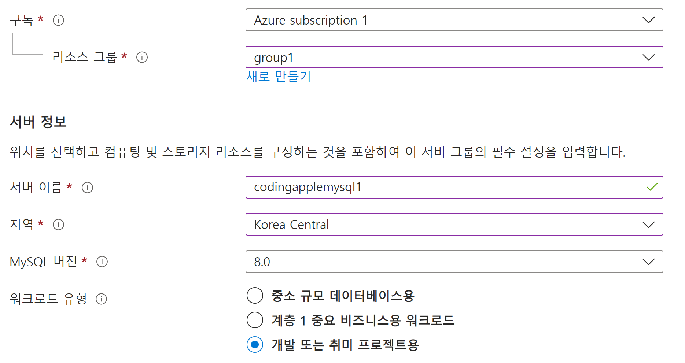
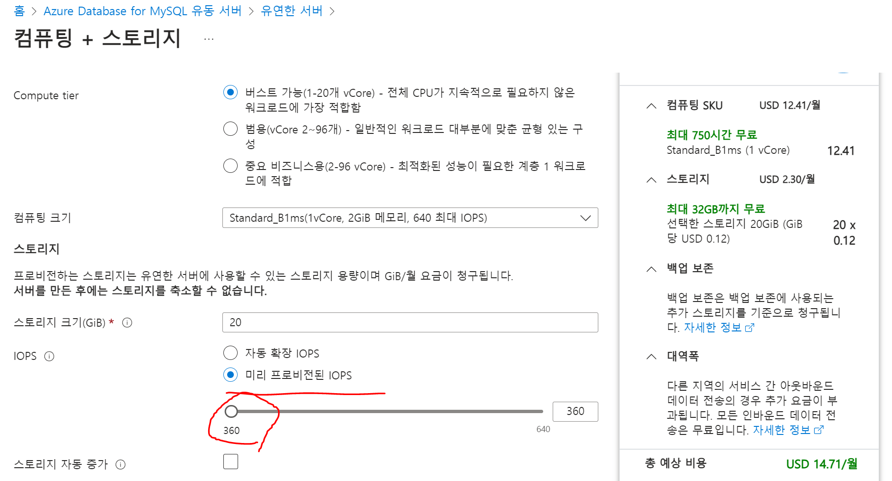
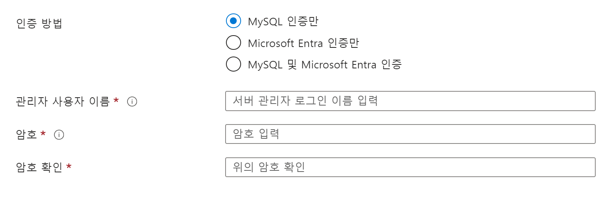
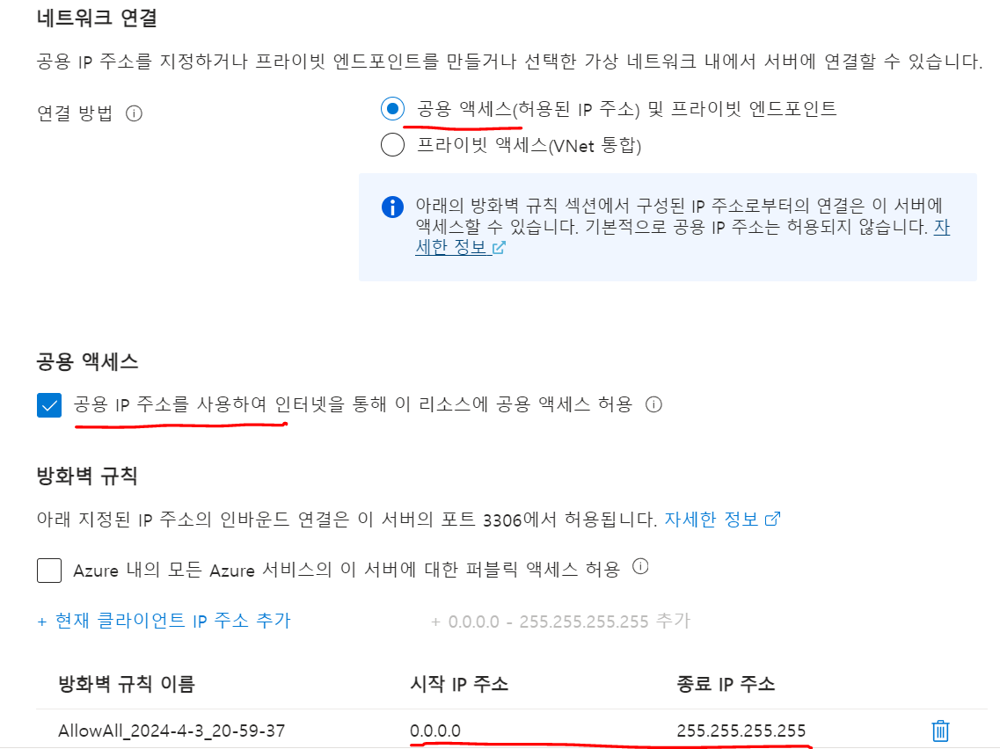
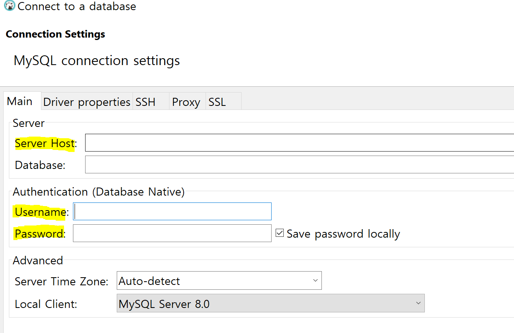

# MySQL Database 호스팅 받기

- 실제 서비스를 운영하려면 고객데이터, 상품데이터, 주문데이터 등 저장해둬야 함

    - 데이터베이스 사용

        - 대량의 데이터를 보관해둘 수도 있고 빠르게 원하는 데이터만 입출력 가능

 

---

 

관계형 데이터베이스
---
- 데이터베이스의 종류

    - key : value 형태로 단순하게 저장

    - key : value를 여러개 묶어서 document 형태로 저장
    
    - 그래프나 벡터형식을 저장할 수 있는 데이터베이스

 

### 관계형 데이터베이스

|관계형 데이터베이스|
|-|
||
- 관계형 데이터베이스는 표 형식으로 데이터를 저장

    - 맨 윗줄에 어떤 데이터를 저장할지 미리 기록한 다음에 하나의 행마다 데이터를 기록

    - 엑셀이랑 똑같음

- 데이터 입출력할 때 보통 SQL 언어를 써야 입출력 가능

    - ORM 라이브러리 사용시 자바 문법으로 데이터 입출력 가능

- 여러 DBMS 중에 하나 골라서 설치하면 데이터베이스 이용 가능

    - 한국에선 MySQL, Oracle, PostgreSQL 자주 사용

    - 서로 저장할 수 있는 데이터의 형식, 약간의 SQL 문법이 다를 수 있음

      - 크게 다르진 않기 때문에 아무거나 써도 별로 상관없음

 

---

 

데이터베이스 호스팅받기
---
- 하드디스크에 직접 MySQL 설치해서 사용

- AWS 같은 클라우드 서비스가서 MySQL 호스팅을 받기

    - 실제 서비스 운영할거면 클라우드 서비스에서 호스팅 받는게 안정적이고 좋음

 

### 클라우드 서비스
- AWS / Google Cloud / 마이크로소프트 Azure 등

    - 대부분 카드등록하면 1년 무료 사용권 지급

    - AWS는 편하게 AWS RDS에서 데이터베이스호스팅 받으려면 IPv4 이용 명목으로 월 3달러 추가요금이 발생

- [Azure](https://azure.microsoft.com/ko-kr/pricing/purchase-options/azure-account/) 가입 후 카드등록 진행

    - Azure는 30일 경과 후엔 직접 종량제 요금제로 업그레이드버튼 눌러야 남은 11개월동안 무료 이용 가능

 

---

 

Supabase
---
- Supabase 들어가면 카드등록 없이 PostgreSQL 무료 호스팅 받기 가능

  - 500MB까지 저장 가능
  
  - DB 입출력이 7일동안 없으면 일시정지

- ORM 라이브러리 쓸 것이라 PostgreSQL, MySQL 아무거나 써도 문법 달라지지 않음

- DB 생성 후 설정에서 DB접속용URL, DB접속용아이디, DB접속용비번 잘 정리해놓기

 

### Azure에서 MySQL 호스팅받기
#### 1. Azure 검색해서 들어가서 가입 및 카드등록
- [Azure](portal.azure.com)에서 마이크로소프트 계정으로 로그인

 

#### 2. portal.azure.com 상단 검색창에서 'MySQL 유동서버' 검색 후 진입
- 만들기 버튼 눌러서 만들기

|-|
|-|
||

 

#### 3. 빈칸 채우기

- 구독/리소스 그룹은 비용관리용 폴더같은 것인데 새로 만들기

- 서버이름은 유니크하게 잘 작명하고 한국에서 서비스할거면 Korea 선택

| -                    |
|----------------------|
|  |

 

#### 4. 컴퓨팅/스토리지 선택

- Compute는 무료라고 써있는거 선택

- IOPS는 '미리 프로비전된 IOPS' + 최소사양 선택

  - 360 : 입출력을 1초에 360회로 제한한다는 뜻

    - 나중에 유저 많아지면 '자동확장 IOPS' 쓰거나 조절

| -                    |
|----------------------|
|  |

 

#### 5. DB 접속용 아이디/비번도 생성
- 분실하거나 해킹당하지 않게 보안 철저히하기

| -                    |
|----------------------|
|  |

 

#### 6. 다음 탭 눌러보면 접속가능한 IP주소 설정 가능
- 안전하게 하려면 Azure 서버컴퓨터만 접속가능하게 '프라이빗 액세스'

  - 지금은 내 컴퓨터에서 접속해야하니까 '공용 액세스' 선택

- 특정 IP주소만 접속가능하게 보안장치 생성 가능 → IP주소 기입

  - 지금은 연습용이라 스타벅스에서 코딩할거면 모든 IP주소 추가(예시 사진 참고)

- 나머지는 건드릴거 없이 데이터베이스 생성 (대략 5~10분 소요)

| -                    |
|----------------------|
|  |

 

#### 7. 생성 완료시 마지막 설정
- 데이터베이스 생성 후 들어가보면 '서버 매개 변수' 설정 가능

  - require_secure_transport를 OFF로 설정

  - 연습용이라 SSL 인증을 잠깐 끄는 방식

 

---

 

AWS
---
- AWS를 좋아한다면 AWS RDS 써도 OK

  - RDS 사용시 퍼블릭 액세스를 "예"로 설정하면 IPv4 사용요금 명목으로 월 3달러 정도 청구

    - 요금을 피하는 방법1
  
      - AWS EC2 들어가서 인스턴스 하나 만든 후
    
      - 같은 VPC그룹에 집어넣고 
    
      - SSH 키파일도 가져온 다음 
    
      - SSH 터널링으로 `내 컴퓨터 -> EC2 -> RDS DB` 로 접속

    - 요금을 피하는 방법2

      - RDS말고 EC2에 직접 설치해 사용

      - 1년무료 free tier 사용중일 경우 IPv4 요금 청구 X

      - EC2에서 컴퓨터 하나 빌려서 직접 MySQL 설치해 사용

        - EC2에 설치하면 백업이나 모니터링 같은 것도 직접 해야하기 때문에 번거로움

 

---

 

DB 접속
---
- DB 접속해서 데이터를 미리보고 싶으면

  - DBeaver 등 프로그램 설치하는게 가장 쉽고 빠르고 좋음

- DBeaver 검색해서 설치하면 상단의 데이터베이스 연결 버튼 클릭

| -                    |
|----------------------|
|  |

- Host 란에는 호스팅받은 데이터베이스 주소나 URL를 Azure에서 가져와서 기재

- Username, Password 란에는 DB 접속용 아이디/비번 생성한 것 기재

- 연결 눌러보면 데이터베이스에 접속해서 데이터 구경 가능

 

 
