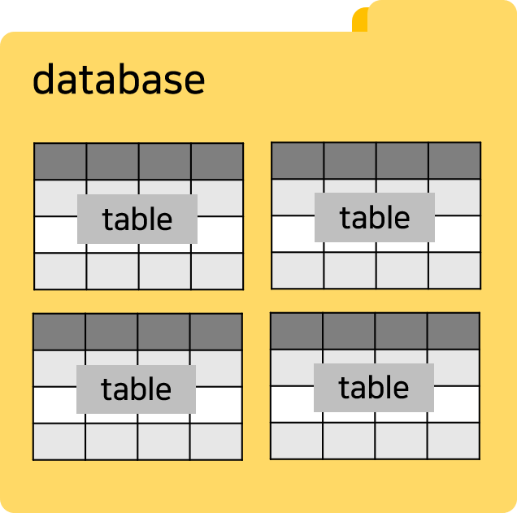
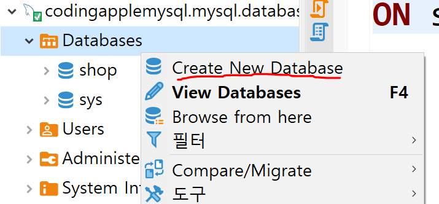

# 서버에서 Database 연결 & JPA 설치

데이터베이스
---
- 이전엔 MySQL이라는 DBMS 호스팅을 받은 것

- 그 안에서 데이터를 실제로 저장하려면 '데이터베이스' 하나 만들어서 저장

<br>

| 데이터베이스            |
|-------------------|
|  |
| 테이블이라는게 엑셀같은 표인데 거기 데이터를 저장 |
| 그걸 모아놓은 폴더가 데이터베이스|

<br>

---

<br>

데이터베이스 생성
---
- DBeaver는 상단에서 SQL편집기 오픈 후 SQL 코드 짜서 실행 가능

```mysql-sql
CREATE DATABASE 데이터베이스명;
```
- 코드 적고 실행

<br>

|-|
|-|
||

- 왼쪽 파일트리에서 우클릭해 간편하게 생성 가능

    - shop 이름의 데이터베이스 생성

    - 여기다가 테이블만들고 데이터도 넣을 예정

- DBeaver 에서 데이터 만질 일은 거의 없음

    - 보통은 서버에서 코드로 데이터 입출력 하는게 일반적

- 서버 코드에서 이 데이터베이스에 접속하려면 라이브러리 설치 필요

<br>

---

<br>

JPA와 MySQL 접속용 라이브러리 설치
---
> build.gradle
```java
dependencies {
    runtimeOnly 'com.mysql:mysql-connector-j'
    implementation 'org.springframework.boot:spring-boot-starter-data-jpa'
}
```
- build.gradle 파일에 추가하고 load gradle changes 버튼 클릭

    - JPA와 MySQL 접속도와주는 라이브러리 설치 완료

<br>

> application.properties
```java
spring.datasource.url=jdbc:mysql://호스팅받은곳엔드포인트주소/만든database이름
spring.datasource.username=DB접속아이디
spring.datasource.password=DB접속비번
spring.datasource.driver-class-name=com.mysql.cj.jdbc.Driver

spring.jpa.properties.hibernate.show_sql=true
spring.jpa.hibernate.ddl-auto=update
```
- application.properties 파일에 추가해두면 서버에서 MySQL 데이터베이스에 접속 가능

- 서버띄울 때 `Hikari pool ~` 안내메세지가 뜨면 DB접속 잘 되었다는 뜻

- 위의 4줄은 접속할 DB정보 입력하는 곳

- `show_sql=true` : DB입출력시 SQL을 따로 실행창에 출력할지 여부

- `ddl-auto=update` : 코드짜서 테이블 생성이나 수정시 그걸 자동으로 DB에도 반영할지 여부

  - `update` : 변경사항 반영, `none` : 반영금지

    - none이 실제 서비스 운영할 땐 안정적인데 update도 나쁘지 않음

<br>

---

<br>

JPA
---
- 원래 관계형 데이터베이스는 SQL이라는 언어를 써서 데이터 입출력을해야함

- 어려우면 ORM이라는 라이브러리도 함께 설치해서 쓰는 경우가 많음

  - ORM을 설치하면 SQL이 아니라 자바코드로 입출력 해결 가능

- 테이블들을 클래스로 관리해서 타입체크도 되고 코드 재사용도 쉽고 여러 장점 多

  - 쓰다가 마음에 안들면 직접 SQL 작성도 가능

<br>

### Hibernate
- JPA : 자바에서의 ORM 표준 문법

- Hibernate 라이브러리 : JPA 문법을 개발자들이 쓰기쉽게 만들어준 것

  - JPA 의 구현체

  - 제일 인기있는 구현체라 JPA 설치하면 자동으로 Hibernate가 함께 설치됨

    - 그래서 JPA랑 Hibernate를 혼용해서 많이 부름

<br>

---

<br>

runtimeOnly
---
- 코드를 컴파일할 때는 필요없는 라이브러리니까 컴파일 할 땐 쓰지말라는 뜻

  - 이 라이브러리 만든 사람이 runtimeOnly 사용해도 상관없게 만들어놔서 그런 것

- 컴파일 : 자바코드는 원래 실행하기 전에 컴퓨터 친화적인 바이트 코드로 변환하는데 그 과정을 뜻함

- 컴파일 되는 시간 절약 가능

  - implementation 써도 상관 X

- 코드를 실제로 실행할 때만 필요한 라이브러리들은 runtimeOnly만 적어놔도 OK

  - DB입출력 도와주는 라이브러리나 로그 출력용 라이브러리 등

<br>

### compileOnly
- compileOnly : 컴파일할 때만 쓰라는 뜻

  - 개발할 때만 잠깐 쓰고 실제 서버구동시 필요없는 라이브러리들은 compileOnly 집어넣으면 용량 절약 가능

  - 코드 자동완성을 시켜주는 Lombok 라이브러리는 그런 식으로 설치해서 쓰기도 함

<br>

---

<br>

Supabase 등에서 PostgreSQL 호스팅받아서 사용할 경우
---
> build.gradle
```java
dependencies {
  runtimeOnly 'org.postgresql:postgresql'
  implementation 'org.springframework.boot:spring-boot-starter-data-jpa'
}
```
- build.gradle 파일에 추가하고 load gradle changes 버튼 클릭

  - JPA와 PostgreSQL 접속도와주는 라이브러리 설치 완료 

<br>

> application.properties
```java
spring.datasource.url=Supabase에 있던 Connection string
spring.datasource.username=Supabase에 있던 User
spring.datasource.password=Supabase에 있던 Password
spring.datasource.driver-class-name=org.postgresql.Driver

spring.jpa.properties.hibernate.show_sql=true
spring.jpa.hibernate.ddl-auto=update
```
- Supabase 설정 들어가보면 JDBC버전의 Connection string, User, Password 정보를 가져올 수 있음

  - 가져와서 application.properties 파일에 입력

- Connection string 복붙할 때 패스워드 넣는 부분이 있으면 넣어주기

<br>

### 서버가 잘 안뜬다면 확인할 것

- DB접속 주소 잘 붙여넣었는지

- DB접속용 아이디 비번 안틀렸는지

- MySQL의 경우엔 application.properties 파일에 주소 기재할 때 `엔드포인트주소:3306/데이터베이스이름` 형식이어야 잘 작동

- application.properties 문자들 마지막에 공백 있으면 X

<br>