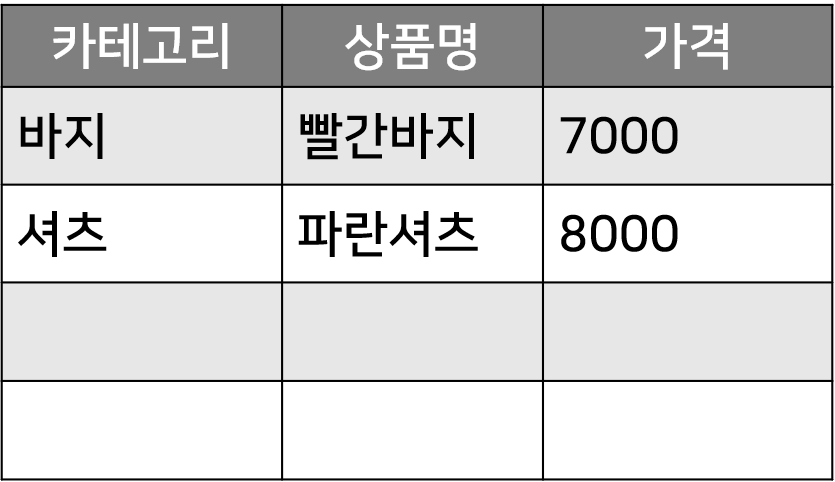
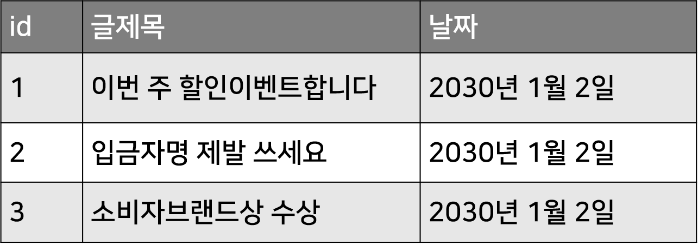

# 테이블 만들기 (Entity)

- 데이터를 저장하려면 테이블 안에 저장

    - 상품정보들을 저장할 테이블을 하나 만들어서 쇼핑몰에서 팔 상품들을 저장해보기

<br>

---

<br>

테이블 만들기 (@Entity)
---
- 테이블을 하나 만들고 싶으면 테이블 만드는 SQL 문법 실행

- ORM을 쓰는 경우 자바 class 하나만 만들면 테이블이 DB에 자동생성

<br>

> Item.java
```java
@Entity
public class Item {

}
```
- java파일과 클래스 하나 생성

- @Entity 애너테이션을 하나 집어넣으면 이 이름으로 테이블 생성

    - JPA 라이브러리 덕분

<br>

- 테이블을 만들 때 관계형 DB들은 어떤 컬럼이 들어갈지 미리 정해야함

    - 테이블의 세로줄이 뭐가 있을지 먼저 정해야함
  
| ex |
|----|
| | 

- 테이블에다가 쇼핑몰 상품들을 저장할 때, 어떤 정보들을 기록할 것인지 지정

    - 카테고리, 상품명, 가격 등

    - 하나하나의 항목들을 컬럼으로 (세로줄로) 미리 만들어두면 됨

<br>

> 컬럼 만들기
```java
@Entity
public class Item {
    Long id;
    String title;
    Integer price;
}
```
- 클래스 안에 변수 만들면 이 이름으로 컬럼 자동 생성

    - 상품명, 가격, 상품의 고유번호 저장할 컬럼 생성

- 나중에 상품명이 서로 같아버리면 혼란해짐

  - id 등 유니크한 번호를 저장할 컬럼도 만드는게 좋음

- 자료형

  - String 넣으면 string 저장 가능

  - Integer 넣으면 int 저장 가능

  - Long 넣으면 long 저장 가능

<br>

> 테이블 생성
```java
@Entity
public class Item {
    @Id @GeneratedValue(strategy = GenerationType.IDENTITY)
    Integer id;
    String title;
    Integer price;
}
```
- 상품 구분용 유니크 번호를 부여하기 위한 컬럼은 id 로 작명 많이 함

    - 보통 1, 2, 3, 4... 등 1씩 증가하는 정수 부여

  - UUID라는 랜덤문자로도 부여 가능

    - 행이 너무 많아지면 성능이슈가 생길 수 있어서 정수가 가장 간단

- 1, 2, 3, 4 를 직접 하나하나 부여하는 대신 @GeneratedValue

    - 상품을 하나 추가할 때마다 알아서 1씩 증가하는 정수 입력됨

- 데이터들끼리 서로 구분하기 위한 id 컬럼은 항상 @Id 라고 표기해주는 것이 좋음

- SQL 개념

    - @Id : primary key로 설정해주는 역할

    - @GeneratedValue : auto increment 기능

<br>

---

<br>

대문자 타입 Integer
---
- int 써도 int 자료를 넣을 수 있는데 Integer 써도 int 자료 넣을 수 있음

- Integer 등 대문자 타입 쓰면

  - 유용한 함수 제공

    - 정수에다가 사칙연산을 쉽게 하고 싶거나

    - "1" 이런 문자를 정수로 변환한다거나

    - 실수같은 다른 타입으로 변환한다거나

- Integer : int 자료를 담고 있는 object

  - primitive type wrapper 라고 부름

  - JPA에서 강요하기 때문에 int 말고 Integer 사용

<br>

대문자 타입 Long
---
- Integer / int 타입 : 약 +-20억까지의 정수 저장 가능

- Long / long 타입 : 약 +-900경까지의 정수 저장 가능

- 예시에선 상품이 20억개는 넘을 것 같아서 Long 사용

    - Long 타입의 숫자를 표현하려면 100L 이런 식으로 숫자 뒤에 대문자 L 붙여줘야함

<br>

---

<br>

public 붙이기
---
> public
```java
@Entity
public class Item {
    @Id @GeneratedValue(strategy = GenerationType.IDENTITY)
    public Integer id;
    public String title;
    public Integer price;
}
```
- 변수 생성시 왼쪽에 public 기재

    - 나중에 object 뽑은 후에 object.title 형식으로 자유롭게 출력/수정 가능

- public 붙이면 추후 실수로인한 버그 발생 가능성有

  - private 선호하기도 함

- class 안에 있는 변수나 함수를 private으로 설정

    - 나중에 class에서 뽑은 object에서 변수, 함수를 점찍어서 출력/변경 불가

    - 수정 : 변수를 출력하고 수정해주는 getter / setter 함수 생성해 사용

<br>

---

<br>

제약조건 @Column으로 부여가능
---
- 컬럼마다 추가 제약사항 부여 가능

<br>

> 제약조건
```java
@Entity
public class Item {
    @Id @GeneratedValue(strategy = GenerationType.IDENTITY)
    public Integer id;
    
    @Column(length = 200)
    public String title;
    public Integer price;
}
```
- 컬럼 위에 @Column() : 제약사항들을 입력 가능

- length = 200 : 최대 저장할 수 있는 문자 길이 제한

  - 위 코드는 200자 넘어가면 DB 저장시 실패하고 에러 발생

<br>

> ex
```java
@Column(nullable = false)
```
- 해당 컬럼에 데이터가 비어있을 경우 저장 불가

<br>

> ex
```java
@Column(unique = true)
```
- 다른 행들에 없는 유니크한 데이터만 저장 가능

    - 유니크하지 않은게 들어오면 저장 막아주고 에러 발생

        - 회원 아이디나 이메일 저장할 때 쓰기 좋음

<br>

> ex
```java
@Column(columnDefinition = "TEXT")
```
- String만 넣어두면 255자까지 저장 가능

- 매우 긴 문자를 저장하고 싶은 경우

  - MySQL같은 경우 text 타입 사용하려면 이렇게 작성

<br>

### 💡 참고
- 컬럼 수정 후 서버재시작한다고 바로 DB에 반영되지 않을 수 있음

  - 테이블 삭제하고 서버 재시작해야 테이블에 깔끔하게 반영됨 

    - 처음에 만들 때 잘 만들어두기

    - 테이블 변경사항은 SQL 문법 작성하는게 깔끔

<br>

---

<br>

데이터 저장
---
- DBeaver 에서 테이블 만든거 확인

    - 테이블이 없으면 서버 재시작

    - 테이블에 판매할 상품들 3개 정도 저장

- DBeaver는 변경사항 발생시 저장버튼 클릭 후 새로고침해야 변경사항 잘 보임

<br>

> SQL 코드
```mysql-sql
insert into item values (1, '셔츠', 7000);
insert into item values (2, '바지', 5000);
insert into item values (3, '자켓', 6000);
```

<br>

> id 에 GeneratedValue 적용한 경우
```mysql-sql
insert into item (title, price) values ('셔츠', 7000);
insert into item (title, price) values ('바지', 5000);
insert into item (title, price) values ('자켓', 6000);
```

<br>

---

<br>

정리
---
- 테이블 하나 필요하면 @Entity 붙은 class 하나 만들면 자동 생성가능

- 그 class에 변수 만들면 그게 자동으로 컬럼으로 변함

- @id 컬럼은 항상 하나 있는게 좋음

  - @GeneratedValue 넣는 것도 편함

- @Column 사용해서 컬럼마다 제약사항 부여 가능

<br>

---

<br>

응용
---
- 공지사항용 글들을 저장해둘 테이블 하나 생성

  - 글의 id, 제목, 날짜를 저장할 컬럼 필요

    - 날짜는 아무 형식이나 상관 X

  - @Entity 활용

  - 날짜는 Date 타입 또는 문자로 넣기

<br>

| ex                   |
|----------------------|
|  | 

<br>

> 테이블
```java
@Entity
public class notice {
    @Id
    @GeneratedValue(strategy = GenerationType.IDENTITY)
    private Long id;
    private String title;
    private String date;
}
```

> SQL
```mysql-sql
insert into notice (title, date) values ('이번 주 할인이벤트합니다', now());
insert into notice (title, date) values ('입금자명 제발 쓰세요', now());
insert into notice (title, date) values ('소비자브랜드상 수상', now());
```

<br>