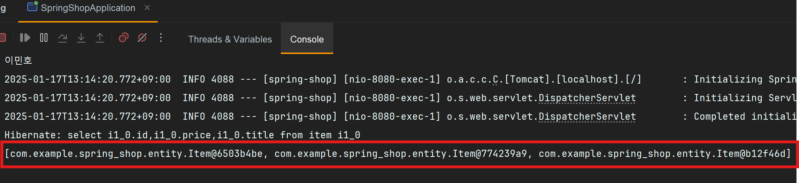

# DB 데이터 출력

Lombok
---
- 필요한 코드를 자동으로 생성해줘서 자바 코드 양을 줄여주는 라이브러리

    - 생산성이 좋아지기 때문에 많이 사용

<br>

### Lombok 설치
> build.gradle
```java
dependencies {
    compileOnly 'org.projectlombok:lombok'
    annotationProcessor 'org.projectlombok:lombok'
}
```
- build.gradle 파일에 추가 우 load gradle changes 클릭 후 서버 재시작

<br>

### 에디터 셋팅
- 에디터 상단메뉴에 파일 - Settings - Plugin 메뉴 들어가서 Lombok 플러그인 설치

- 에디터 상단메뉴에 파일 - Setting 메뉴에서 annotation processor 검색해서 체크

<br>

---

<br>

DB 데이터 출력
---
- 진짜 쇼핑몰처럼 DB에 있던거 자료 꺼내기

- 테이블에서 데이터 꺼내는 법

<br>

### 테이블에서 데이터 입출력 방법

1. repository 생성

2. DB입출력 원하는 클래스에서 repository 등록

3. DB입출력문법 사용


<br>

### 1. Repository interface 만들기
- Entity 만든거 옆에 .java 파일 생성

    - class 말고 interface 생성

<br>

> 생성 방법
```java
public interface 작명 extends JpaRepository<엔티티명, id컬럼타입> {

}
```
- 파일명은 관습적으로 입출력할 Entity이름 + Repository

- 그 안에 public interface 생성

- <> 안에는 데이터 입출력할 Entity 이름과 그 Entity에 있던 id 컬럼의 타입 기재

<br>

> ex
```java
package com.example.spring_shop.repository;

import com.example.spring_shop.entity.Item;
import org.springframework.data.jpa.repository.JpaRepository;

public interface ItemRepository extends JpaRepository<Item, Long>{

}

```
- interface 생성시 같은 이름을 가진 클래스를 컴퓨터가 자동으로 생성

    - 클래스 안에는 DB 입출력 도와주는 함수들 존재

        - 함수 가져다쓰면 입출력 가능

- `new ItemRepository()` 하면 거기에 DB 입출력 함수들이 들어있어서 꺼내서 쓰면 됨

    - 직접 new ItemRepository() 쓰진 않고 특별한 문법 사용

<br>

### 2. DB입출력 원하는 클래스에서 repository 등록

> controller
```java
@Controller
@RequiredArgsConstructor
public class ItemController {
    private final ItemRepository itemRepository;

    (API들 ~~)
}
```
- Item 테이블에서 입출력하고 싶은 클래스가 있으면

    - 클래스 안에 변수를 아무 이름으로 하나 생성

      - 타입은 만든 repository 이름

- 클래스 위에다가 `@RequiredArgsConstructor` 추가 (Lombok 문법)

  - private final 붙여야 잘 작동

  - 변수 안에 DB입출력 함수 들어있으니 사용

<br>

> Lombok 문법 사용 X 시
```java
@Controller
public class ItemController {
    private final ItemRepository itemRepository;
    
    @Autowired
    ItemController(ItemRepository itemRepository) {
        this.itemRepository = itemRepository;
    }
    
    (API들 ~~)
}
```
- constructor 직접 작성

  - @RequiredArgsConstructor 라는 Lombok 문법쓰면 constructor 자동 생성

<br>

- 스프링한테 `알아서 object 하나 뽑으라`는 명령 (dependency injection)

    - 스프링은 new ItemRepository() 해서 변수에 넣어줌

- 위의 itemRepository 변수엔 new ItemRepository() 들어있음

    - 앞으로 new ItemRepository()가 필요할 때 변수 사용

<br>

### 3. DB 입출력 문법 사용
- 등록한 변수엔 DB 입출력 함수들이 들어있기 때문에 점찍어서 사용

    - 등록한변수.findAll() : 테이블의 데이터를 다 가져와줌

    - 등록한변수.save() : 테이블에 데이터 저장 가능

<br>

> ex
```java
var result = itemRepository.findAll();
```

|                결과                |
|:--------------------------------:|
|              |
|         테이블의 3개 행 다 가져옴          |
| [ ] : List 자료형<br>거기에 다 넣어서 가져옴  |

<br>

---

<br>

List 자료형
---
- 여러개의 문자나 숫자를 한 변수에 넣고 싶으면 List 

- List는 여러 종류가 있는데 보통 ArrayList 많이 사용

<br>

> ArrayList 생성
```java
var a = new ArrayList<>();
a.add(30);
a.add(40);
System.out.println(a);
System.out.println(a.get(0);
```
- 상단에 ArrayList 를 import 해와야 사용가능

- ArrayList에는 .add() 라고 쓰면 안에다가 자료 입력 가능

- 한개만 출력하려면 .get(순서) 입력

<br>

> ex
```java
List<Integer> a = new ArrayList<>();
a.add(30);
a.add(40);
System.out.println(a);
```
- var 말고 좀 더 정확히 변수의 타입을 기재하고 싶으면 ArrayList<> 타입

  - <> 안에는 리스트에 넣을 자료들의 타입 기재 가능

- 위 처럼 작성하면 Integer만 넣을 수 있는 리스트

<br>

### 💡 참고1 
- 문자와 숫자 등 여러종류 타입을 동시에 넣고 싶으면 Object

<br>

### 💡 참고2
- 왼쪽에 타입을 그냥 `ArrayList<~>`로 기재 가능

<br>

### List<~> 사용 이유
- List : ArrayList랑 비슷한 타입들(LinkedList 등)의 상위타입

- List로 넣으면 나중에 ArrayList, LinkedList로 필요할 때 바꾸는게 쉬기 때문

- List가 더 짧고 간결해보이기 때문

<br>

---

<br>

테이블의 한 행 출력
---
> ex
```java
List<Item> result = itemRepository.findAll();
System.out.println(result.get(0))
System.out.println(result.get(0).title)
```
- List 안에 들어있던 여러 행 중에 0번째 행을 가져옴

  - ㅋ 중에 .title 컬럼도 출력 가능

- result 변수에 타입도 정확히 작성

  - var 자리에 타입을 뭘 적을지 모르겠으면 변수에 마우스 hover

<br>
 

 