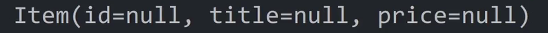

# HTML에 서버데이터 넣기

- 서버에서 데이터만 보내주는 REST API 만들고 있으면

    - `DB에 있던 데이터 뽑아서 유저에게 보내달라`고 코드 작성

- html까지 만들어서 보내주는 완전한 웹서비스 만들기

    - html에 DB 데이터 꽂아서 보내주기

<br>

---

<br>

상품목록페이지 디자인 넣기
---
> 상품목록 레이아웃 디자인
```html
<div class="card">
  
  <div>
    <h4 th:text="${name}">바지</h4>
    <p>7억</p>
  </div>
</div>
```

> css
```css
.card {
    margin : 30px auto;
    display : flex;
}

.card img {
    width : 150px;
    margin-right : 20px;
}
```
- .css 파일 안에 넣고 html 파일에 <link>태그로 첨부

    - static 폴더에 main.css 파일 생성

    - html파일 상단에 `<link href=”/main.css” rel=”stylesheet”>` 작성시 css 적용 가능

<br>

---

<br>

Thymeleaf th:each 반복문
---
- DB에서 뽑은 데이터를 html 파일에 넣기

<br>

> ItemController.java
```java
@GetMapping("/list")
String list(Model model){
    List<Item> result = itemRepository.findAll();
    model.addAttribute("items", result);
    
    return "list.html";
}
```
- model.attribute() 사용시 서버데이터를 html에 넣을 수 있음

- List 자료(result 변수)도 가능

<br>

> list.html
```html
<div class="card">
  
  <div>
    <h4 th:text="${items.get(0).title}">바지</h4>
    <p>7억</p>
  </div>
</div>
<div class="card">
  
  <div>
    <h4 th:text="${items.get(1).title}">바지</h4>
    <p>7억</p>
  </div>
</div> 
```
- html 파일에서 첫 상품, 둘째 상품의 title 컬럼 출력

    - 상품의 개수가 많으면 html을 반복문으로 반복생성

        - Thymeleaf의 th:each 반복문 사용

<br>

> list.html
```html
<div class="card" th:each="작명 : ${items}">
  
  <div>
    <h4 th:text="${items.get(0).title}">바지</h4>
    <p>7억</p>
  </div>
</div>
```
1. 반복생성하고 싶은 html 덩어리에 th:each 부여

2. 안에 `작명 : ${서버에서보낸변수}` 작성

    - 서버에서 보낸 변수에 담긴 자료 갯수만큼 html 덩어리 복붙해줌

<br>

> list.html
```html
<div class="card" th:each="i : ${items}">
  
  <div>
    <h4 th:text="${i.title}">바지</h4>
    <p>7억</p>
  </div>
</div>
```
- `th:each` 쓰면 `${서버에서보낸변수}`에 있던 `List 안의 자료`들을 꺼내서 작명한 변수에 넣어줌

    - 변수 출력하고 싶으면 th:text 쓰고 ${} 안에 변수명 기재

<br>

---

<br>

object 출력 편하게 하려면 @ToString (롬복 사용법)
---
- object 쓰다보면 가장 불편한 점

    - `object.변수명` 출력하면 잘나오지만

    - `object` 자체는 출력해봤자 `com.apple.shop.Item@~~` 형태로 출력

- object의 모든 변수를 한 번에 편하게 출력하고 싶으면?

    - 직접 `object에 있는 모든 변수를 한 번에 출력해주는 함수` 구현

<br>

> Item.java
```java
@Entity
public class Item {
    public Long id;
    public String title;
    public Integer price;
    
    public String toString(){
        return this.title + this.price;
    }
}
```
- Item 클래스에 toString() 함수 생성

  - 위에 있던 모든 변수 출력해달라고 작성

    - 앞으로 Item object에다가 .toString() 붙이면 그 자리에 모든 변수가 출력됨

<br>

> Lombok 기능
```java
@Entity
@ToString
public class Item {
    public Long id;
    public String title;
    public Integer price;
}
```
- `@ToString` 붙이면 .toString() 역할의 함수를 알아서 만들어줌

    - Lombok 라이브러리 덕분

<br>

| 결과                                                          |
|-------------------------------------------------------------|
|                                         |
| 앞으로 Item 클래스의 object들을 출력할 때 .toString() 붙여서 출력하면 모든 변수 출력됨 |

<br>

---

<br>

정리
---
- `th:each` 반복문을 쓰면 html 반복생성 가능

- 서버에서 List 자료 보내면 th:each 반복문으로 List 안에 있던 내용 하나하나 출력 가능

- object 안의 변수들을 전부 한번에 출력쉽게하고 싶으면 클래스에 @ToString 부착

<br>

---

<br>

| -                    |
|----------------------|
|  |

- 이 테이블에서 글을 뽑아서 보여주는 HTML 페이지 생성

  - th:each 반복문 사용

- 테이블의 데이터 입출력 3-step 참고

- .findAll()로 뽑은 데이터는 List 자료형

  - html에 보낼 경우 th:each 반복문으로 쉽게 출력가능

<br>

> repository
```java
package com.example.spring_shop.repository;

import com.example.spring_shop.entity.Notice;
import org.springframework.data.jpa.repository.JpaRepository;

public interface NoticeRepository extends JpaRepository<Notice, Long> {

}
```

> html
```html
    <div class="container">
        <table>
            <tr style="background: lightgray">
                <th class="id">id</th>
                <th>글제목</th>
                <th>날짜</th>
            </tr>
            <tr th:each="i : ${notices}">
                <td class="id" th:text="${i.id}">id</td>
                <td th:text="${i.title}">글제목</td>
                <td th:text="${i.date}">날짜</td>
            </tr>
        </table>
    </div>
```

> css
```css
.container {
    width: 100%;
}

table {
    margin: 0 auto;
    border: 1px solid;
    border-collapse: collapse;
}

tr {
    margin: 0;
}

th, td {
    width: 300px;
    padding: 5px 10px;
    border: 1px solid;
}

.id {
    width: 50px;
    text-align: center;
}
```

> controller
```java
package com.example.spring_shop.controller;

import com.example.spring_shop.entity.Notice;
import com.example.spring_shop.repository.NoticeRepository;
import lombok.RequiredArgsConstructor;
import org.springframework.stereotype.Controller;
import org.springframework.ui.Model;
import org.springframework.web.bind.annotation.GetMapping;

import java.util.List;

@Controller
@RequiredArgsConstructor
public class NoticeController {
    private final NoticeRepository noticeRepository;

    @GetMapping("/notice")
    String notice(Model model) {
        List<Notice> result = noticeRepository.findAll();
        System.out.println(result.get(0).title);
        model.addAttribute("notices", result);
        return "notice";
    }
}
```

<br>