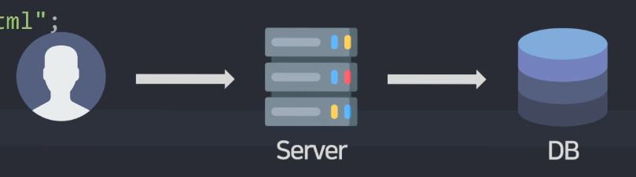

# 상품 추가기능 (Map 자료형 & Navbar 만들기) 
- 상품을 하나 추가하는 기능

- 거의 모든 웹서비스는 게시판과 똑같음

    - 게시판 글 추가기능이라고 생각

<br>

---

<br>

상품 추가기능을 글로 먼저 작성
---
- 상품 하나 추가하는 기능을 글로 설명

  1. 상품추가하는 페이지 하나 만들고 폼도 만들어놓고

  2. 전송버튼 누르면 그 내용을 DB로 보내서 저장

<br>

| -                    |
|----------------------|
|  |

- 문제 발생

    - 유저가 작성한걸 DB에 바로 집어넣어버리면 위험

        - DB 조작이 필요하면 중간에 서버가 개입해 검사해주는게 좋음

- 문제 해결

  1. 글작성페이지 하나 만들고 인풋과 폼 만들어놓고

  2. 유저가 전송누르면 글을 서버로 먼저 보내고

  3. 그 다음에 서버는 글을 검사 후 별일 없으면 DB에 저장

<br>

### 1. 글작성페이지 만들기
> write.html
```html
<form>
  <input name="title">
  <input name="price">
  <button type="button">버튼</button>
</form>
```
- \<body>태그 안에 \<form> 추가

- 상품 이름이랑 가격을 입력할 수 있는 \<input> 추가

    - input 만들 때 중요한점 : name 속성을 잘 작명해놔야 서버로 전송됨

- 유저들에게 보여주는 방법

    - html 페이지 보내주고 싶으면 API 생성

<br>

> controller
```java
@GetMapping("/write")
String write() {
    return "write.html";
}
```
- 누가 /write로 접속하면 글작성 페이지를 보내라고 작성

<br>

### 2. 전송누르면 서버로 글 전송
- HTTP POST 요청을 날리면 문자나 숫자를 서버로 전송 가능

- POST요청은 \<form>에 기입

> write.html
```html
<form action="/add" method="POST">
  <input name="title">
  <input name="price">
  <button type="submit">버튼</button>
</form>
```
- `action="/URL"`과 `method="POST"` 기입

    - 전송버튼 눌렀을 때 `특정 /URL로 POST요청`을 날릴 수 있음

- 서버에 만들어둔 API와 URL이 없어서 /add로 작명

- type="submit"으로 변경해야 폼이 제출됨

<br>

### 3. 서버는 데이터 받으면 확인 후 DB저장
> controller
```java
@PostMapping("/add")
String writePost() {
    return "";
}
```
- API 생성

    - `@PostMapping` : 유저의 POST 요청을 처리하는 API 생성 가능

    - `@DeleteMapping` : 유저의 DELETE 요청을 처리하는 API 생성 가능
  
    - `@PutMapping` : 유저의 PUT 요청을 처리하는 API 생성 가능

- 여기서 유저가 보낸 데이터를 출력 및 검사해보고 DB에 저장

<br>

---

<br>

유저가 보낸 데이터 출력
---
> controller
```java
@PostMapping("/add")
String writePost(String title, Integer price) {
    return "";
}
```
- 유저가 보낸 데이터 출력하려면

    - 함수 소괄호 안에 파라미터 작성

- \<input>보면 title, price 라는 이름으로 인풋 데이터들을 보내고 있음

    - 그대로 파라미터란에 적어주면 유저가 보낸 title, price를 파라미터 변수에 담아줌

    - 왼쪽에 타입을 적으면 그 타입으로 title, price 변수를 각각 변환

<br>

> controller
```java
@PostMapping("/add")
String writePost(@RequestParam String title, @RequestParam Integer price) {
    System.out.println(title + " " + price);
    return "redirect:/list";
}
```
- 출력 잘 안되면 왼쪽에 @RequestParam 

- `redirect:/list` : 특정 페이지로 유저를 강제 이동시킬 수 있음 (ajax로 요청하는 경우 이동불가능)

<br>

### 💡 참고1 : @RequestParam 생략이 안된다면
- 파일 - 설정 - java compiler 메뉴 검색

    - additional command line parameter 입력란에 -parameters 입력잘되어있는지 확인

- out 폴더 삭제 후 다시 서버 띄우기

<br>

### 💡 참고2 
- \<form> 말고 ajax의 body로 전송한 데이터는 @RequestBody 써야 출력 가능

<br>

### 💡 참고3
- 유저가 보내는 데이터가 100개면 파라미터도 100개 적어야함

    - Map 자료형에 한 번에 담기 가능

> controller
```java
@PostMapping("/add")
String writePost(@RequestParam Map<String, Object> formData) {
    return "redirect:/list";
}
```
- Map 자료형 : List처럼 자료 여러개를 한 변수에 저장하고 싶을 때 쓰는 자료형

<br>

---

<br>

Map 자료형
---
- 변수 하나에 이름과 주소를 저장하고 싶을 때

    - List 써서 넣는 방법
  
    - Map 만들어서 쓰는 방법

<br>

> Map
```java
Map test = new HashMap<>();
```
- `Map 변수 = new HashMap<>();` : Map 생성 가능

- `.put()` : Map 안에 데이터 넣을 수 있음

<br>

> List 와의 차이점
```java
Map test = new HashMap<>();
test.put("name", "kim");
test.put("address", "seoul");
```
- List랑 다르게 자료마다 이름을 붙여서 저장해야함 

  - `put("자료이름", "자료값")`

  - 자료 이름은 key, 자료 값은 value

<br>

> 자료 출력
```java
Map test = new HashMap<>();
test.put("name", "kim");
test.put("address", "seoul");
System.out.println(test.get("address"))
```
- 자료 하나 출력은 `.get("자료이름")` 사용

<br>

> 자료 저장
```java
Map<String, String> test = new HashMap<>();
test.put("name", "kim");
test.put("address", "seoul");
```
- 저장할 자료의 타입을 엄격하게 제한하고 싶으면 `<자료이름타입, 자료값타입>`

- 원래 <> 2개에 전부 넣어줘야하지만, 왼쪽에만 넣어도 오른쪽에도 알아서 들어감

<br>

### 💡 참고1 : 문자나 숫자를 전부 저장하고 싶은 경우
- Object 작성

- Object : String, Integer 등의 상위타입

<br>

### 💡 참고2 : Map은 2종류가 있는데 그 중에 HashMap 자주 사용
- 그것들의 상위 타입이 Map

  - Map타입이라고 기재하는 경우가 많음

    - 다른 종류의 Map으로 전환이 쉬워짐 (전환할 일 잘 없음)

<br>

---

<br>

응용
---
- 서버는 데이터 받으면 Item 테이블에 저장해주는 기능 완성

    - 폼 전송시 그 정보들이 테이블에 추가되면 성공

<br>

> 답
```java
@PostMapping("/add")
String writePost(String title, Integer price) {
    Item item = new Item;
    item.setTitle(title);
    item.setPrice(price);
    itemRepository.save(item);
    return "redirect:/list";
}
```
- 유저가 제출한 내용을 검사한 후 Item 테이블에 저장하는 기능

    - 테이블에 저장 : `new Item()`에다가 여러가지 정보를 채운 다음 `리포지토리.save()` 안에 넣기
  
      - 정보들을 채워서 행을 하나 테이블에 추가

- private을 붙여놨기 때문에 setter 함수를 사용해서 데이터 넣음

<br>

---

<br>

유저가 보낸 데이터를 object로 쉽게 변환하려면 @ModelAttribute
---
- 유저가 보낸 데이터를 object로 바로 변환하고 싶을 때

<br>

> 변환
```java
@PostMapping("/add")
String writePost(@ModelAttribute Item item) {
  itemRepository.save(item);
  return "redirect:/list";
}
```
- `@ModelAttribute 클래스명 변수명`

  - `var 변수명 = new 클래스명()` 알아서 해줌

  - 그 변수에 유저가 보낸 데이터를 넣어줌

<br>

---

<br>

Navbar 만들기
---
- 상단메뉴(Navbar) 생성

- Navbar를 여러 페이지에 매번 복붙하면 번거로움

  - 페이지가 몇 개 없으면 복붙해도 되긴 하지만 수정사항 발생시 복붙한 모든 페이지 수정해야함

- 해결방법

  - 페이지마다 재사용하고 있는 UI를 별도 파일로 뺀 다음 가져다 쓰는 식으로 개발

    - 타임리프 문법 쓰면 가능

<br>

> Navbar 레이아웃
```html
<div class="nav">
  <a class="logo">SpringMall</a>
  <a>List</a>
  <a>Write</a>
</div>
```

> Navbar Css
```css
@import url('https://fonts.googleapis.com/css2?family=Montserrat:wght@400;800&display=swap');
.nav {
  display: flex;
  padding: 10px;
  align-items: center;
  font-family : 'Montserrat';
}
.nav a {
  margin-right: 10px;
  text-decoration : none;
  font-weight : 400;
  letter-spacing : -0.5px;
}
.nav .logo {
  font-weight : 800;
}

input, button {
  padding : 8px 13px;
  margin-top : 5px;
  border : 1px solid grey;
  border-radius : 4px;
  vertical-align : middle;
}
button {
  background : black;
  color : white;
  border : none;
}
input {
  display : block;
}
```

<br>

---

<br>

HTML UI 재사용
---
- templates 폴더에 재사용할 html 덩어리를 보관할 파일 생성

<br>

> nav.html
```html
<div class="nav" th:fragment="navbar">
  <a class="logo">SpringMall</a>
  <a>List</a>
  <a>Write</a>
</div>
```
- 이런 html 덩어리를 재사용하고 싶으면 `th:fragment="작명"`

  - 다른 파일에서 이 html 덩어리를 쉽게 쓸 수 있음

<br>

> 다른 html
```html
<div th:replace="~{nav.html :: navbar}"></div>
```
- `th:replace="~{파일경로 :: fragment이름}"` : 그 파일경로에 있던 th:fragment 첨부

  - div태그 내용물을 `th:fragment="navbar"` 붙은 html 덩어리로 채워줌

<br>

### 💡 참고1 
- `th:insert` 사용하면 div를 갈아치우는게 아니라 div 안에 붙여넣어줌

  - 근데 갈아치우는게 일반적

<br>

### 💡 참고2
- `th:fragment` 정의는 한 파일에 여러번 사용해도 OK

<br>

### 참고3
- html 덩어리로 변수나 데이터 전송 가능

```html
th:replace="nav.html :: navbar('데이터1', '데이터2')"
```

<br>
 