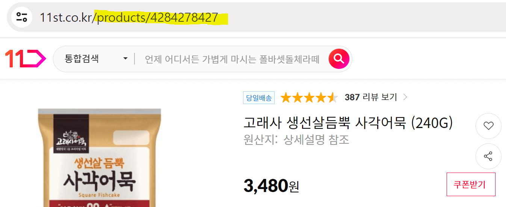

# 상세페이지 만들기 (Optional & 예외처리)

- 상품명을 클릭하면 상세페이지로 이동

- [ex](11st.co.kr/mart/category?categories=1120865)) 이런 쇼핑몰의 상세페이지를 구경

| 11번가                 |
|----------------------|
|  |
| /products/~~ 접속하면 상품 상세페이지 보여줌|
|~~ 부분은 상품번호|

- 위 방식과 비슷하게 API나 페이지 생성

    - 누가 /detail/1 로 접속하면 1번 상품 보여주기

        - 1번 상품 : Item 테이블에 있던 id가 1인 상품

    - 누가 /detail/2로 접속하면 2번 상품 보여주기

- 상품이 5개 있으니까 페이지가 5개 필요하고 그럼 페이지 보내주는 API도 5개 만들어야함

  - URL 파라미터 문법을 쓰면 굳이 비슷한 URL 가진 API 여러개 만들 필요 X

<br>

---

<br>

URL 파라미터
---
> 사용법
```java
@GetMapping("/detail/{id}")
String detail() {
    return "detail.html";
}
```
- 서버에서 URL을 정할 때 {작명} 사용하면 아무 문자라는 뜻

  - 위처럼 작성하면 누가 /detail/ 뒤에 아무 문자나 입력하면 API 실행됨

- 비슷한 URL 가진 API가 여러개 필요하면 이 문법 사용

- 작명은 진짜로 아무렇게나 가능

- 여러개 동시 사용가능 (슬래시로 서로 구분하는게 좋음)

<br>

---

<br>

detail.html 만들기
---
> 상세페이지 HTML
```html
<div class="detail">
  <h4>상세페이지</h4>
  
  <h4>청바지</h4>
  <p>70000원</p>
</div>
```


> 상세페이지 css
```css
.detail {
    text-align : center;
}

.detail img{
    max-width : 30%;
    display : block;
    margin : auto;
}
```

<br>

- /detail/1, /detail/2, /detail/3 경로로 접속

  - 상세페이지 노출

  - 매번 똑같은 html 내용만 보여줌

    - 상품 개수마늠 html 파일도 상품마다 하나씩 각각 만들 필요 X

    - html 전송할 때 html에 매번 다른 데이터 넣어서 보여주기

<br>

---

<br>

DB에서 글 뽑아서 html에 넣어보기
---
- 누가 /detail/1로 접속하면 1번 상품 DB에서 가져와서 html에 넣어 보여주기

    - 1번 상품은 id가 1로 저장되어있는 상품

    - id가 1인 행을 테이블에서 출력

<br>

> id가 1인 행 출력
```java
@GetMapping("/detail/{id}")
String detail() {
    var result = itemRepository.findById(1L);
    return "detail.html";
}
```
- `리포지토리.findById(1L)` : id가 1인 행 찾아옴

    - 숫자를 Long 타입으로 만들고 싶으면 뒤에 L 기재

- 변수에 저장해서 html에 보내면 됨

- var 자리에 타입은 모르겠으면 변수에 마우스 hover

    - Optional 타입으로 확인

<br>

---

<br>

Optional 타입
---
- Optional : null일 수도 있고 아닐 수도 있다는 타입

- DB에서 찾은걸 이런 타입으로 변형하는 이유

    - DB에 id가 1인 행이 없을 수도 있음

      - 그럴 땐 null 혹은 텅빈 값이 이 변수에 들어감

        - null일수도 있으니까 조심해서 쓰라고 만들어준 타입

<br>

> 사용법
```java
@GetMapping("/detail/{id}")
String detail() {
    Optional<Item> result = itemRepository.findById(1L);
    System.out.println(result.get());
    return "detail.html";
}
```
- Optional 자료는 `.get()` 붙여야 안에 들어있는 자료가 나옴

- result 변수가 비어있을 수 있기 때문에 그냥 .get() 하면 에러 발생 가능성有

    - `만약에 result 안에 뭐가 있는 경우에만 .get() 해서 사용하라`고 쓰는게 안전

<br>

> 작동 내용
```java
@GetMapping("/detail/{id}")
String detail() {
    Optional<Item> result = itemRepository.findById(id);
    if (result.isPresent()){
        System.out.println(result.get());
        return "detail.html";
    } else {
        return "~~~";
    }
}
```
- `Optional타입변수.isPresent()` : result변수에 뭐가 들어있으면 true를 그 자리에 남겨줌

- 위처럼 쓰면 확실하게 값이 들어있을 경우에만 .get() 해서 데이터를 안전하게 사용 가능

    - if 안쓰면 에디터가 알아서 잡아줘서 외우고 그럴 필요는 없음

- result.get() 출력시 DB에서 뽑은 id가 1번인 내용이 나옴

    - 그대로 html 파일에 넣어서 상세페이지 만들기

    - 상품제목 누르면 상세페이지로 이동하는 링크 생성

      - 힌트) 유저가 URL 파라미터에 입력한 값을 서버에서 알 수 있도록 @PathVariable 참고

<br>

> controller
```java
@GetMapping("/detail/{id}")
String detail(@PathVariable Long id) {
  Optional<Item> result = itemRepository.findById(id);
  if (result.isPresent()){
    return "detail.html";
  } else {
    return "redirect:/list";
  }
}
```
- `@PathVariable 타입 URL파라미터명` : URL 파라미터 자리에 유저가 입력한 내용을 가져올 수 있음

- 위처럼 코드짜면 /detail/x로 접속하면 x번 상품을 잘 가져옴

<br>

> 최종
```java
@GetMapping("/detail/{id}")
String detail(@PathVariable Long id, Model model) {
  Optional<Item> result = itemRepository.findById(id);
  if (result.isPresent()){
    model.addAttribute("data", result.get());
    return "detail.html";
  } else {
    return "redirect:/list";
  }
}
```

<br>

- 가져온 데이터를 detail.html 넣기

> detail.html
```html
<div class="detail">
  <h4>상세페이지</h4>
  
  <h4 th:text="${data.title}">금도금 바지</h4>
  <p th:text="${data.price + '원'}">7억</p>
</div>
```
- detail.html에 서버에서 보낸 data 변수를 박아넣음


<br>

---

<br>

링크만들기
---
- 상세페이지로 접속할 수 있는 링크 생성

  - `<a href="/url">` 사용하면 클릭시 /url로 이동

<br>

> list.html
```html
<div class="card" th:each="i : ${items}">
  
  <h4 th:text="${i.title}">바지</h4>
  <a href="/detail/1">링크</a>
  <p th:text="${i.price + '원'}">7억</p>
</div>
```
- 위 코드는 모든 글을 누르면 항상 `/detail/1`로 이동

  - 1번 상품에는 href="/detail/1"

  - 2번 상품에는 href="/detail/2"

  - 3번 상품에는 href="/detail/3"

  - href="/detail/현재상품의id"

    - 현재 상품의 id는 반복문에 있던 i라는 변수 출력해보면 안에 들어있음

<br>

> list.html
```html
<div class="card" th:each="i : ${items}">
  
  <h4 th:text="${i.title}">바지</h4>
  <a th:href="@{'/detail/' + ${i.id} }">링크</a>
  <p th:text="${i.price + '원'}">7억</p>
</div>
```
- href 안에 변수나 서버에서 보낸 데이터 넣는 방법

- 보통은 서버에서 보낸 변수를 넣고 싶으면 `${ }`

  - href 안에는 `@{ }` 부터 시작

- 문자는 작은 따옴표 안에 넣어도 OK

- 문자들을 합치고 싶으면 + 기호 사용

- html이 잘 완성되어있는지 확인하고 싶으면 개발자도구 열어서 html 검사

<br>

---

<br>

예외상황 처리
---
- 서버개발할 땐 항상 예외상황을 가정하고 코드 작성

- 글 발행 기능 만들어놨는데 유저가 이상한 데이터를 보내면?

  - 상품명을 빈칸으로 보내거나 없는 상품의 상세페이지를 들어가는 등

  - 직접 악성 유저가 되어서 테스트해보고 예외 상황마다 대처하는 코드를 if문으로 걸러주기

<br>

---

<br>

에러발생시
---
- if문으로 부족한 경우

  - 코드에서 에러가 나는 경우도 처리해야함

    - 유저가 보낸 데이터가 숫자형식이어야 하는데 문자를 보냈거나

    - DB에 너무 긴 데이터를 집어넣거나

    - DB가 꺼져있거나

- 강제로 에러를 내보고 싶으면 `throw new Exception()`

  - 타입 틀리게 전송해봐도 에러 체험 가능

- ex) /detail/abc 접속해보면

  - abc를 Long타입으로 변환할려고 하는데 그건 불가능해서 아마 서버에서 에러 발생

  - 에러가 나면 기본 에러페이지로 안내

    - 유저들에게 바로 보여주는 것 보다는 따로 에러페이지를 만들어두는게 좋음

<br>

---

<br>

error.html
---
- Thymeleaf를 설치해서 쓰는 경우에는 error.html 생성

  - 서버에서 에러가 발생하면 그 페이지로 자동으로 이동

- 에러 처리 끝

<br>

> error.html
```html
<div>에러페이지임</div>
<p th:text="${status}"></p>
<p th:text="${error}"></p>
<p th:text="${path}"></p>
<p th:text="${message}"></p>
<p th:text="${exception}"></p> 
```
- 안에 기본적으로 status, error, path 등 에러 원인을 알 수 있는 변수들 전송

  - 변수들 사용하여 에러페이지 꾸미기 가능

- 유저에겐 status, error, path 정도만 알려주는게 좋음

<br>
 