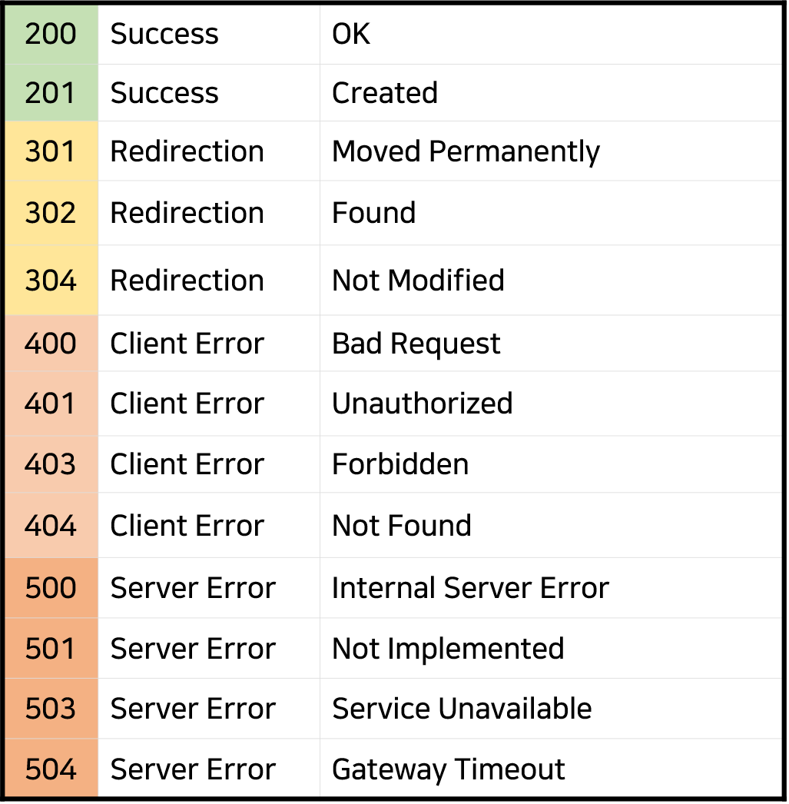

# REST API의 예외처리 방법
- 타임리프 쓰는경우엔 에러시 자동으로 error.html로 이동

    - 에러처리 끝

- 서버에서 데이터만 보내주는 REST API들을 만드는경우 html 에러페이지 보내봤자 의미 X

    - 서버와 유저가 데이터만 주고받는 관계라서 html 보내봤자 열지도 못함

      - 다른 방법 필요

<br>

try catch
---
> try catch
```java
@GetMapping("/detail/{id}")
@ResponseBody
String detail() {
    try {
        에러날 수 있는 코드~~
    } catch(Exception e){
        return "에러남 ㅅㄱ";
    }
}
```
- `try 안에 있는 코드에서 에러가 나면 catch 안에 있는 코드 실행해달라`는 뜻의 문법

- 에러가 날 수 있는 코드를 try로 감싸고 에러날 때 실행할 코드는 catch 안에 기재 

  - 에러상황에 대처 가능

- ex) DB 입출력하는 코드 실행시 가끔 에러가 날 수 있기 때문에

    - try로 감싸고 catch 안에는 에러나는 경우에 유저에게 메세지 보내줌

<br>

> 에러 강제 발생
```java
@GetMapping("/detail/{id}")
@ResponseBody
String detail() {
    try {
        throw new Exception("이런저런에러");
    } catch(Exception e){
        System.out.println(e.getMessage());
        return "에러남 ㅅㄱ";
    }
}
```
- `throw new Exception()` : 강제로 에러발생 가능

- catch 안에서 e라는 파라미터에 에러이유가 담겨있어서 필요하면 사용가능

- 데이터만 주고받는 REST API 만드는 경우엔 에러페이지가 안뜨니 이 문법 사용

- 실제 배포후에는 에러시 출력보다는 로깅 라이브러리 쓰는게 좋은

<br>

---

<br>

throws Exception
---
> throws Exception
```java
@GetMapping("/detail/{id}")
@ResponseBody
String detail() throws Exception {
    throw new Exception("이런저런에러");
}
```
- 함수 안에서 에러를 뱉는 코드가 있는데 try catch를 써서 예외처리를 안했다면

    - 함수 뒤에 `throws Exception` 꼭 기재 
  
      - 안하면 에디터가가 화냄

- 별 기능은 없고 여기서 에러뱉을 수 있다는 경고문 역할

    - `에러 뱉어서 코드가 정지될 수 있으니 언젠간 try catch를 쓰는게 좋다`는 뜻

<br>

---

<br>

ResponseEntity
---
> ResponseEntity
```java
@GetMapping("/detail/{id}")
ResponseEntity<String> detail() {
    try {
        throw new Exception("이런저런에러");
    } catch(Exception e){
        return ResponseEntity.status(에러코드).body("에러이유");
    }
}
```
- REST API에서 에러가 났을 때 더 정확하게 에러 코드도 기입해서 보내줄 수 있음

- `ResponseEntity` : 에러코드는 뭔지, 에러이유는 뭔지 작성해서 보내줄 수 있음

    - 프론트엔드에서 API에게 요청날릴 때 에러나는 경우 원인이 뭔지 빠르게 파악 가능

- `.status()` 안에 에러코드를 숫자로 입력

  - 유저가 잘못해서 에러나는거면 400

  - 서버가 잘못해서 에러나는거면 500

  - 에러없이 정상작동하는 경우엔 200

- 에러났을 때만 기재하는 건 아니고 평소에 REST API 만들 때도 200 기재후에 데이터 보내주면 좋음

<br>

| HTTP status code     |
|----------------------|
|  |
| 상황에 맞는거 찾아서 기재       |

<br>

> 사용법
```java
ResponseEntity.status(HttpStatus.NOT_FOUND).body("에러남");
```
- 숫자찾기 귀찮으면 에러코드 모아둔 클래스가 하나 있는데 거기서 점찍어서 뽑아써도 OK

- ex) 데이터나 페이지를 못찾는 경우 404를 기입하는게 관습

    - 404인지 뭔지 까먹었으면 .NOT_FOUND 찾으면 됨

<br>

### 💡 참고
- ResponseEntity를 쓰는 경우 굳이 @ResponseBody를 붙일 필요 X 

  - 한글 보낼 때 안깨지는 것도 편리함

<br>

---

<br>

@ExceptionHandler
---
- try catch 써봤자 try 안에 있는 코드만 에러나는걸 처리할 수 있을 뿐

- URL 이상하게 입력하는 등 에러는 처리하지 못함

    - try catch 쓰는 것 보다는 spring boot가 제공하는 예외처리 기능 사용

<br>

> @ExceptionHandler
```java
@ExceptionHandler(Exception.class)
public ResponseEntity<String> exceptionHandler() {
    return ResponseEntity.status().body("");
}
```
- 컨트롤러 클래스의 API들과 나란하게 @ExceptionHandler 붙은 함수 작성 가능

    - 같은 클래스에 있는 API 들에서 에러가 나면 @ExceptionHandler 안에 있는 코드 실행

    - return 써서 유저에게 메세지보내는 등 동작 처리 가능

<br>

---

<br>

@ControllerAdvice
---
- 컨트롤러 클래스가 많으면 직접 그 파일마다 이 코드 넣어야해서 번거로워짐

  - 한 번에 처리할 수 있는 방법 존재

<br>

> MyExceptionHandler.java
```java
@ControllerAdvice
public class MyExceptionHandler {
    @ExceptionHandler(Exception.class)
    public ResponseEntity<String> handler() {
        return ResponseEntity.status(400).body("모든 컨트롤러 에러시 발동");
    }
}
```
- `@ControllerAdvice` 붙이고 그 안에 `@ExceptionHandler` 넣기

    - 모든 컨트롤러에서 에러가 나는 경우 여기 있는 코드가 대신 실행됨

- 개별 컨트롤러에도 만들어놨고 여기도 만들어놨으면?

  - 개별 컨트롤러에 있는 @ExceptionHandler 코드가 더 우선권 가짐

<br>

---

<br>

특정에러에만 실행하기
---
> MyExceptionHandler.java
```java
@ControllerAdvice
public class MyExceptionHandler {
    @ExceptionHandler(MethodArgumentTypeMismatchException.class)
    public ResponseEntity<String> handler() {
        return ResponseEntity.status(400).body("특정 에러시 발동");
    }
}
```
- MethodArgumentTypeMismatchException 에러 발생시에는 다른 코드 실행하려면

    - 에러 이름을 `@ExceptionHandler()` 안에 기재

- ex) URL에 숫자말고 문자를 입력하면 저런 이름의 에러 발생

    - 에러 이름은 실행창에서 확인 가능

<br>

---

<br>

정리
---
- 서버만들 때는 예외상황과 에러상황에 대처하는 코드 필수

    - 악성 유저가 되어서 이거저거 상황을 만들어보고 그걸 대처하는 코드 작성

- Thymeleaf 사용시엔 에러 처리는 error.html 만들면 끝

- REST API 만들 때는 에러 처리는 @ControllerAdvice 만들어놓는게 편리

 <br>

 

 
