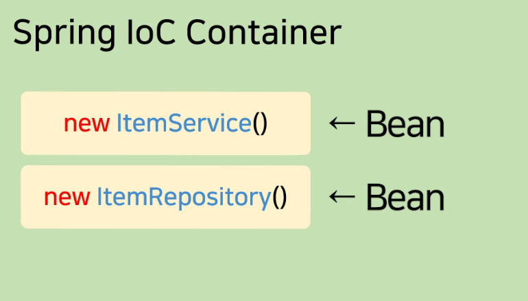

# Service 레이어로 분리

- 지금 @Controller안의 함수에 계속 길게 코드를 짜고 있음

- 함수 만들 때 지키면 좋은 원칙

    - 하나의 함수 안에는 하나의 기능만 담는게 좋음

      - 나중에 관리가 편해짐

<br>

> ItemController.java (/add api)
```java
@PostMapping("/add")
String writePost(String title, Integer price) {
    Item item = new Item;
    item.setTitle(title);
    item.setPrice(price);
    itemRepository.save(item);
    return "redirect:/list";
}
```
- 기능이 두개라면 둘 중 하나는 다른 함수로 빼는 게 좋음

  - DB에 데이터 입출력하는 기능

  - html을 보내주는 기능

- 원래 함수는 코드 덩어리 재사용하고 싶을 때 쓰는 문법

- @Controller 안에는 데이터나 html 보내주는 기능을 보통 넣음

    - DB 입출력하는 코드들은 다른 함수로 빼는게 좋음

      - 다른 클래스에 함수하나 만들어서 DB입출력하는 4줄의 코드를 거기로 옮기기

<br>

### Q. 다른 클래스를 만드는 이유?

- 하나의 클래스에도 비슷한 기능의 함수들만 보관하는게 좋은 관습

<br>

---

<br>

Service 클래스로 코드 옮기기
---
> ItemService.java
```java
public class ItemService {

    public void saveItem(){
        Item item = new Item();
        item.setTitle(title);
        item.setPrice(price);
        itemRepository.save(item);
    }

}
```
- ItemService 클래스 하나 만들고 그 안에 함수 하나 만들어서 그 4줄의 코드 옮김

<br>

### Q. 왜 ItemService라고 작명?

- 원래 데이터 전송 전에 이거저거 처리해주는 비즈니스 로직같은걸 Service라고 보통 부름

<br>

> ItemService.java
```java
@RequiredArgsConstructor
public class ItemService {
    private final ItemRepository itemRepository;
    
    public void saveItem(String title, Integer price){
        Item item = new Item();
        item.setTitle(title);
        item.setPrice(price);
        itemRepository.save(item);
    }
}
```
- 다른 함수로 코드를 분리할 때 주의점

    - 함수 안에 정의되지 않은 변수들을 정의해줘야 함

- 해결법

  - 전부 함수 파라미터로 입력할 수 있게 만들면 됨

- 이제 앞으로 saveItem() 쓸 때 title, price 변수를 파라미터로 입력해서 사용 가능

- itemRepository 변수도 정의가 안되었다?

    - 그것도 파라미터로 입력할 수 있게 만들어도 되긴 함

    - 근데 DB입출력함수 쓰려면 3-step 사용해도 ok

      - 그럼 API에서 new ItemService().saveItem() 사용 가능

<br>

---

<br>

다른 클래스의 함수 사용하려면
---
- new ItemService().saveItem() 사용하면 비효율적

    - /add로 요청이 들어올 때 마다 매번 new 키워드로 object를 뽑아야함

- 싫으면 그냥 object를 한 번 뽑고 그걸 변수에 저장해뒀다가 계속 재사용하는 식으로 코드짜도 ok

    - 직접 코드로 구현해도 되겠지만 스프링에게 시킬 수도 있음

<br>

### 3-step

#### 1. 클래스에 @Service 붙여놓고
> ItemService.java
```java
@Service
@RequiredArgsConstructor
public class ItemService {

}
```

<br>

#### 2. 이 함수들 쓰고싶은 곳에 가서 변수로 등록
> ItemController.java
```java
@Controller
@RequiredArgsConstructor
public class ItemController {
    private final ItemRepository itemRepository;
    private final ItemService itemService;
    
    @PostMapping("/add")
    String writePost(String title, Integer price) {
        itemService.saveItem(title, price);
        return "redirect:/list";
    }
}
```

<br>

3. 원하는 곳에서 변수.함수() 사용
- @Service 말고 @Service, @Repository, @Component 이런거 붙여놔도 기능이 똑같음

<br>

---

<br>

dependency injection 
---
- Lombok 문법 덕분에 코드를 길게 안짜도 됨

<br>

> Lombok을 안쓰면?
```java
@Controller
//@RequiredArgsConstructor
public class ItemController {
    private final ItemRepository itemRepository;
    private final ItemService itemService;
    
    @Autowired
    ItemController(ItemRepository itemRepository, ItemService itemService) {
        this.itemRepository = itemRepository;
        this.itemService = itemService;
    }
}
```
- `스프링아 니가 알아서 new ItemService()를 itemService 변수에 넣어둬라`는 뜻

- 내부적으로 ItemController 이것도 나중에 new ItemController() 이런 식으로 사용될 것

  - 그 때 new ItemService()도 new ItemController(new ItemService()) 이렇게 집어넣어서 itemService 변수에 넣어달라는 뜻

- itemRepository도 마찬가지

<br>

- @Autowired는 ItemRepository, ItemService 이름의 타입만 붙여둔 자리에 new ItemRepository(), new ItemService() 알아서 찾아와서 넣으라는 스프링 문법

- dependency injection

  - 다른 클래스의 변수, 함수를 사용할 때 new 클래스().함수() 이렇게 매번 쓰는게 아니라

    - 그걸 new 클래스()를 다른데서 미리 뽑은 다음에

    - 그 결과만 파라미터로 집어넣어서 쓰게 만드는걸 dependency injection이라고 부름

<br>

---

<br>

dependency injection 쓰는 이유
---
- 장점1. 매번 object를 뽑아쓰지 않아도 되니까 성능상 효율적임

    - API가 실행될 때 마다 object를 새로 뽑을 필요가 없음

    - object를 하나만 뽑아놓고 계속 재사용하는걸 싱글톤 패턴이라고 부름

- 장점2. 클래스간의 연결고리를 줄일 수 있음

    - 클래스간의 커플링을 줄여서 클래스들을 서로 독립적으로 깔끔하게 유지할 수 있음

    - 클래스1에서 new 클래스2(); 하면 클래스간에 커플링이 생긴다고 함

      - 나중에 클래스2가 변경되면 그걸 쓰는 클래스1도 찾아가서 변경해야함

      - 그래서 커플링을 줄이면 관리가 편해짐

<br>

---

<br>

Container, Bean이라는 용어
---

| -                    |
|----------------------|
|  |

- 스프링이 몰래 object를 하나 뽑아서 알아서 집어넣어준다?

    - 스프링이 object를 뽑아서 보관하는 공간이 있을 것

      - 그걸 Container 아니면 IOC Container라고 부름

      - 거기 안에 들어있는 object들을 Spring의 Bean이라고 부름

- @Service, @Component 이런걸 클래스에 붙여놓으면

    - 이 클래스의 object를 자동으로 뽑아서 Container안에 담아놓으라는 뜻

    - 스프링이 뽑아준 그 object를 Bean이라고 부름

<br>

---

<br>

Service layer 예외처리 방법
---
- Service 클래스에 있는 코드들에서 예외상황이 발생할 수 있음

- ex) 글작성 기능인데 "제목이 너무 길게 도착하면 DB저장하지 말고 퇴짜" 넣고 싶음

  - 제목.length() 하면 문자의 길이를 알 수 있음

  - 이걸 if문으로 검사해서 원하는 경우엔 다른 페이지로 이동시킴

  - Service 클래스에서 다른 페이지로 이동시키거나 그런 코드는 보통 넣지 않음

    - 가능은 한데 페이지 보내고 그런건 Controller 클래스에 더 어울리기 때문

- 예외처리 방법

  - 예외상황 발생시 Serivce 함수에서 실패했다고 메세지 같은걸 return 

    - 이럴 경우 Service함수() 사용하는 곳에서 return 결과에 따라서 if 문을 또 써야해서 불편
    
    - 함수들 간에 연결고리가 생겨버리고 로직도 복잡해져서 귀찮아짐

  - 예외상황 발생시 에러를 발생시킴 (이게 가장 깔끔)

    - throw new Exception() 코드를 실행하면 에러를 강제로 낼 수 있음
    
      - 소괄호 안에 에러 이유도 맘대로 적을 수 있음

    - 그렇게 해두면 타임리프 쓰는 경우 error.html로 자동 이동

    - REST API의 경우엔 자동으로 @ExceptionHandler 만들어놓은게 동작

<br>

> 에러발생
```java
throw new ResponseStatusException(
    HttpStatus.NOT_FOUND, "어쩌구 저쩌구해서 404에러남"
);
```
- 에러를 발생시킬 때 더 정확하게 에러코드도 적고 싶으면

    - Exception() 말고 ResponseStatusException() 사용가능

<br>

---

<br>

정리
---
```
1. 데이터/html 보내주는 기능 말고 다른 기능은 Service 클래스로 빼는게 좋을 수 있음

2. 다른 클래스에 있던 함수를 효율적으로 쓰고 싶으면 3-step을 잘 기억하기

3. dependency injection을 쓰는 이유 숙지
```

<br>

---

<br>

응용
---
- 다른 Controller 함수들에 있던 코드도 html 보내주는 기능과 관련이 없다면 

  - 서비스 레이어로 코드를 옮겨서 사용

<br>

 

 