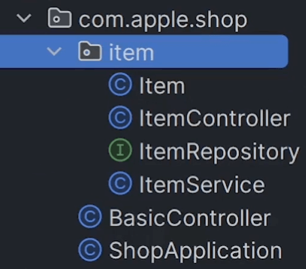

# 삭제기능 (AJAX, query string)

관련있는 파일은 한 폴더에 모아놓기
---
- 예전엔 Controller 끼리, Repository끼리 한 폴더에 모아놓았음

- 요즘은 테이블 기준으로 모아놓는게 나중에 찾기 편해서 선호

|-|
|-|
||

▲ Item 테이블과 관련된 파일은 다 같은 폴더에 몰아놓음

<br>

---

<br>

삭제기능 만들고 싶으면 글로 설명부터
---
- 상품을 잘못 올렸으면 그걸 삭제할 수 있어야 함

- 기능 설명

    - 글마다 삭제버튼이 있고, 클릭시 DB에 있던거 삭제

    - 중간에 서버를 거치는게 안전

      - 서버에게 삭제해달라고 요청날리고 서버는 확인 후에 글 삭제시켜줌

- \<form>말고 ajax를 이용해서 서버로 요청 날려서 구현해보기

<br>

ajax로 요청날리기
---
- 웹페이지에서 서버에 요청을 날리는 방법

  - 주소창에 URL을 집어넣든가 (GET요청가능)

  - \<form> 쓰든가 (GET, POST요청가능)

  - ajax를 쓰든가 (전부가능)

- ajax만의 장점

  - 새로고침 없이도 서버로 요청을 날릴 수 있음

    - 주소창 쓰거나 \<form> 쓰면 항상 자동 새로고침됨
    
    - ajax는 그런거 없어서 몰래 스무스하게 요청을 날릴 수 있음

  - 사용 방법 

    - 자바스크립트로 `fetch('/URL~~')` : ajax를 이용해서 GET 요청 날릴 수 있음

<br>

> html 파일
```html
<script>
  fetch('/test1')
</script>
```
- \<script>열면 자바스크립트 적을 수 있음

- \<script>안에 적은 자바스크립트는 페이지 로드시 1회 실행됨

    - GET요청 확인하고 싶으면 서버에 /test1 경로의 API 만들어보기

<br>

> html 파일
```html
<button class="btn">테스트용</button>

<script>
  document.querySelectorAll('.btn')[0].addEventListener('click', function(){
    fetch('/test1')
  })
</script>
```
- 특정 버튼 누를 때 자바스크립트를 실행하라고 코드짜고 싶으면 이런 식으로 작성

  - `위에 class가 btn인 태그를 클릭하면 fetch() 하라`고 코드 작성

- 자바스크립트도 자바랑 똑같이 코드가 길고 더럽다는게 특징

- 서버 API 만들어서 테스트해보면 새로고침 없이도 서버에 요청 날리는것 확인 가능

    - 유저몰래 요청날리고 싶을 때 사용

<br>

> 참고

- 리액트 쓰면 새로고침없는 부드러운 모바일 앱 같은 사이트를 만들기 편리

    - 그런 사이트는 서버랑 통신할 때 ajax를 주로 이용해서 데이터를 주고받음

<br>

---

<br>

ajax로 데이터도 전송가능
---
> html
```html
<script>

  fetch('/test', {
    method : 'POST',
    headers : {
      "Content-Type": "application/json",
    },
    body : JSON.stringify({title : 'kim', price : 123})
  })

</script>
```
- ajax로 요청 날릴 때 설정 기입 가능

  - method 속성에 어떤 method로 요청할지 설정 가능

  - body 속성에 어떤 데이터를 서버로 보낼지 설정 가능

  - headers란에 전송할 데이터의 타입을 설정 가능

- 전송할 데이터가 많으면 자바스크립트 array나 object 안에 담아서 전송 가능 

  - 자바에서의 List, Map과 유사함

  - array나 object자료 전송할 때는 JSON.stringify() 안에 넣어서 전달

    - 타입을 application/json로 기입해야 잘 전달됨

<br>

---

<br>

서버는 application/json 타입 데이터 출력하려면
---
> controller
```java
@PostMapping("/test1")
String test(@RequestBody Map<String, Object> body) {
    System.out.println(body.get("name"));
    return "redirect:/list";
}
```
- ajax로 application/json 타입의 데이터를 보냈다면

    - 서버에서 출력할 땐 파라미터에 @RequestBody 작성

- 변환할 자료형 맘대로 입력

    - 자바스크립트 object 형태로 보냈다면 Map으로 간편하게 변환해서 사용

<br>

> controller
```java
@PostMapping("/test1")
String test(@RequestBody Item body) {
    System.out.println(body);
    return "redirect:/list";
}
```
- Map 말고 특정 object로 바로 변환도 가능

<br>

---

<br>

서버로 전송할 데이터가 하찮으면 query string
---
- 서버로 데이터 전송할 때 저렇게 복잡하게 적기 싫으면 query string 사용가능

> html
```html
<script>
  fetch('/abc?데이터이름=데이터값') 
</script>
```
- URL에다가 이런 식으로 정보를 숨겨서 요청을 날리면 서버로 진짜로 그 데이터가 전송됨

<br>

> html
```html
<script>
  fetch('/abc?데이터이름=데이터값&데이터이름2=데이터값2') 
</script>
```
- 여러개 전송하려면 & 기호로 연결

  - 서버에서 이걸 꺼내고 싶으면 (@RequestParam 타입 데이터이름) 파라미터로 꺼낼 수 있음

  - 폼전송으로 보낸 데이터처럼 똑같이 꺼낼 수 있음

- 데이터를 서버로 간단하게 보내고 싶을 때는 query string 써도 ok

- 단점

  - 자료가 길고 복잡하면 여기 적는게 오히려 더러움

  - URL에 뭔가를 적는 방식이다보니까 정보가 너무 잘 보여서 코딩 모르는 사람들도 위조하기가 쉬워짐

- 간단하고 안중요한 데이터 전송하는데 쓰는게 좋음

<br>

---

<br>

응용
---
### 삭제 기능 만들기
- 상품마다 있는 삭제버튼 누르고 새로고침하면 그 상품이 목록에서 삭제되면 성공

- 삭제기능

  - 상품마다 있는 삭제버튼 누르면 서버로 삭제요청이 날라가고

  - 서버는 삭제요청받으면 DB에 있는 글 삭제

<br>

#### 팁1. onclick으로 만드는게 더 쉬움

> html
```html
<button onclick="fetch()">버튼</button>
```
- 버튼 클릭시 fetch()가 실행됨

<br>

#### 팁2. 한 번에 모든 버튼에 기능부여하려고 하면 어려울 수 있음
- 1번글 삭제기능만 먼저 만들어본 후에 확장

<br>

#### 팁3. DELETE method 요청을 날릴 때 body 안에 뭔가 집어넣으면 전송이 잘 안될 수도 있dma

- POST 또는 query string 사용

<br>

---

<br>

### 1. 상품마다 있는 삭제버튼 누르면 서버로 삭제요청함
> list.html
```html
<div class="card" th:each="i : ${items}">
  (생략)
  <span onclick="fetch('/item', { method : 'DELETE' } )">🗑️</span>
</div>
```
- 목록페이지에 버튼 생성

- 버튼 누르면 /item으로 DELETE 요청 날리라고 코드 작성

<br>

### 2. 서버는 삭제요청 받으면 DB에 있던 글 삭제

> controller
```java
@DeleteMapping("/item")
String deleteItem() {
    itemRepository.deleteById(1L);
}
```
- 서버에 API 작성

  - .deleteById(1L) 하면 id가 1인 글이 테이블에서 삭제됨

- 2번글 삭제기능은?

  - API 하나 더 만들어서 2L로 수정

  - 같은 코드 반복

- .deleteById(유저가삭제원하는상품id) 이렇게 코드 작성

  - 유저가 삭제원하는 상품id는 서버가 모름

  - 그런 데이터는 유저에게 보내라고 하거나 DB에서 뽑아보거나 택 1

<br>

---

<br>

유저야 삭제원하는 글 id도 같이 보내라
---
- 유저가 ajax 요청을 보낼 때 데이터를 함께 전송하고 싶으면?

  - 요청날릴 때 body로 보내거나 아니면 query string으로 보내거나 그러면 서버로 데이터전송 가능

- delete 요청 사용할 땐 body가 잘 안가는경우도 있어서 그냥 query string 사용

<br>

> list.html
```html
<div class="card" th:each="i : ${items}">
  (생략)
  <span onclick="fetch('/item?id=???', { method : 'DELETE' } )">🗑️</span>
</div>
```
- 유저가 삭제하고 싶은 상품의 id를 여기다가 같이 보내라고 하면 됨

  - 삭제버튼 옆에 있는 상품의 id를 알아서 기입

  - 반복문 안의 i 변수 안에 들어있음

<br>

> list.html
```html
<div class="card" th:each="i : ${items}">
  (생략)
  <span onclick="fetch('/item?id=[[${i.id}]]', { method : 'DELETE' } )">🗑️</span>
</div>
```
- 자바스크립트 안에 타임리프 변수를 넣으려면 스페셜한 문법이 필요

    - `[[${ 변수 }]]` 이런 식으로 넣어야함

- i.id가 잘 들어갔는지 확인하려면 크롬 개발자도구 열어서 확인가능

<br>

> controller
```java
@DeleteMapping("/item")
ResponseEntity<String> deleteItem(@RequestParam Long id) {
    itemRepository.deleteById(id);
    return ResponseEntity.status(200).body("삭제완료");
}
```
- 유저가 보낸걸 삭제하라고 코드 작성

- 서버는 query string 으로 보낸 데이터 출력하고 싶으면

    - `@RequestParam 타입 데이터이름` 사용

<br>

> 참고
- ajax로 데이터 주고받을거면

  - 서버 측에서 html전송하고 redirect하고 그런게 불가능

  - ResponseEntity 정도로 메세지만 보내주면 됨

<br>

---

<br>

새로고침해야 삭제되는 이유
---
- 삭제버튼 누른 후에 새로고침을 꼭 해야 상품이 없어질까?

  - 그렇게 코드를 짰을 뿐이라 그런 것

- ajax로 서버에 삭제요청날리는 코드만 있고 삭제요청 후에 박스를 사라지게 만들고 싶으면

  - 강제로 새로고침시키거나

  - 방금 삭제한 박스를 안보이게 처리해달라고 하거나

<br>

---

<Br>

ajax 요청 완료시 코드 실행하려면
---
> list.html
```html
<span onclick="fetch('/item?id=[[${i.id}]]', { method : 'DELETE' } )
.then(r => r.text())
.then(result => { 서버응답이 오면 실행할 코드 })
">🗑️</span>
```
- ajax 요청후에 서버가 보낸 데이터를 출력해보고 싶으면

    - `.then()` 을 2번 붙여주면 됨

- result 같은 변수에는 서버가 보낸 자료가 들어있음

    - 서버가 보내주는게 문자 자료형이면 r.text() 사용

    - 서버가 보내주는게 List나 Map 자료형이면 r.json() 사용

- 서버에서 뭔가 실패하면 실패메세지나 에러코드를 보내줄 수 있음 

  - 그런 상황도 예외처리 해주는게 좋음

    - 자바스크립트가 길고 복잡하기 때문에 필요할 때 찾아서 사용

- .then 안에서 window.location.reload() 쓰면 새로고침됨

    - `e.parentElement.parentElement.style.display = 'none'` 

      - 지금 누른 버튼의 부모의 부모 태그를 안보이게 처리할 수 있음

<br>

---

<br>

URL 파라미터 써도 서버로 데이터 전송가능
---
- 서버로 데이터 전송할 수 있는 다른 간편한 방법도 존재

  - URL 파라미터문법 활용

<br>

> controller
```java
@DeleteMapping("/item/{abc}")
(생략)
```
- ex) 서버의 API에다가 URL 파라미터자리를 마련해놓으면

  - 앞으로 /item/ 뒤에 아무 문자나 집어넣어도 이 API가 실행된다는 뜻

  - 아무 문자 자리에 데이터를 몰래 집어넣는 것

<br>

> html
```html
<span onclick="fetch('/item/바보')">🗑️</span>
```
- 이런 식으로 요청을 날리면 서버는 '바보'라는 문자를 출력해볼 수 있음

  - 이런 방식으로 서버에 데이터를 전송할 수도 있음

<br>

---

<br>

정리
---
```
1. 새로고침없이 서버에 요청날리려면 ajax 사용

2. 서버로 데이터 전송하는 법은 query string, url parameter 같은 방법도 있음

    근데 URL에 데이터가 노출이 쉽게 되는 단점도 있어서 코딩초보도 위조하기 쉬움

3. html 파일의 자바스크립트 안에 타임리프 변수 넣을 수도 있음
```

<br>
 
 

