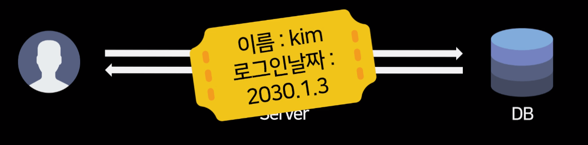
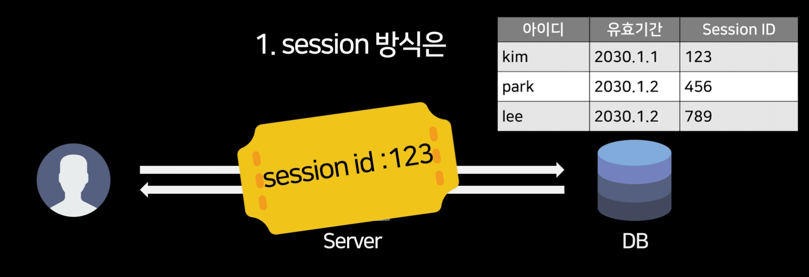
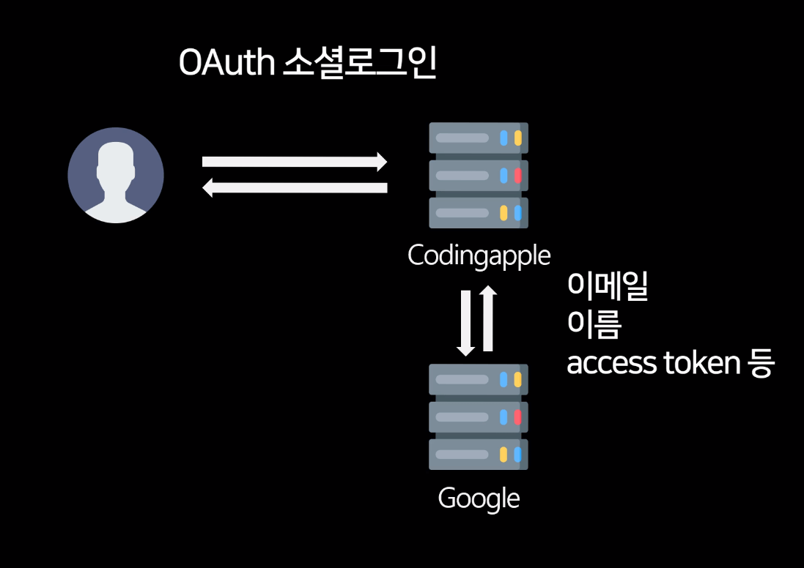

# Session, JWT, OAuth 개념

회원기능 동작방식
---
- 어떤 페이지는 로그인한 사람만 볼 수 있게 만든다고 가정

  - 회원기능이 필요

- 회원가입

  - 유저가 가입하면 아이디/비번을 DB에 저장해둠

- 로그인

  - 유저가 로그인시 아이디/비번을 서버로 보냄

  - (DB에 있는 아이디/비번 == 유저가 보낸 아이디/비번) 이면 입장권을 발급해줌

- 로그인이 필요한 서버기능 이용시

  - 유저는 서버에 GET/POST로 데이터 요청시 입장권도 함께 제시함

  - 서버는 입장권 확인 후 데이터나 페이지 보내줌

 

---

 

입장권
---

| -                    |
|----------------------|
|  |
| ▲ 사이트 로그인할 때 발급됨     |

- 로그인 완료시 서버가 `이 사람은 누구고 언제 로그인했습니다` 이런 문자를 만듦

    - 유저에게 보내서 계속 사용하게 만들면 그것이 입장권

 

### Q. 저는 평생 인터넷서핑하면서 입장권을 본 적이 없는데요?

- 입장권은 유저 모르게 유저 브라우저에 몰래 저장해둠

  - 브라우저의 쿠키 저장소 이용

- 크롬 개발자도구 켜면 Application 탭에 Cookie 존재

  - 쿠키 저장소에 저장해놓은 쿠키는 서버로 GET/POST 요청시 자동으로 함께 전송

  - 입장권 전송도 편하게 할 수 있어서 자주 사용됨

- 로그인시 입장권 만들어서 유저 브라우저 쿠키에 넣어두면 됨

  - 입장권을 만들 때 session, token 방식 중 택1

 

---

 

session 방식
---

|session 방식|
|--------------------|
|  |

- session 방식을 쓴다면 입장권을 만들 때 한개의 내용만 딱 적어서 보냄

- 로그인

  - 유저가 로그인하면 DB에 유저아이디, 유효기간, session id 기록해둠

  - 유저에게 입장권을 발급해줄 때 입장권에 session id 하나만 달랑 적어보냄

- session id는 행들을 구분하기 위한 랜덤 문자나 숫자

 

- 로그인이 필요한 서버기능 이용시

  - 유저가 GET/POST 요청시 입장권을 서버에 제출함

  - 서버는 입장권에 써있는 session id를 가지고 DB를 조회

  - DB기록에 별 이상 없으면 GET/POST 요청 진행

 

- 장점

  - 매번 GET/POST 요청할 때 마다 DB를 조회

    - 하나하나의 요청마다 엄격하게 유저를 체크해볼 수 있음

- 단점

  - 그 만큼 DB의 부담이 심해질 수 있음

    - 유저가 많은 사이트들은 Redis같은 빠른 메모리 DB를 이용하기도 함

 

---

 

token 방식
---

|token 방식|
|--------------------|
|  |

- 대부분 JWT와 혼용 (JSON Web Token)

- JWT방식을 쓴다면 입장권에 많은 정보를 기록해놔서 DB 조회를 안해도 되게 함

 

- 로그인

  - 유저가 로그인하면 유저에게 입장권을 발급해줄 때 
  
    - 입장권에 `유저의 아이디, 로그인 날짜, 유효기간` 등을 적어두고 암호화해서 보냄

  - DB에 뭐 저장하는건 없음

 

- 로그인이 필요한 서버기능

  - 유저가 GET/POST 요청시

    - 유저가 입장권을 제출하면 입장권의 유효기간 까보고 별 이상 없으면 통과시켜 줌

    - 유저 정보가 필요하면 입장권에 써있는걸 꺼내서 사용

 

### Q. 유저가 JWT를 맘대로 위조하면?
- JWT를 만들 때 여러 정보들을 짧은 문자로 변환을 해서 생성 (일명 hashing)

- 변환할 때 암호를 넣을 수 있어서 암호가 변경되거나 내용이 변경되면 짧은 문자도 변함

  - 위조여부를 쉽게 알 수 있어서 걱정 안해도 됨

 

- JWT의 장점

  - 매번 GET/POST 요청할 때 마다 DB를 조회할 필요가 없어서 DB 부담이 적음

    - 유저가 매우 많거나 마이크로서비스형태로 서버를 여러개 운영하는 사이트들이 즐겨씀

- JWT의 단점

  - 유저의 JWT를 나쁜 사람이 훔쳐가면 그 사람의 로그인을 막거나 할 수 있는 방법이 없음

  - 다른 컴퓨터에 저장된 JWT를 소멸시킬 수 없음
  
    - 다른 컴퓨터를 로그아웃시키기도 어려울 수 있음

  - 나쁜 JWT들을 모아서 DB 같은 곳에 기록해두면

    - 매번 JWT 사용마다 DB를 조회해야하니 session 방식과 딱히 다른 점이 없음

 

- session, JWT 각각 장단점이 있으니 골라서 사용

 

---

 

OAuth
---

| OAuth                |
|----------------------|
|  |

- OAuth는 입장권같은건 아님

- OAuth 뜻

  - 어떤 유저의 A 사이트의 사용권한을 B 사이트를 운영하는 내가 잠깐 빌리는 과정을 정의하는 규칙

- OAuth 잘 이용하면

  - 유저의 A 사이트 회원정보를 가져와서 내가 운영하는 B 사이트 회원가입시 사용할 수도 있음

  - 이걸 흔히 소셜로그인이라고 부름

- ex) 사이트를 운영하는데 구글로그인을 구현하고 싶으면

  - 유저가 사이트에서 구글 로그인 버튼을 누르면 구글 계정으로 로그인하라고 뜨는데 로그인함

  - `수상한 사이트로 개인정보 전송해도 되냐`고 구글이 물어봄

  - 유저가 허락하면 허락했다고 구글 → 사이트서버 알림 전송

  - 알림이 도착하면 코딩애플서버는 구글에게 유저 정보를 요청해서 받아옴

    - 거기엔 { 유저이메일, 이름, access_token, 유효기간 } 이런 것들이 들어있음

    - 그 정보들로 JWT 만들어서 사용하거나 session 으로 DB에 저장해둠

    - 사이트 로그인기능 구현시 사용

 

---

 

spring security 라이브러리
---
- 실제 구현은 spring security 라이브러리 쓰는게 빠르고 간편

- 설정만 하면 session 또는 JWT 기능을 쉽게 구현 가능

 