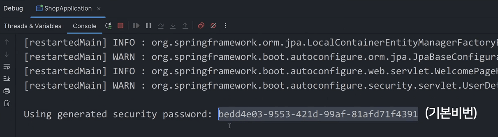
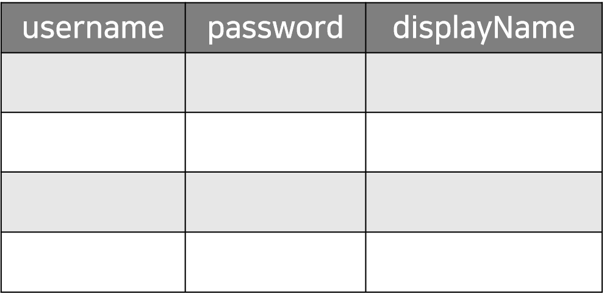

# Spring Security 설치와 셋팅, Hashing

- 회원기능은 그냥 쿠키수정할 줄 알고 jwt가 뭔지 알면 구현 가능

- 보통은 spring security 라이브러리 써서 회원기능 쉽게 구현 가능

<br>

spring security 라이브러리 설치
---
> build.gradle
```java
implementation 'org.springframework.boot:spring-boot-starter-security'
implementation 'org.thymeleaf.extras:thymeleaf-extras-springsecurity6:3.1.1.RELEASE'
```
- build.gradle 파일에 추가

  - spring security 라이브러리 설치 가능

- 두번째 줄은 Thymeleaf 쓰는 사람만 설치하면 됨

  - html 파일에서 회원정보 쉽게 꺼내쓸 수 있게 도와주는 용도

- 처음 설치하고 서버 띄워보면 모든 페이지를 로그인 창으로 막아줌

  - 아무것도 못함

<br>

| -                    |
|----------------------|
|  |
|▲ 에디터 실행창보면 기본 비번 확인 가능|
|아이디는 user, 비번은 콘솔창에 뜨는거|

<br>

---

<br>

기본설정바꾸기
---
- 모든 페이지를 막아주는 기본 동작방식 바꾸기

- @EnableWebSecurity 붙인 클래스 하나 만들면 거기 안에서 여러가지 라이브러리 설정을 바꿀 수 있음

> SecurityConfig.java
```java
@Configuration
@EnableWebSecurity
public class SecurityConfig {
    @Bean
    public SecurityFilterChain filterChain(HttpSecurity http) throws Exception {
        http.authorizeHttpRequests((authorize) ->
            authorize.requestMatchers("/**").permitAll()
        );
        return http.build();
    }
}
```
- 아무데나 SecurityConfig.java 파일 만들고 위 코드 복붙

  - spring security 만든 사람이 이렇게 쓰래서 복붙해서 쓰는 것

- spring security 6버전 이상에서 쓰는 문법

- .requestMatchers() 를 이용해서 URL을 기재할 수 있음

  - /** : 모든 URL이라는 뜻

- .permitAll() 뒤에 붙이면 기재한 URL 접속시 로그인여부와 상관없이 접속허락 가능

  - 위처럼 작성하면 모든 URL 접속시 모든 유저의 접속을 허락해줌

<br>

> 참고

- filterChain : 유저의 요청과 서버 응답사이에 자동으로 실행해주고 싶은 코드를 담는 곳

  - filterChain을 다른 곳에선 '미들웨어'라고 부르기도 함

<br>

---

<br>

CSRF 보안기능
---

> SecurityConfig.java
```java
@Configuration
@EnableWebSecurity
public class SecurityConfig {
    @Bean
    public SecurityFilterChain filterChain(HttpSecurity http) throws Exception {
        http.csrf((csrf) -> csrf.disable());
        http.authorizeHttpRequests((authorize) ->
            authorize.requestMatchers("/**").permitAll()
        );
        return http.build();
    }
}
```
- 위처럼 작성해서 CSRF 보안기능도 잠깐 꺼보기

- CSRF 공격

  - 원래 다른 사이트에서 내 사이트를 몰래 이용할 수 있게 만들 수 있음

    - \<form>을 비슷하게 위조하면 됨

  - 다른 사이트에서 내 사이트로 POST 요청날리는 폼을 만들어서 내 사이트에 테러행위 할 수 있음

- CSRF 공격 방지

  - \<form> 들어있는 페이지를 전송할 때 서버에서 발급한 랜덤 문자도 집어넣고

  - 폼 전송시 함께 전송하게하고 서버에서 그걸 확인

  - 폼안에 숨겨져 있는 문자가 서버와 다르면 폼전송을 막아주면 됨

- JWT 쓰는 경우에 CSRF 예방 가능

  - 입장권을 쿠키에넣어서 직접 보내는게 아니라 

    - ajax요청시 headers 부가정보 기입란에 적어서 보내는 식

  - 그래서 JWT쓰면 끄는 경우가 많음

- 세션방식을 쓰는 경우엔 CSRF 방지기능이 필요할 수 있음

<br>

---

<br>

arrow 기호 (lambda)
---
- 함수하나 만들 때 파라미터로 다른 함수를 넣어서 실행할 수 있게 만들 수도 있음

  - 함수1(함수2) 이런 식

- 언제 사용?

  - 순차적으로 실행하게 만들고 싶거나

  - 내가 만든 함수에 다른 사람의 코드를 집어넣어서 실행하게 만들고 싶을 때

<br>

- 자바는 함수를 하나 사용하려면

  - 클래스 만들고

  - 거기에 함수넣어두고

  - object뽑아서 .함수() 방식으로 사용

- 바로 클래스와 함수를 그 자리에서 즉흥적으로 만들어서 넣을 수도 있음

  - `->` 화살표 문법 : 임시 클래스와 함수 간편하게 하나 만들어달라는 뜻

<br>

---

<br>

함수에 함수를 집어넣어서 쓸 수 있게 만드는 방법
---
> 함수에 함수 입력해서 실행해주는 코드
```java
interface Callback { //3
    void callback();
}

public class MyClass {
    public static void main(String[] args) {
        함수1(() -> System.out.println("world")); //4
    }
    
    static void 함수1(Callback 함수2){ //1
        System.out.println("hello");
        함수2.callback(); //2
    }
}
```
- ex) 함수1에 다른 함수를 입력하면 그걸 실행해주고 싶은 경우

  - 함수1 생성 

    - 다른 클래스 object를 입력하면 그 안에 있던 함수를 실행해주라고 코드 작성

  - object에 있던 함수를 실행하려면 `object.함수()` 이렇게 실행

  - 파라미터에 타입을 미리 써놔야함 
  
    - class 또는 interface로 미리 object의 생김새를 정해놓아야 함

  - 함수1()을 사용할 때 앞으로 object를 입력하면 함수1 내용 실행
  
    - 그 다음에 `object.함수()` 실행

<br>

- object를 직접 뽑고 입력하기 싫으면

  - `() -> 함수에집어넣을코드` 이런 식으로 코드 작성

    - (1) 클래스하나 만들고

    - (2) 그 안에 callback()이라는 이름의 함수 하나 만들고 함수에집어넣을코드 담아주고

    - (3) 그 자리에서 object를 뽑아줌

- 함수에 다른 함수를 편하게 집어넣고 싶을 때 -> 문법 사용

<br>

### Q. callback() 함수 만든 적 없는데 함수2.callback() 쓰면 왜 실행될까?

- `() -> 함수에집어넣을코드` 이걸 파라미터자리에 집어넣으면

  - 자동으로 interface에 만들어둔함수 이름으로 변해서 
  
  - object에 추가됨 (형태 : `void callback(){ 함수에집어넣을코드 }`)

  - 함수2.callback() 쓰면 실행됨

- 함수가 들어올 자리라고 표기하기 위한 interface를 functional interface라고 함


<br>

### Q. 왜 파라미터에 함수를 넣어야할까?

- 라이브러리 만든 사람이 여기 파라미터에다가 함수넣으라고 강요한거라서..

- 사용

  - 뭔가 순차적으로 실행하게 만들고 싶을 때

  - 내가 만든 함수에 다른 사람의 코드를 집어넣어서 실행하게 만들고 싶을 때


<br>

---

<br>

패스워드는 db에 저장할 때 해싱해서 저장해야함
---
- 회원가입 기능

  - 유저가 제출한 아이디/비번을 테이블에 저장하면 회원가입 기능 끝

- 비번같은 경우 그냥 저장하면 DB가 털렸을 때 비번을 그대로 알 수 있음

  - 랜덤문자로 변환해서 저장하는게 일반적

- 랜덤문자로 변환하는걸 해싱이라고 함 (해싱해서 저장)

<br>

### 해싱의 특징

1. 같은 문자를 해싱하면 항상 같은 결과가 나옴

2. 해시결과를 보고 원래 문자가 뭔지 추론할 수 없음

<br>

### 해싱알고리즘
- bcrypt, argon2, scrypt, SHA 등

- 여기서는 bcrypt 해싱 알고리즘 기본 제공해줘서 사용

<br>

```java
@GetMapping("/test2")
String test2() {
    var encoder = new BCryptPasswordEncoder();
    System.out.println(encoder.encode("qwer1234"));
    return "redirect:/list";
}
```
- new BCryptPasswordEncoder().encode("해싱할문자")

  - 아무데서나 이렇게 쓰면 문자 해싱 가능

<br>

- 비번저장할 때 salt 개념

  - Bcrypt쓰면 자동으로 알아서 salt도 더해서 해싱해줌

- rainbow table attack이라는 해킹 기법을 막기 위해서 하는 것

<br>

### Q. 비번을 해싱으로 꼬아놓으면 나중에 로그인시 비번이 맞는지 어떻게 비교할까?

- 로그인시 제출한 비번도 해싱해서 DB에 있던거랑 비교해보면 됨

<br>

---

<br>

응용
---
- 회원가입페이지에서 아이디, 비번, 이름 전송하면 그걸 테이블에 저장

  - 조건 1. 비번은 해싱해서 저장해야함

  - 조건 2. 테이블하나 새로 생성

    - 테이블 이름 : Member

    - 아이디/비번/유저이름 컬럼 : username/password/displayName 


<br>

| 테이블 예시               |
|----------------------|
|  |

<br>


