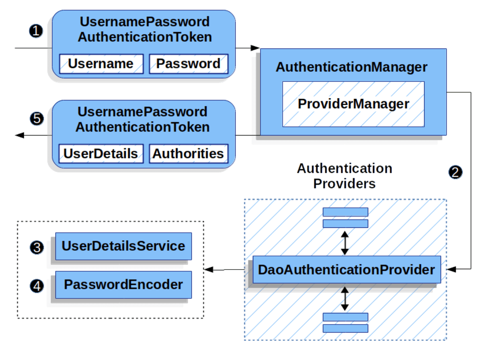
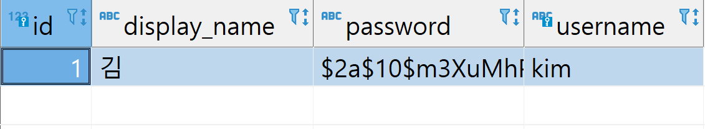
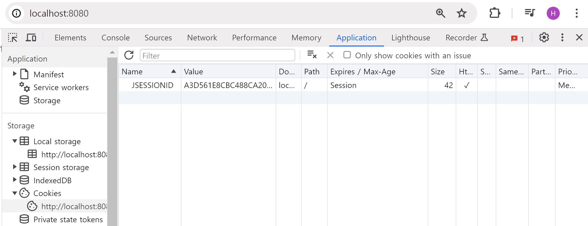
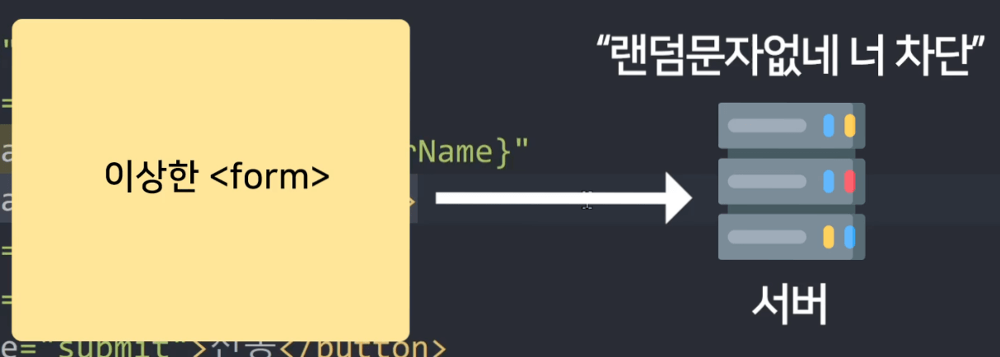

# 로그인 기능

- Spring security 라이브러리 쓰면 셋팅하는 코드만 복붙하면 로그인기능 구현 끝

  - 로그인용 html 페이지 만들고

  - 폼으로 로그인하겠다고 설정해놓고

  - DB에 있던 유저정보를 꺼내는 코드 작성

- session 방식의 로그인기능 작동

<br>

### 1. 로그인용 html 페이지
> loginController
```java
@GetMapping("/login")
public String login() {
    return "login.html";
}
```
- API 생성

<br>

> login.html
```html
<form action="/login" method="POST">
  <input name="username">
  <input name="password" type="password">
  <button type="submit">전송</button>
</form> 
```
- 방문시 보여줄 html 페이지 생성

- 아이디는 username, 패스워드는 password 이름으로 전송해야 잘됨

- 전송버튼 누르면 /login으로 POST 요청 날려야 잘됨

  - Spring Security쓸 때는 기본으로 이렇게 해줘야 잘되기 때문에 이렇게 설정

<br>

### 2. 폼으로 로그인하겠다고 설정
> SecurityConfig.java
```java
http.formLogin((formLogin) -> formLogin.loginPage("/login")
    .defaultSuccessUrl("/")
    .failureUrl("/fail")
);
```
- 설정하는 SecurityConfig 클래스에 코드 추가

  - 앞으로 폼으로 로그인하겠다는 뜻

- 성공이나 실패시 이동할 페이지 url도 적어줄 수 있음

- 성공시, 실패시 이동할 페이지도 설정가능

<br>

> login.html
```html
<div th:if="${param.error}">
  <h4>아이디나 비번 틀림</h4>
</div> 
```
- 실패시 이동할 페이지는 안적으면 기본적으로 /login?error 페이지로 이동

  - 쿼리스트링식으로 에러가 있었다는걸 전달해주는 것

- 실패시 안내메세지 보여주고 싶으면 login 페이지에 위와 같은 코드를 적어두면 됨

  - `만약에 쿼리스트링 중 error 이름을 가진 쿼리스트링이 있으면 특정 html 보여달라`는 뜻

<br>

#### Q. 로그인 실패시 아이디/비번 중 뭐가 틀렸는지 어떻게 알려줌?
- 아이디나 비번 중에 뭐가 틀렸는지 정확하게 알려주는건 보안상 좋지 않기 때문에 이 정도로 만족하기

<br>

### 3. DB에 있던 유저정보 꺼내는 코드를 작성

> MyUserDetailsService.java
```java
@Service
public class MyUserDetailsService implements UserDetailsService {
    @Override
    public UserDetails loadUserByUsername(String username) throws UsernameNotFoundException {
        DB에서 username을 가진 유저를 찾아와서
        return new User(유저아이디, 비번, 권한) 해주세요
    }
}
```
- MyUserDetailsService.java 파일 생성 후 코드 작성시 로그인 기능 알아서 동작

<br>

---

<br>

spring security 동작흐름
---

| spring security 동작흐름 |
|----------------------|
|  |


- 유저가 폼으로 username, password 라는 이름의 데이터들을 제출

- 사진에 있는 클래스들을 타고 이동해 UserDetailsService 클래스에 도착

  - 방금 만든 클래스

- 여기서 유저정보를 DB에서 꺼내주기만 하면

  - 컴퓨터가 알아서 유저가 제출한 비번이랑 DB에서 꺼낸 비번이랑 비교

    - DaoAuthenticationProvider 안에서 진행

- PasswordEncoder라는 Bean이 있으면 해싱도 자동으로 해줌

- 이상하면 에러 발생시켜줌

- 이상한게 없으면 입장권용 쿠키를 하나 생성해서 유저에게 보내주고

  - 누가 무슨 이름으로 언제 로그인했는지 세션데이터 생성해서 저장해줌

- 앞으로 유저가 제출한 입장권 검사해보는 것도 알아서 다 자동으로 됨

<br>

### MyUserDetailsService.java
- 유저가 폼으로 아이디/비번 제출시 비번 맞는지 자동으로 검사

  - 비번 검사하려면 DB에 있던 비번도 필요

    - 라이브러리는 비번이 DB어디에 있는지 모름

- DB에 있던 비번 찾아오는건 직접 코드로 작성 

  - 코드 작성하는 곳이 방금 만든 MyUserDetailsService 클래스

- loadUserByUsername() 함수만들고 거기서 아이디/비번/권한 담아서 return 

  - 비번검사 등이 알아서 됨

<br>

### 💡
- 라이브러리 문법 쓸 때

  - 외우고 이해하고 그럴 필요 X

  - 대충 흐름 이해만 한 다음에 복붙식으로 쓰는게 좋은 사용법

<br>

---

<br>

interface
---
- 어떤 클래스만들 때 특정 함수 이름들을 꼭 만들게 강제하고 싶을 때 interface 문법 사용

> 사용법
```java
interface 가이드 {
    public void doThis();
}

class Test implements 가이드 {
    public void doThis() {
        System.out.println("dd");
    }
}
```
- interface 하나 만들어두고 강제할 함수 만들기

  - 함수 이름과 타입만 집어넣을 수 있고 변수도 넣을 수 있음

- 클래스 하나 만들 때 `implements interface이름` 작성

  - interface에 있던 함수들을 만들도록 강제할 수 있음

  - interface에 있던 함수들을 똑같이 안만들면 에러

- interface : 쉽게 비유하자면 일종의 클래스 가이드라인

    - 특정 규격에 맞게 코드짜라고 강제하고 싶을 때 사용하면 유용함

<BR>

> ex
```java
interface 가이드 {
    public void doThis();
}

class A implements 가이드 {
    public void doThis(){ 어쩌구~ }
}
class B implements 가이드 {
    public void doThis(){ 저쩌구~ }
} 

가이드 a = new A(); //new A() 지우고 new B()로 교체가 쉬워서 나중에 관리가 편리해짐
a.doThis();
```
- 비슷한 클래스를 많이 만들어서 사용해야하는 경우

  - interface로 가이드부터 만들어두고 코드짜놓으면 나중에 클래스를 변경해야할 때 편리

- 변수의 타입을 interface로 해두면 같은 interface를 implement한 클래스끼리 자유롭게 변경 가능

- ex) ArrayList, LinkedList 대신 List라는 interface 타입을 집어넣는 것

<br>

---

<br>

loadUserByUsername 함수 완성하기
---
> MyUsetDetailsService.java
```java
public UserDetails loadUserByUsername(String username) throws UsernameNotFoundException {
    DB에서 username을 가진 유저를 찾아와서
    return new User(유저아이디, 비번, 권한) 해주세요
}
```
- loadUserByUsername 함수에다가 파라미터 추가

  - 유저가 로그인시 제출한 username 들어옴

- DB에서 이거랑 일치하는 회원을 찾아와

  - 그 회원정보들을 new User()에 담아서 return 해주라고 코드 작성시 회원기능 구현 끝

<br>

---

<br>

테이블에서 특정 컬럼에 들어있는 값을 찾아오기
---

| 테이블              |
|----------------------|
|  |

- 테이블에서 행 하나 찾고 싶으면?

  - JPA문법으로 `.findById(1L)` 등 사용시 행 하나 찾아올 수 있음

    - id 컬럼이 1과 일치하는 행 찾아오는 문법

- 지금은 username 컬럼을 바탕으로 찾아와야함

  - `.findByUsername()` 있으면 좋을거같으나 없음

    - 여기다가 "kim" 입력하면 username 컬럼이 kim인 행을 찾아오게하면 좋을듯

- repository interface : 소원비는 곳

<br>

> MemberRepository.java
```java
public interface MemberRepository extends JpaRepository<Member, Long> {
    Optional<Member> findByUsername(String username);
}
```
- Repository interface 안에다가 함수 기재 

  - JPA가 이걸 보고 이 함수를 진짜로 만들어줌

- `findBy컬럼명(파라미터);` 이런 식으로 만들면

  - 그 컬럼명에 파라미터가 들어있는 행을 찾아오는 함수를 만들어줌

- 결과를 무슨 타입에 담아줄지도 맘대로 정하면 됨 

  - 행을 못찾을 수도 있으니 Optional

<br>

### 참고1 
- findBy 말고 findAllBy 라고 붙이면 파라미터가 들어있는 모든 행을 다 찾아와줌

  - 여러개 찾아오니까 List같은거에 담는게 좋음

<br>

### 참고2
- 이런걸 Derived Query Methods 라고 부름

- 여러가지 작업을 하는 DB 입출력 문법을 생성 가능
  
  - and, or 조건주기

  - 특정문자 포함되었는지 like연산자 검색하기

  - 특정 숫자 이상/이하인거 검색하기

  - 정렬하기

<br>

---

<br>

loadUserByUsername 함수 완성하기
---
- loadUserByUsername 함수 완성

  - DB에서 username을 가진 유저를 찾아와서 return new User(유저아이디, 비번, 권한)

> MyUserDetailsService.java
```java
@Override
public UserDetails loadUserByUsername(String username) throws UsernameNotFoundException {
    var result = memberRepository.findByUsername(username);
    if (result.isEmpty()){  // Optional 은 if 써야 안전
        throw new UsernameNotFoundException("그런 아이디 없음");
    }
    var user = result.get();
    return new User(user.getUsername(), user.getPassword(), 권한목록);
}
```
- Member 테이블 중에 username 컬럼에서 String username이 담긴 컬럼을 찾아오라고 함

  - 찾은 유저가 없으면 에러 띄우기

  - new User() 안에 유저아이디, 비번, 권한을 담으면 끝입

- 유저아이디, 비번을 스프링에서 내부적으로 유저가 제출한거랑 비교해보고 잘 맞으면 통과

<br>

- 권한 넣기
```java
@Override
public UserDetails loadUserByUsername(String username) throws UsernameNotFoundException {
    (생략)
    List<GrantedAuthority> 권한목록 = new ArrayList<>();
    권한목록.add(new SimpleGrantedAuthority("일반유저"));
    return new User(user.getUsername(), user.getPassword(), 권한목록);
} 
```
- 권한도 new User() 안에 넣어야함

  - 유저의 권한들이 뭔지 써놓은 리스트자료를 여기 넣으면 됨

- new SimpleGrantedAuthority("일반유저") 이렇게 메모해서 집어넣으면 됨

- 권한 : 특별한 코드적인 기능은 없고 이 유저가 무슨 유저인지 메모해놓는 것

  - 유저가 일반유저인지, 관리자인지, 판매자인지 등 유저들을 분류하기 위한 메모

- 좋은 점 : 나중에 컨트롤러에서 현재 유저의 로그인정보 출력 가능 

  - 그 때 권한 메모해둔 것도 출력 가능

    - 권한에 따라서 특정 페이지나 API를 못쓰게 차단시킬 수 있음

<br>

### 💡 유저에 따라서 다른 메모를 해주고 싶으면
- if문 추가

  - 특정 아이디를 가진 유저는 예를들어 "관리자"라고 메모

  - DB에 특정 정보를 가지고 있는 유저는 "판매자"라고 메모

<br>

---

<br>

로그인
---
- 셋팅만 잘 해놓으면 로그인 기능구현 끝

| -                    |
|----------------------|
|  |

▲ 로그인 후 개발자도구 application 탭 들어가보면 쿠키가 생성되는 것 볼 수 있음

- 로그인 실패해도 쿠키가 생기긴 하는데 로그인잘하면 세션아이디같은게 잘 적힌 입장권용 쿠키가 잘 생김

- 이제 사이트 이용시 쿠키가 전송될텐데 그거 보고 서버에선 로그인여부를 판단할 수 있음

<br>

---

<br>

마이페이지 만들기
---
- 누가 /my-page 접속하면 마이페이지 보내주기

```java
@GetMapping("/my-page")
public String myPage() {
    return "mypage.html";
}
```
- 이렇게 API를 만들어보면 /my-page 접속시 잘 보임

- 이런 페이지들은 로그인한 유저만 볼 수 있게 만들어야함

<br>

---

<br>

로그인 중인 유저 확인
---
> MemberController.java
```java
@GetMapping("/my-page")
public String myPage(Authentication auth) {
  System.out.println(auth);
  System.out.println(auth.getName()); //아이디출력가능
  System.out.println(auth.isAuthenticated()); //로그인여부 검사가능
  System.out.println(auth.getAuthorities().contains(new SimpleGrantedAuthority("일반유저")));
  return "mypage.html";
}
```
- 컨트롤러 안에서는 Authentication 타입붙은 파라미터 하나 추가

  - 거기에 현재 유저의 로그인정보가 전부 들어있음

- spring security가 자동으로 유저정보를 넣어준 것이라 사용만 하면 됨

- getAuthorities() 쓰면 현재 유저의 권한 메모해둔 것도 출력가능

- 회원기능들을 만들고 싶으면 auth 변수와 함께라면 쉽게 작성 가능

  - 유저가 로그인안했으면 마이페이지 말고 로그인 페이지로 보내주기

  - 글하나 작성할 때 누가 작성한 글인지 아이디도 함께 저장하기

<br>

---

<br>

html에서 유저정보 출력하려면
---
```html
<span sec:authentication="principal"></span>
<span sec:authentication="principal.username"></span>
<span sec:authentication="principal.authorities"></span>
```
- 타임리프 사용시

  - sec:authentication 문법 사용하면 현재 로그인 중인 유저정보 출력 가능

  - 서버에서 직접 안보내도 되니까 편리함

- REST API들은 서버가 이것저것 보내줘야 유저정보를 알 수 있음

<br>

```html
<span sec:authorize="hasAuthority('일반유저')">특정권한이 있으면 보여주기</span>
<div sec:authorize="isAuthenticated()">
  로그인된 사람만 보여주기
</div>
```
- 현재 유저가 로그인 되어있는 경우에만 특정 html을 보여주고 싶으면 

  - `sec:authorize="isAuthenticated()"` 쓰고 그 안에 html 넣으면 됨

- 현재 유저가 로그아웃 되어있는 경우에만 특정 html을 보여주고 싶으면

  - `sec:authorize="isAnonymous()"` 쓰고 그 안에 html 넣으면 됨

- 유저가 특정 권한을 가진 경우에만 특정 html을 보여주고 싶으면

  - `hasAuthority()` 쓰고 권한 이름 안에 넣으면 됨

  - 안되면 thymeleaf-extras-springsecurity6 라이브러리 설치 잘했나 확인

<br>

---

<br>

로그아웃 방법
---
> SecurityConfig.java
```java
http.logout( logout -> logout.logoutUrl("/logout") );
```
- /logout으로 GET요청을 날리는 경우 로그아웃 시켜줌

<br>

---

<br>

API마다 로그인검사하기 귀찮으면
---
```java
@PreAuthorize("isAuthenticated()")
@GetMapping("/admin")
컨트롤러함수(){
    어쩌구저쩌구
}
```
- @PreAuthorize() annotation

  - API마다 붙일 수 있고 Controller 클래스 위에도 붙일 수 있음

  - 소괄호 안에 있는 코드를 실행해보고 이게 참인 경우에만 밑에 있는 API를 실행해줌

<br>

> 소괄호 안에 넣을 수 있는 것들
```java
@PreAuthorize("isAuthenticated()")
@PreAuthorize("isAnonymous()")
@PreAuthorize("hasAuthority('어쩌구')")
```
- 각각 유저가 로그인 상태인지

- 로그아웃 상태인지

- '어쩌구'라는 authority를 가지고 있는지 확인 가능

- 참인 경우에만 API를 동작시켜주는 annotation

- 여러 조건을 넣고 싶으면 || 아니면 && 연산자로 이어붙이면 됨

- if문의 조건식이랑 거의 동일하게 쓰면 되는데 안에 들어갈 수 있는게 더 많음

  - 여러 API들에 로그인검사 로직을 일일이 작성하기 귀찮을 때 찾아서 사용

<br>

---

<br>

응용
---

### Q1. 사이트 상단 navbar에 현재 로그인된 유저의 아이디를 출력해주려면?

- 서버에서 보내줘도 되는데 Thymeleaf 문법 써도 편리

```html
<span sec:authentication="principal.username"></span>
```
- 상단바 안에 코드 추가

<br>

### Q2. 사이트 상단에 로그아웃 버튼과 기능을 생성
- 로그인한 유저에만 보여야함

  - Thymeleaf 문법 사용

```html
<div sec:authorize="isAuthenticated()">
  <a href="/logout">로그아웃</a>
</div>
```
- a태그 쓰면 GET 요청을 쉽게 날릴 수 있음

<br>

### Q3. 로그인 중인 유저는 /register 페이지 접속시 /list 페이지로 보내주려면?

- Controller 에서 현재 유저의 로그인정보 확인 가능

```java
if (auth.isAuthenticated()){
    return "redirect:/list";
}
```
- API 안에 코드 추가

<br>

### Q4. 상품하나 추가하는 기능 만들 때 어떤 유저가 작성했는지 아이디도 함께 집어넣고 싶으면?

- Item 테이블에 아이디 저장할 컬럼도 하나 새로 생성

  - Item 테이블에 컬럼 하나 만들고

  - 행 하나 추가할 때 auth.getName()을 집어넣으라고 코드 작성

- 뭔가 만들어놨으면 항상 나쁜유저처럼 테스트해봐야 안전한 사이트가 됨

<br>

---

<br>

- 로그인기능 쓰다보면 불편한 점

  - 유저의 아이디랑 권한 정도만 나온다는 것

  - 유저의 displayName 등을 컨트롤러에서 출력하고 싶으면?

    - 유저의 username은 아니까 그거 가지고 DB에서 출력해보면 되긴 하는데 더 쉬운 방법 존재

<br>

auth 변수에 유저정보 더 집어넣기
---
- 왜 유저 아이디만 출력가능할까?

> loadUserByUsername() 함수
```java
public UserDetails loadUserByUsername() {
    (생략)
    return new User(result.username, result.password, authorities);
}
```
- return 한 내용이 컨트롤러에 있던 Authentication 변수에 들어가는 식으로 동작

  - 컨트롤러에서 유저이름이랑 authority 정도만 출력 가능

- 여기다가 추가 정보를 더 넣어주면 됨

- User 클래스에 미리 정의된 변수들만 집어넣을 수 있음

  - User 클래스 정의된 부분 찾아가서 직접 소스코드를 수정해도 되지만 라이브러리 코드를 직접 수정하는건 좋지않음

    - 나중에 라이브러리 업데이트하면 코드가 꼬일 수도 있음

- 직접 User 클래스랑 비슷한걸 하나 만들면 됨

<br>

```java
public UserDetails loadUserByUsername()  {
  (생략)
  return new CustomUser(); //궁시렁댐
}

class CustomUser {

}
```
- 아무렇게나 만들어서 User 자리에 집어넣으면 "User 넣어야하는 자리에 이상한 클래스 넣지마라"고 경고뜸

```java
public UserDetails loadUserByUsername()  {
  (생략)
  return new CustomUser();
}

class CustomUser extends User{

}
```
- 클래스 만들 때 `extends 다른클래스명` 문법

  - 다른 클래스에 있던 변수 함수를 그대로 전부 복사해올 수 있음

- 위처럼 User 클래스에 있던걸 복사해버리면 User 클래스와 비슷하게 생겼으니까 경고 안뜸

- xtends를 쓰면 항상 `super()` 문법을 함께 써야함

  - 에디터에서 super 쓰라고 제안할 것임 → 자동적용 클릭

<br>

> super()
```java
public UserDetails loadUserByUsername()  {
  (생략)
  return new CustomUser();
}

class CustomUser extends User {
  public CustomUser(String username,
  String password,
  List<GrantedAuthority> authorities ) {
    super(username, password, authorities);
  }
}
```
- super() : 복사해온 클래스의 constructor라는 뜻

- 위 코드에선 super()는 User클래스의 constructor

  - 해석 : `앞으로 CustomUser 사용할 때 파라미터 3개 넣으면 그걸 User의 constructor에도 그대로 넣어달라`는 뜻

- 클래스를 복사해올 때 그 원본 클래스의 constructor기능을 똑같이 유지해주는게 좋기 때문

  - User 클래스와 비슷하게 완벽위장가능

<br>

> 다른 클래스를 복사하고 싶으면 extends와 super()를 이용
```java
public UserDetails loadUserByUsername()  {
  CustomUser customUser = new CustomUser(result.username, result.password, authorities);
  customUser.id = result.getId();
  customUser.displayName = result.getDisplayName();
  return customUser;
}

class CustomUser extends User {
  public Long id;
  public String displayName;
  public CustomUser(String username,
  String password,
  List<GrantedAuthority> authorities ) {
    super(username, password, authorities);
  }
}
```
- 클래스에 id, displayName 이런 변수 추가

  - 방금 만든 커스텀 클래스에 추가

- 이제 유저의 id, displayName을 집어넣어서 new User() 대신 집어넣을 수 있음

<br>

---

<br>

타입캐스팅
---
- customUser 에 들어있던 정보

  - 컨트롤러에서 auth.getPrincipal() 출력하면 사용 가능

    - `auth.getPrincipal().displayName`

- 주의 : 타입 확인해보면 Object

  - 점찍어서 displayName 출력 불가

- 코드 짜다보면 타입이 이상하거나 마음에 안드는 경우

  - 타입을 맘대로 변환하는 것도 가능 ⇒ 타입캐스팅

<br>

> API 내부
```java
CustomUser user = (CustomUser) auth.getPrincipal();
System.out.println(user.displayName);
```
- 자료 왼쪽에다가 `(타입명)` : 타입을 강제로 바꿔줄 수 있음

- `getPrincipal()` 등 우리가 직접 만든게 아니라 타입을 수정하기 어렵다면

  - 타입캐스팅해서 쓸 수도 있음

- Spring security에선 getPrincipal() 사용시 타입캐스팅하는걸 권장함

<br>

---

<br>

세션 유지시간 설정가능
---
- 로그인 하면 누가 언제 로그인했는지 저장해두는 세션 데이터가 하나 생성됨

  - 세션 데이터를 얼마 동안 유지해줄지도 맘대로 설정가능

<br>

> application.properties
```properties
server.servlet.session.timeout=5s
server.servlet.session.cookie.max-age=5s
```
- application.properties 파일열어서 코드 추가

  - 5s 적으면 5초 지나면 로그인이 자동으로 풀림

  - 1m 적으면 1분 지나면 로그인이 자동으로 풀림

<br>

---

<br>

DB persist
---
- 사용자의 세션 데이터를 컴퓨터의 메모리 아니면 파일하나 만들어서 임시로 저장하면

  - 불안정하기 때문에 DB에 세션 데이터를 저장해두는게 안정적

- `spring-session-jdbc` 라이브러리 설치하면 자동

<br>

> build.gradle
```gradle
implementation 'org.springframework.session:spring-session-jdbc'
```
- 라이브러리 하나 추가

<br>

> application.properties
```properties
spring.session.jdbc.initialize-schema=always
```
- application.properties 파일에 추가

- 세션 데이터용 테이블도 DB에 하나 생성

- 여기까지 하면 DB에 세션데이터가 자동으로 보관됨

<br>

---

<br>

CSRF 토큰
---
- 조금 더 안전한 사이트를 만들고 싶으면 CSRF 기능을 켜놓으면 됨

  - 다른 사이트에서 내 사이트를 원격으로 조작질하는걸 막을 수 있음

<br>

> SecurityConfig.java
```java
public class SecurityConfig {
  //추가
  @Bean
  public CsrfTokenRepository csrfTokenRepository() {
    HttpSessionCsrfTokenRepository repository = new HttpSessionCsrfTokenRepository();
    repository.setHeaderName("X-XSRF-TOKEN");
    return repository;
  }
}
```
- SecurityConfig 클래스에 함수 하나 추가

<br>

>> SecurityConfig.java 의 filterChain 함수 안
```java
http.csrf(csrf -> csrf.csrfTokenRepository(csrfTokenRepository())
.ignoringRequestMatchers("/login")
)
```

<br>

> login.html
```html
<input type="hidden" th:name="${_csrf.parameterName}" th:value="${_csrf.token}">
```
- \<form> 태그마다 넣어주면 서버에서 CSRF 토큰 발급

  - \<form> 전송시 자동으로 서버에서 전달됨

<br>

| -                    |
|----------------------|
|  |

<br>

- 이제 내 \<form> 이 아니라 다른 이상한 방법으로 폼을 전송하면

  - CSRF 토큰이 없기 때문에 403에러를 내면서 차단됨

- 앞으로 모든 폼과 AJAX 요청에 CSRF 토큰을 서버에서 받아온 다음에 그걸 함께 전송해야 함

- 참고 : 페이지 접속할 때 마다 매번 다르게 토큰을 만들어주는 식으로 코드짜면

  - 더 안전한 사이트를 만들 수 있음

<br>

---

<br>

정리
---
### 1. 남이 만든 클래스를 수정하고 싶으면 원본을 수정하는 것 보다는 extends로 복사해서 새로 클래스를 만드는 방법 사용

<br>

### 2. extends로 복사할 때 super를 사용해서 constructor도 복사

<br>

### 3. 세션 유효기간 설정도 가능

<br>

### 4. 세션 데이터를 안전하게 DB에 저장도 가능

<br>

### 5. CSRF 기능 사용시 안전한 사이트만들 수 있음

<br>

### 6. 라이브러리 세부 문법들은 AI에게 물어보거나 찾아보면 되는 것일 뿐 외울 필요 X

<br>
