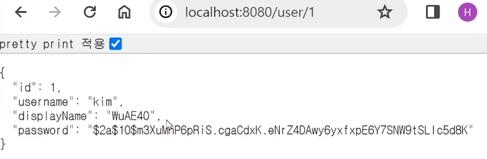

# object를 변환할 땐 DTO

- 코드를 짜다보면 object를 여기저기 보낼 일이 많음

    - 클래스간에 object를 주고받기도 하고

    - object를 유저에게 보내주기도 하고

- 그 때 object안의 데이터를 변경해서 보내야할 때가 있음

<br>


유저 상세페이지 만들기
---
- /user/1로 GET요청시 DB에 저장된 1번 유저의 이름이랑 아이디를 보내주는 API를 만들고 싶으면

> MemberController.java
```java
@GetMapping("/user/1")
@ResponseBody
public Member user() {
    var a = memberRepository.findById(1L);
    return a.get();
}
```
- Optional은 if문 쓰는게 좋겠지만 생략

> 결과

| -                    |
|----------------------|
|  |

- /user/1 경로로 접속해보면 유저정보가 나옴

    - 패스워드 부분까지 전송되어버림

        - DB에서 뽑은 모든걸 전송했기때문

<br>

### 💡 참고 
- 한글 보낼 때 인코딩이 깨지면 ResponseEntity 로 보내면 됨

<br>

- 패스워드 부분은 전송하기 싫으면 필요없는 변수를 직접 제거하는 코드 작성

    - object에서 .password 변수 자체를 없애달라고 코드를 짤 수는 없음

      - Map자료형 안에 집어넣어서 보내거나

      - 새로운 object를 만들어서 거기 집어넣어서 보내거나

<br>

---

<br>

방법1. Map에 담아서 보내기
---
> MemberController.java
```java
@GetMapping("/user/1")
@ResponseBody
public HashMap<Object, Object> user() {
    var a = memberRepository.findById(1L);
    var map = new HashMap<>();
    map.put("어쩌구", a.get().getDisplayName());
    return map;
}
```
- HashMap 하나 만들어서 원하는 자료만 put으로 담아서 보내기

<br>

---

<br>

방법2. 새로운 object를 만들어 거기 집어넣어서 보내기
---
- object 하나 새로만들어서 거기 담아서 보내도 됨

> MemberController.java
```java
class Data {
    public String username;
    public String displayName;
}
```
- 전달하고 싶은 변수만 담겨있는 클래스를 하나 만들어줌

<br>

> MemberController.java
```java
@GetMapping("/user/1")
@ResponseBody
public Data user() {
    var a = memberRepository.findById(1L);
    var data = new Data();
    data.username = a.get().getUsername();
    data.displayName = a.get().getDisplayName();
    return data;
}
```
- new 클래스() 하고 여기다가 원하는 데이터만 넣어서 유저에게 보냄

- 이런 용도의 클래스를 Data Transfer Object 라고 부름

    - 줄여서 DTO

    - object를 다른 형식으로 변환해서 보내고 싶을 때 만들어 쓰는 클래스

<br>

---

<br>

constructor 쓰기
---
- object에 데이터 집어넣을 때 하나하나 넣기보단 constructor 만들어두고 그걸로 데이터 집어넣는것이 편리

> MemberController.java
```java
@GetMapping("/user/1")
@ResponseBody
public MemberDTO getUser() {
    var a = memberRepository.findById(1L);
    var result = a.get();
    var data = new MemberDTO(result.getUsername(), result.getDisplayName());
    return data;
}
```

<br>

> MemberDTO
```java
class MemberDTO {
    public String username;
    public String displayName;
    
    Data(String a, String b){
        this.username = a;
        this.displayName = b;
    }
}
```
- constructor 생성

- 앞으로 new Data("어쩌구", "저쩌구") 사용시

    - "어쩌구"는 username에 들어가고

    - "저쩌구"는 displayName에 들어감

- 이렇게 object를 생성할 수도 있음

- constructor는 한 클래스 안에 여러개 만들어놔도 상관없음

<br>

---

<br>

public 빼먹으면 전송이 안되는 이유
---
- Data transfer object 만들 때 변수들에 public을 빼먹으면 전송이 안됨

    - object 하나를 그대로 유저에게 보내줄 때 스프링이 내부적으로 JSON 형식으로 변환해서 보내줌

        - { "변수이름" : "변수값" } 이런 형태

    - public이 안붙어있으면 스프링이 이걸 가져다가 마음대로 JSON으로 변환할 수 없어서 그런 것

        - public이 안붙어있으면 자동으로 getter를 쓰려고 하기 때문

        - getter 붙여주거나 아니면 public 쓰거나 둘 중 하나 택1

<br>

---

<br>

DTO 장점1. 타입체크
---
- object 변환하려면 Map이나 DTO 둘 중 하나 사용

- Map이 직관적이고 편할 수도 있는데 DTO로 클래스 사용시 장점 존재

- DTO 쓰면 우선 타입체크가 쉬워질 수 있음

    - 클래스라서 정확히 어떤 내용들이 들어가있는지 쉽게 보임

    - 점찍어서 자동완성도 되니까 편함

- Map으로 만들어놓으면 여기에 무슨 자료가 들어있는지 파악이 어려울 수 있음

<br>

---

<br>

DTO 장점2. 재사용이 쉬움
---
- 클래스로 만들어두면 나중에 비슷한 클래스가 하나 더 필요하면 재사용하기도 쉬움

- 지금은 username, displayName 이정도만 보내주고 있는 API를 만들었는데 나중에 이 API를 업그레이드해야한다면

    - 예를 들어 id 변수도 넣어서 보내주는 API를 만들고 싶으면?

      - 기존 API를 수정하면 되겠으나 급격하게 기존 API를 수정하면 프론트엔드 측에서 뭔가 고장나는 경우도 있음

        - 새로운 API를 하나 더 만드는 것도 좋음

<br>

> 
```java
@GetMapping("/user/1")
public String user() {
    var a = memberRepository.findById(1L);
    // username, displayName 들어간 자료 보내는 코드
}

@GetMapping("/v2/user/1")
public String user() {
    var a = memberRepository.findById(1L);
    // username, displayName, id 들어간 자료 보내는 코드
}
```
- 이런 식으로 비슷한 API를 하나 더 만들기도 함

- 이런 상황에서 Map자료를 쓰고 있다면 비슷한 코드가 매우 많이 생성됨

- DTO 쓰면 기존 코드 재활용이 가능

- 비슷한 클래스가 여러개 필요하면 constructor 문법 사용

    - extends 써도 기존 클래스를 복사해서 새로 만들 수 있음

<br>

---

<br>

다른데도 사용가능
---
- DTO 는 유저에게 데이터 보낼 때만 쓰는 것이 아니라 데이터를 특정 object 형태로 변환할 때 전부 사용해도 됨

  - ex) Service에 있는 코드에서 DB에서 찾은 뭔가를 반환시 DTO로 원하는 변수만 담아서 반환 가능

  - 용도를 잘 기억해두면 자유롭게 문법 활용 가능

- DTO를 자주 만든다면 직접 DTO에 이거저거 집어넣는 코드가 길면 라이브러리 쓰는게 편할 수도 있음

    - mapping 라이브러리 사용시 특정 object를 다른 object로 쉽게 코드 한 줄로 변환할 수 있게 도와줌

    - mapstruct 등

<br>

---

<br>

DTO 만드는 코드도 적기 싫다면
---
- DTO 일일이 만드는게 싫으면 자바 14버전 이후부터 사용할 수 있는 record 키워드 사용

    - 클래스 하나 빠르게 만들어달라는 뜻

```java
public record Person(String name, Integer age) {}
```
- 이러면 name, age라는 속성을 가진 Person 클래스를 하나 만들어줌

  - constructor, getter, toString() 등도 자동생성해줌

  - 다만 setter 이런건 사용불가능해서 값변경은 안됨

- DTO 용도로 사용할 클래스 직접 만들기 싫으면 record 키워드 사용 가능


<br>

---

<br>

정리
---
### 1. 어떤 object를 다른 형태로 변환하고 싶을 때
- Map이나 DTO 둘 중 하나 선택해 사용

### 2. 기술을 배웠으면 왜 쓰는지를 잘 기억해두기

 <br>

 

 

 

 