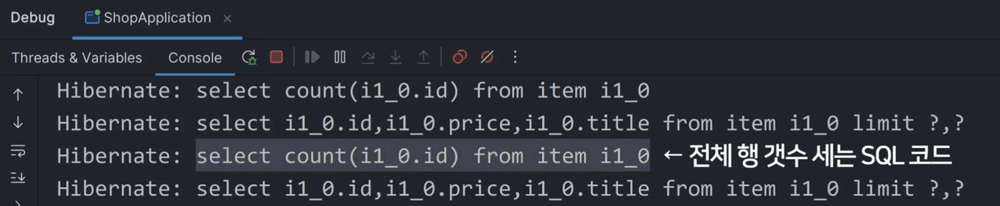

# 페이지 나누기 (pagination)

- 지금 /list 페이지 방문하면 모든 글을 다 가져와서 보여주고 있음

- 글이 100만개 있으면? 전부 가져와서 보여줄 것?

    - 그러면 유저도 부담되고 DB도 부담되기 때문에 여러 페이지로 나눠서 한 페이지에 5개만 보여주기

- 페이지 나누는걸 페이지네이션이라고 부름

<br>

| 페이지네이션               |
|----------------------|
|  |

- 다른 사이트들은 페이지 하단에 페이지 번호들이 있는데

    - 1누르면 어떤 페이지로 이동하는데 거기엔 1번부터 5번게시물 가져와서 보여줌

    - 2누르면 어떤 페이지로 이동하는데 거기엔 6번부터 10번게시물 가져와서 보여줌

<br>

---

<br>

1번 페이지 만들기
---
> ItemController.java
```java
@GetMapping("/list/page/1")
String getListPage(Model model) {
  var result = // 1번부터 5번글 가져와주세요~;
  model.addAttribute("items", result);
  return "list.html";
}
```
- 누가 /list/page/1 접속하면 1부터 5번 게시물만 넣은 list.html을 보여주기

- DB에서 모든 행을 가져오는 방법밖에 안배웠는데 id가 1 부터 5인 게시물만 가져오고 싶으면?

- SQL 잘 알면 그냥 LIMIT 문법 쓰면 되는데 JPA 함수 만들어쓰면 더 쉬움

<br>

---

<br>

일부만 가져오기
---
- 페이지 나누고 싶은 Item 테이블의 Repository 들어가서 함수 생성

> ItemRepository
```java
public interface ItemRepository extends JpaRepository<Item, Long> {
    Page<Item> findPageBy(Pageable page);
}
```
- findPageBy 쓰고 타입과 파라미터 잘 채우면 됨

  - findAll이랑 똑같이 이 테이블에 있는 데이터를 다 가져와주긴 하는데 위에서 몇개의 행만 잘라서 가져올 수 있음

  - 파라미터로 몇개 가져올지 입력하면 진짜 그것만 가져와줌

<br>

> ItemController.java
```java
@GetMapping("/list/page/1")
String getListPage(Model model) {
  Page<Item> result = itemRepository.findPageBy(PageRequest.of(0, 5));
  model.addAttribute("items", result);
  return "list.html";
}
```
- 사용할 땐 `PageRequest.of(몇번째페이지, 한페이지에몇개)` 입력해서 사용

  - 위 처럼 작성하면 id가 1번부터 5번인 글을 가져와줌

    - 정확히 말하면 1번째부터 5번째 글

- 페이지 실제로 들어가보면 글이 5개만 잘 나옴

<br>

---

<br>

2번 페이지도 만들어보자
---
- 누가 /list/page/2로 접속하면 6번부터 10번 게시물 보여주고 싶으면?

  - API 하나 더 만들면 됨

<br>

> ItemController.java
```java
@GetMapping("/list/page/2")
String getListPage(Model model) {
  Page<Item> result = itemRepository.findPageBy(PageRequest.of(1, 5));
  model.addAttribute("items", result);
  return "list.html";
}
```
- PageRequest.of(1, 5) 사용하면 6번째부터 10번째 글을 가져옴

- 3번 페이지 만들고 싶으면?

  - 비슷한 API 또 만들면 됨

- 그게 싫으면 URL 파라미터 또는 query string 사용

<br>

> ItemController.java
```java
@GetMapping("/list/page/{abc}")
String getListPage(Model model) {
  Page<Item> result = itemRepository.findPageBy(PageRequest.of(1, 5));
  model.addAttribute("items", result);
  return "list.html";
}
```
- 위 코드처럼 URL 파라미터 문법을 사용하면 비슷한 API 여러개 만들 필요 없음

- /list/page/1, /list/page/2 등 아무렇게나 접속해도 페이지를 잘 보여줌

  - 이러면 1번째 글부터 5번째 글만 보여줌

  - 해결하고 싶으면?

    - 누가 /list/page/1로 접속하면 PageRequest.of(0, 5)를 넣어야함

    - 누가 /list/page/2로 접속하면 이게 PageRequest.of(1, 5)를 넣어야함

    - 누가 /list/page/3으로 접속하면 PageRequest.of(2, 5)를 넣어야함

<br>

> ItemController.java
```java
@GetMapping("/list/page/{abc}")
String getListPage(Model model, @PathVariable Integer abc) {
  Page<Item> result = itemRepository.findPageBy(PageRequest.of(abc-1, 5));
  model.addAttribute("items", result);
  return "list.html";
}
```
- PageRequest.of(URL에유저가입력한거-1, 5) 집어넣으면 됨

<br>

---

<br>

페이지네이션 버튼만들기
---
-  /list/page/1 API를 만들었는데 유저들은 직접 입력하진 않기 때문에 버튼을 만들어주는게 좋음

- Page 타입가지고 있는 변수에서 몇개의 버튼이 필요한지 등 추가정보들을 쉽게 출력해볼 수 있음

<br>

> ItemController.java
```java
@GetMapping("/list/page/{abc}")
String getListPage(Model model, @PathVariable Integer abc) {
  Page<Item> result = itemRepository.findPageBy(PageRequest.of(abc-1, 5));
  System.out.println(result.getTotalPages());
  System.out.println(result.hasNext());
}
```
- getTotalPages() : 총 몇페이지가 있는지 알려줌

- hasNext() : 다음 페이지가 있는지 알려줌

<br>

---

<br>

Page말고 Slice 타입도 있음
---

| -                    |
|----------------------|
|  |

- Page 타입으로 가져오는 것의 단점

  - 방금 만든 페이지 방문할 때 마다 SQL 쿼리문 실행되는걸 살펴보면 count 어쩌구라는 SQL 문법도 실행해줌

  - count : 지금 테이블에 행이 총 몇개있는지 세어주는 것

    - getTotalPages() 쓰기 위해 count 문법도 실행해주는 것

    - 성능적으로 부담이 될 수 있음

  - 그럴 땐 Page 타입 말고 Slice 타입으로 가져오면 됨

<br>

> ItemRepositoy.java
```java
public interface ItemRepository extends JpaRepository<Item, Long> {
  Page<Item> findPageBy(Pageable page);
  Slice<Item> findSliceBy(Pageable page);
}
```
- Slice와 Page는 별 차이는 없는데 Slice는 총 몇 개의 페이지가 있는지는 안알려줌

  - 부담스러운 count 문법을 실행 안하기 때문에 나중에 좀 더 성능적으로 이점이 있을 수 있음

- 전체 페이지 갯수가 필요없으면 사용

  - 더보기 버튼만 만들 때 유용

<br>

### 💡 참고
- find나 findAll 뒤에도 findAllByTitle 이런 식으로 함수를 만들어두면 특정 컬럼으로 검색 가능

- Page 타입에 담아서 X개만 가져오라고 할 수도 있음

- findPageByTitle 이런 식으로 작명 잘하고 Page타입에 담아보기

<br>

---

<br>

응용
---
### 각 페이지로 이동하는 버튼 만들기

- \<a>태그 쓰면 페이지 이동 링크를 쉽게 만들 수 있음

- 전체 페이지 갯수는 Page타입 변수에다가 .getTotalPages() 해보면 나옴


> list.html
```html
<a href="/list/page/1">1번페이지</a>
<a href="/list/page/2">2번페이지</a>
...
```
- 이런 링크를 페이지 하단에 추가

- 하드코딩하기 싫으면 타임리프 반복문 사용

  - 총 몇개 생성할지 모르겠으면 서버에서 getTotalPages() 보내서 그만큼 반복문 돌리라고 하면 됨

<br>

- 타임리프 이용해 반복문 가능 

> list.html
```html
<div>
    <div th:each="pageNum : ${#numbers.sequence(1, totalPages)}">
        <a th:href="@{/list/page/{num}(num=${pageNum})}" th:text="${pageNum}"></a>
    </div>
</div>
```

> ItemController.java
```java
    @GetMapping("/list/page/{no}")
    String getListPage(Model model, @PathVariable Integer no) {
        Page<Item> result = itemRepository.findPageBy(PageRequest.of(no-1, 5));
        System.out.println(result.getTotalPages());
        System.out.println(result.hasNext());
        int totalPages = result.getTotalPages();
        if (totalPages == 0) totalPages = 1;

        model.addAttribute("items", result.getContent());
        model.addAttribute("totalPages", totalPages);
        return "list";
    }
```

<br>
