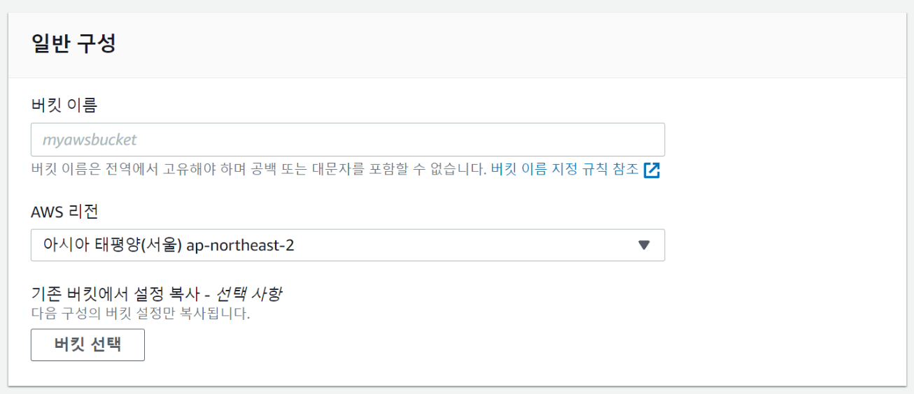
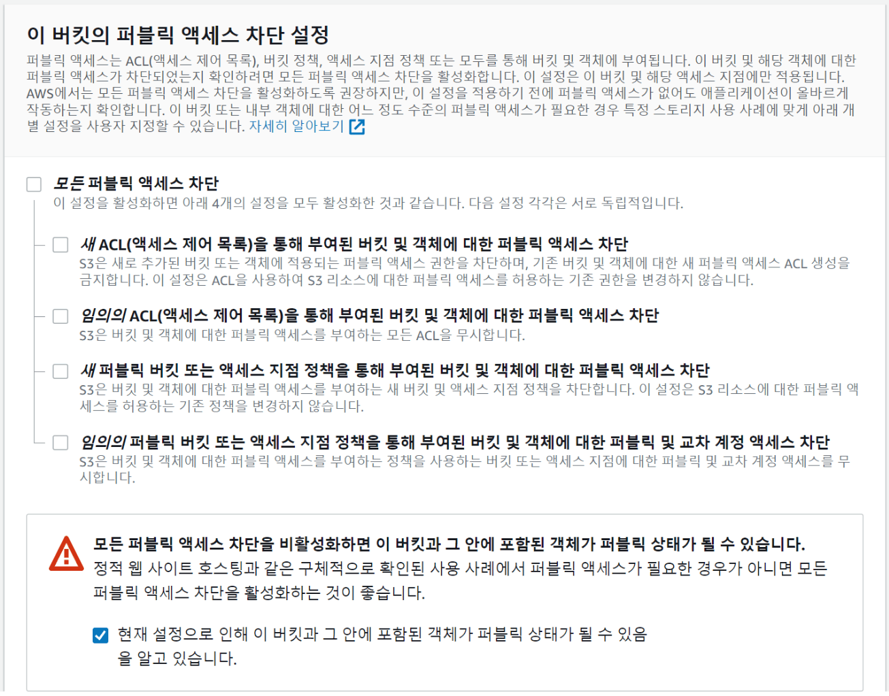
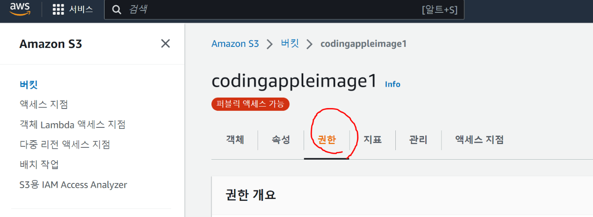
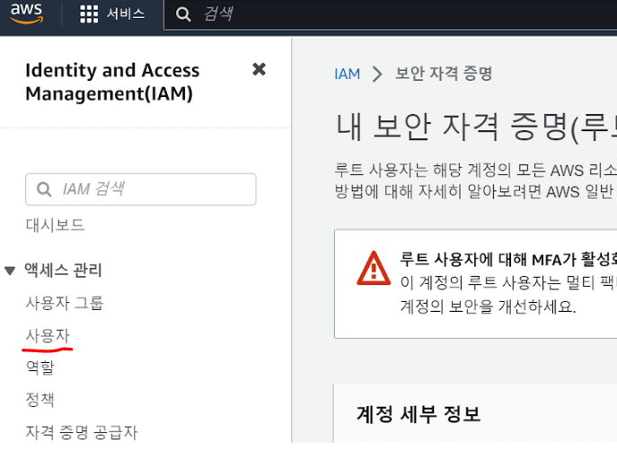
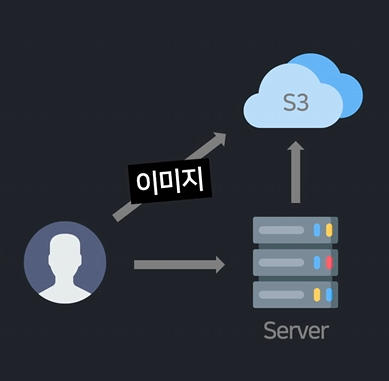

# 이미지 업로드 기능 1 (S3 셋팅)
- 글작성시 이미지도 업로드할 수 있게 만들어보기

- 이미지는 DB에 넣기 너무 크기 때문에 보통은 하드에 저장해놓고 이미지 저장 경로만 DB에 보관해놓음

- 서버컴퓨터 하드에 저장하기도 하는데 용량이 점점 커지면 문제가 생길 수도 있고 나중에 배포할 때 하드 이용이 불가능한 경우가 많음

- 보통은 파일저장용 클라우드 서비스 빌려서 거기에 업로드

  - AWS의 S3 클라우드 서비스

    - AWS 처음 가입하고 카드등록 해놓으면 S3도 무료로 5GB까지 1년 이용가능

    - AWS S3 사용해서 이미지 파일 올리는 법

<br>

---

<br>

AWS S3 셋팅
---
- AWS 로그인하고 S3 검색

- 버킷만들기 버튼 클릭

<br>

| 버킷                   |
|----------------------|
|  |


- 버킷은 가상 하드디스크 하나라고 생각하면 됨

- 버킷이름은 다른 유저들이랑 겹치지 않게 유니크하게 작명

- 한국에서 서비스할 것이면 '서울' 선택

<br>

|퍼블릭 엑세스 설정|
|-|
||

- 퍼블릭 액세스 설정을 이렇게 바꿔줘야 개발시 편함

- ACL 정책은 예전에 쓰던거라 나중에 잘되면 맨 위에 2개 정도 체크

<br>

---

<br>

버킷정책 수정하기
---
- 이렇게만 하면 아무나 내 버킷에다가 이미지를 읽고 쓸 수 있게 되는 것

- 보안을 신경써야한다면

  - 모든 사람은 읽기가 가능하게

  - 관리자만 업로드, 수정, 삭제가 가능하게 변경

<br>

|버킷 정책|
|-|
||

- '권한' 눌러서 '버킷 정책' 편집 클릭

- 누가 버킷을 읽기, 수정, 삭제 할 수 있는지 정의하는 부분

<br>

---

<br>

S3 버킷 정책 설정
---
> 버킷 정책
```
{
    "Version": "2012-10-17",
    "Statement": [
        {
            "Sid": "1",
            "Effect": "Allow",
            "Principal": "*",
            "Action": "s3:GetObject",
            "Resource": "arn:aws:s3:::님들버킷명/*"
        },
        {
            "Sid": "2",
            "Effect": "Allow",
            "Principal": {
                "AWS": "arn:aws:iam::님들AWS계정ID:root"
            },
            "Action": [
                "s3:PutObject",
                "s3:DeleteObject"
            ],  
            "Resource": "arn:aws:s3:::님들버킷명/*"
        }
    ]
}
```
- 누가 버킷에 접근가능한지 권한 설정하는 부분

- 첫째는 아무나 내 버킷 파일을 읽기가 가능하다는 뜻

- 둘째는 특정 사람만 버킷에 업로드와 삭제가 가능하다고 제한해놓겠다는 뜻

- AWS 계정 ID 적으면 나만 업로드와 삭제가 가능한데 AWS 계정 ID는 사이트 우측 상단에 나옴

<br>

---

<br>

S3 버킷 CORS 설정
---
- 권한 메뉴에서 CORS 설정도 바꿀 수 있음

> 권한 메뉴
```html
[
    {
        "AllowedHeaders": [
            "*"
        ],
        "AllowedMethods": [
            "PUT",
            "POST"
        ],
        "AllowedOrigins": [
            "*"
        ],
        "ExposeHeaders": [
            "ETag"
        ]
    }
]
```
- 어떤 사이트에서 이 버킷에 업로드가 가능한지 약간의 보안장치를 만드는 부분

- AllowedOrigins에 * 말고 내 사이트 주소를 추가하면 거기서만 업로드를 허락해줌

- 나중에 사이트 발행하고 실제 사이트주소 입력해보기

<br>

---

<br>

Access 키 발급
---
- 직접 AWS 사이트 들어가서 이미지 올리진 않음

  - 서버코드에서 S3를 조작해야 함

- 그러려면 코드짜면 되는데 Access key라는게 필요함

  - 서버에서도 내 권한으로 이미지 업로드 가능

- AWS 상단 검색창에서 IAM 검색

  - 중간쯤에 `액세스키 만들기`가 있는데 하나 만들어서 액세스키와 비밀키 2개 세트를 코딩할 때 사용하게 안전한 곳에 보관

  - 분실하면 지우고 새로 생성

    - 이거 털리면 AWS 요금 많이 나오기 때문에 잘 관리하기

- 애초에 AWS 사이트도 다른 곳에서 사용중인 아이디/비번 그대로 쓰지 않는게 좋음

<br>

💡 참고

| -                    |
|----------------------|
|  |

- 더 안전하게 가고 싶으면 AWS 전체를 컨트롤할 수 있는 액세스 키를 만드는거보다는 IAM 들어가 사용자를 새로 생성

- 그 사용자에는 S3FullAccess 권한만 준 다음에 그 사용자의 액세스키를 발급해서 가져오기

  - 나중에 잘못해서 키가 털려도 S3 이용권한만 털림

- 버킷정책 설정하는 곳의 'AWS유저ID' 적는 란에 그 사용자의 ID 적어야 함

<br>

---

<br>

S3 라이브러리 설치
---
- 서버에서 AWS S3 기능을 쓰려면 라이브러리 설치랑 셋팅 필요

<br>

> build.gradle
```gradle
implementation 'io.awspring.cloud:spring-cloud-aws-starter-s3:3.1.1'
```
- build.gradle 파일에 추가

- 예전에 쓰던 spring-cloud-aws-starter:2버전과 문법 상이함

<br>

> application.properties
```properties
spring.cloud.aws.credentials.accessKey=액세스키
spring.cloud.aws.credentials.secretKey=시크릿키
spring.cloud.aws.s3.bucket=버킷명
spring.cloud.aws.region.static=ap-northeast-2
```
- application.properties 파일에 이런 정보도 추가

- 서울에 버킷 만들어놨으면 ap-northeast-2 넣어주기

- 최신 라이브러리는 이것만 잘 적어놓으면 알아서 셋팅까지 완료해줌

<br>

---

<br>

이전버전 라이브러리 셋팅용 코드
---

> S3Config.java
```java
@Configuration
public class S3Config {

    @Value("${cloud.aws.credentials.accessKey}")
    private String accessKey;
    @Value("${cloud.aws.credentials.secretKey}")
    private String secretKey;
    @Value("${cloud.aws.region.static}")
    private String region;
    
    @Bean
    public AmazonS3Client amazonS3Client() {
        BasicAWSCredentials credentials = new BasicAWSCredentials(accessKey, secretKey);
        return (AmazonS3Client) AmazonS3ClientBuilder
        .standard().withRegion(region)
        .withCredentials(new AWSStaticCredentialsProvider(credentials))
        .build();
    }

}
```
- spring-cloud-aws-starter:2 사용하거나 amazonS3Client 이런 변수가 필요하면

  - 아무데나 S3Config.java 파일 만들어서 복붙하면 됨

<br>

---

<br>

Presigned URL
---
- 원래 이미지를 S3에 올리는 방식

  - 이미지를 일단 POST요청으로 서버로 보내서

  - 서버는 이미지를 확인해본다음에 그걸 S3에 업로드

<br>

| Presigned URL                |
|-----------------|
|  |

- S3에서 이미지를 업로드하는 Presigned URL 방식

- 유저가 직접 S3에 업로드를 해버리는 것

- 장점 : 서버 부담이 덜함

  - 그냥 풀어주면 위험하기 때문에 서버에게 잠깐 허락을 받고 S3에 업로드하는 식으로 코드 작성

- 구체적 흐름

  - 유저가 이미지를 선택하면 그 이름의 이미지를 업로드해도 되냐고 서버에게 허락 받음

  - 서버는 허락해줌 

    - 정확히 말하면 PresignedURL 발급해줌

  - 유저는 10분동안만 이 URL로 이미지를 더해서 POST나 PUT요청을 날릴 수 있음

    - 날리면 이미지 업로드 끝

  - 업로드했던 URL을 그대로 사용하면 이미지 출력 가능

- 단점 : 유저가 이상한거 업로드하는거 막기가 힘들 수 있음

    - 업로드하는 이미지 사이즈를 줄이고 싶으면 자바스크립트로 압축하거나 이미지 축소하는 서버리스 기능 만들어야 함

<br>

---

<br>

# 이미지 업로드 기능 2 (Presigned URL)

- S3에 이미지 업로드하는 기능 (PresignedURL 방식)

  - S3 라이브러리 사용법 찾아서 따라하면 됨

<br>

### 1. 유저가 이미지를 고르면 서버에 presignedURL 발급해달라고 요청
- 발급시 이미지 이름정도가 필요해서 이미지 이름도 서버로 보내면 됨

<br>

### 2. 서버는 이름 전송받으면 이걸로 PresignedURL을 발급해서 보내줌
- S3 라이브러리 설치한거 도움받으면 발급 쉽고 URL의 유통기한 설정도 가능

<br>

### 3. 그걸 받으면 유저는 그 URL로 이미지와함께 PUT요청을 날림
- 이미지가 S3에 저장됨

<br>

### 4. 저장이 완료되면 그 이미지의 URL을 알 수 있는데 원하는 곳에서 사용하면 됨

<br>

---

<br>

presignedURL 발급
---
- write.html에 이미지를 고를 수 있는 \<input> 하나 추가

> write.html
```html
<input type="file" onchange="서버야 URL줘~~">
```
- `type="file"` : 파일선택하는 \<input>을 만들 수 있음

- `onchange=""` : 유저가 여기다가 뭔가 입력했을 때 자바스크립트 실행해달라는 뜻

  - 거기다가 fetch() 넣어서 서버로 presignedURL 달라고 요청

  - 파일 이름을 넣어서 요청을 날려야하기 때문에 코드가 길어지니 함수로 만들어서 집어넣기

<br>

> write.html
```html
<input type="file" onchange="getURL(this)">

<script>
    function getURL(e){
      let name = encodeURIComponent(e.files[0].name)
      fetch('/presigned-url?filename=' + name)
    }
</script>
```
- 파일선택시 `getURL()` 함수를 실행하라고 함

- 함수 안에서 `e.files[0]` 쓰면 유저가 선택한 파일

    - `e.files[0].name` 쓰면 유저가 선택한 파일의 이름

- console.log()로 출력 → 출력한건 크롬 콘솔탭에 나옴

- 서버에 요청을 날릴 때 파일명도 query string으로 함께 전송

    - 파일명에 이상한 문자가 들어있으면 잘 안갈 수도 있음 
  
    - 파일명을 인코딩해서 보내는게 좋음

      - `encodeURIComponent()` 라는 기본함수에 담으면 인코딩해줌

<br>

---

<br>

서버는 요청받으면 URL 발급해서 보내줌
---
- API 하나 생성

<br>

> ItemController.java
```java
@GetMapping("/presigned-url")
@ResponseBody
String getURL(@RequestParam String filename){
    var result = presignedURL 발급해주기~~;
    return result;
}
```
- 유저가 보낸 파일명은 filename 여기 들어있음

- 그 다음에 presignedURL을 발급해서 여기서 보내주면 됨

- 코드가 길기 때문에 따로 함수를 만들어 구현

  - 함수는 Service 클래스같은데다가 만드는게 나음

<br>

> S3Service.java
```java
@Service
@RequiredArgsConstructor
public class S3Service {

    @Value("${spring.cloud.aws.s3.bucket}")
    private String bucket;
    private final S3Presigner s3Presigner;
    
    String createPresignedUrl(String path) {
        var putObjectRequest = PutObjectRequest.builder()
        .bucket(bucket)
        .key(path)
        .build();
        var preSignRequest = PutObjectPresignRequest.builder()
        .signatureDuration(Duration.ofMinutes(3))
        .putObjectRequest(putObjectRequest)
        .build();
        return s3Presigner.presignPutObject(preSignRequest).url().toString();
    }

}
```
- 클래스 하나 만들어서 위 코드 작성시 Presigned URL 발급해주는 함수 생성 가능

- 라이브러리 사용법일 뿐이라 그냥 복붙해서 쓰면 끝

- `s3Presigner.presignPutObject(preSignRequest).url().toString()` 쓰면 presignedURL 발급됨

  - 여기엔 여러가지 설정들이 들어가야함

    - `.bucket()` : 업로드할 버킷이름

    - `.key()` : 업로드할 경로 (파일명)

    - `.signatureDuration()` : URL의 유효기간

- `@Value("${spring.cloud.aws.s3.bucket}")` : application.properties 파일에 있던 내 버킷명을 가져오라는 뜻

  - `@Value`는 비슷한게 몇 개 있어서 import시 잘 해와야함

<br>

> ItemController.java
```java
@GetMapping("/presigned-url")
@ResponseBody
String getURL(@RequestParam String filename){
    var result = s3Service.createPresignedUrl("test/" + filename);
    return result;
}
```
- 방금 만든 함수를 API에서 사용

<br>

---

<br>

유저는 URL 받으면 그 URL로 이미지 넣어서 PUT요청
---
- 서버에서 보낸 URL로 PUT요청 날리면 업로드 끝

<br>

> write.html
```html
<input type="file" onchange="getURL(this);">

<script>
  async function getURL(e){
    let file = e.files[0]
    let name = encodeURIComponent(file.name)
    let result = await fetch('/presigned-url?filename=' + name)
    result = await result.text()

    let 결과 = await fetch(result, {
      method: 'PUT',
      body: e.files[0]
    })

    console.log(결과.url.split("?")[0])
    if (결과.ok) {
      document.querySelector('img').src = 결과.url.split("?")[0]
    }
  }
</script>
```
- 서버에서 받아온 URL은 result 변수에 저장

- 그 URL로 PUT요청하라고 코드작성

- `await` : .then() 붙이기 귀찮을 때 쓰는 대체 문법

- PUT요청이 성공하면 그 URL을 그대로 img 태그에 집어넣거나 하면 이미지가 보임

<br>

---

<br>

응용
---
### 1. 어떤 글의 상세페이지 들어가면 그 글과 함께 저장해둔 이미지를 보여주는 기능

- 이미지 URL을 \안에 집어넣으면 이미지가 보임

- 이미지 URL이 없는 경우 대신 다른걸 보여달라고 if문 사용

- 글 발행시 이미지 URL도 보내서 함께 DB에 저장

  - 글을 하나 발행할 때 이미지 URL 저장할 수 있는 컬럼 생성

  - 상세페이지에서 글을 보여줄 때 \태그 하나 만들어서 거기에 이미지 URL 집어넣으면 끝

<br>

### 2. /list 페이지에도 이미지 보여주기

<br> 

 


