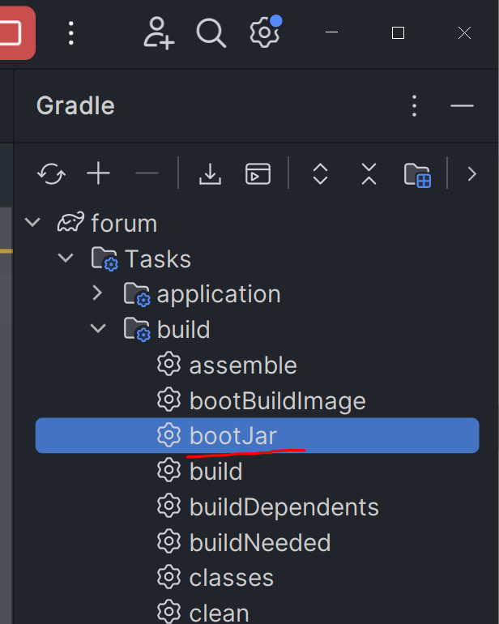
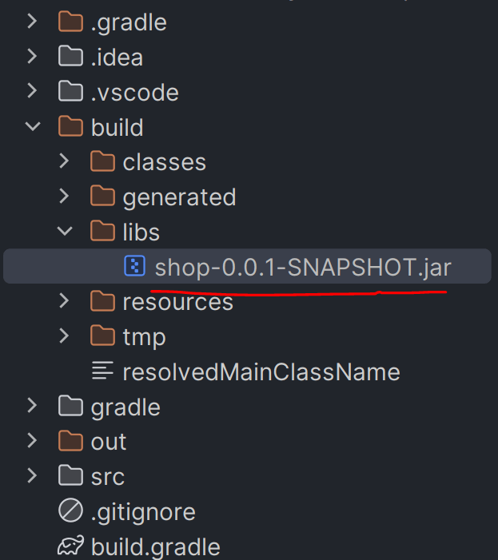
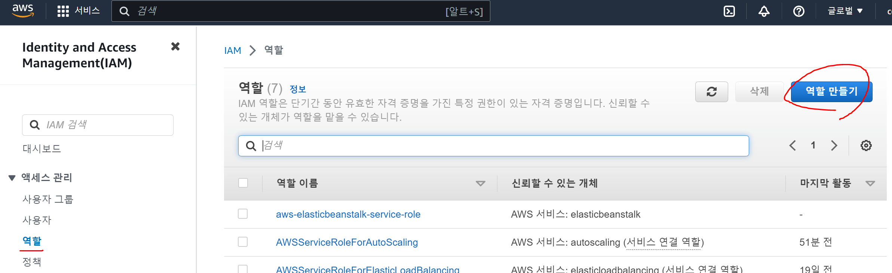
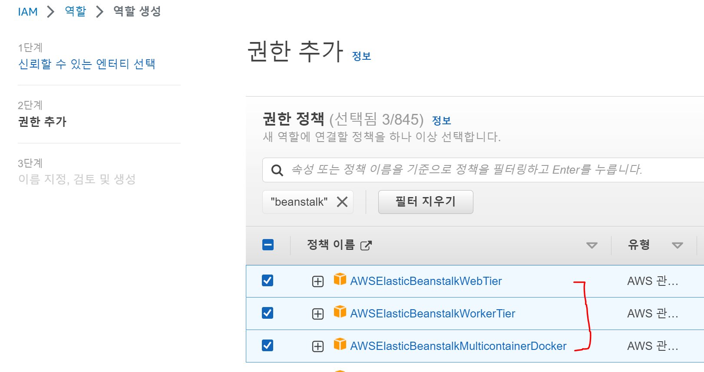
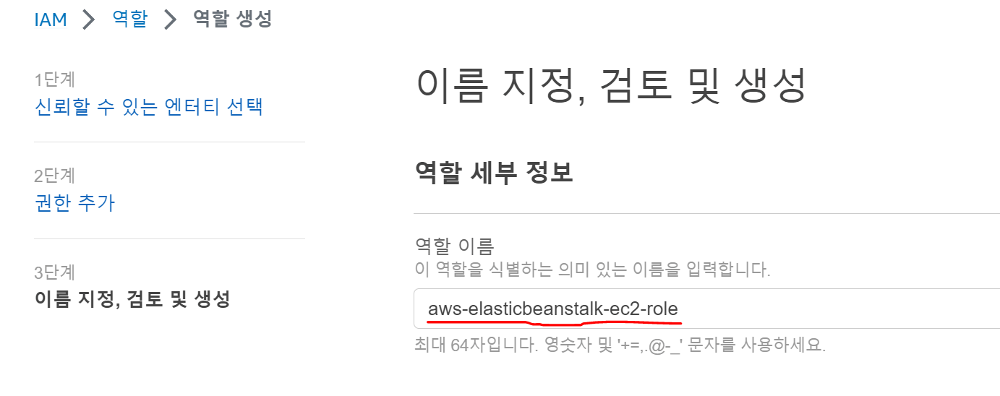
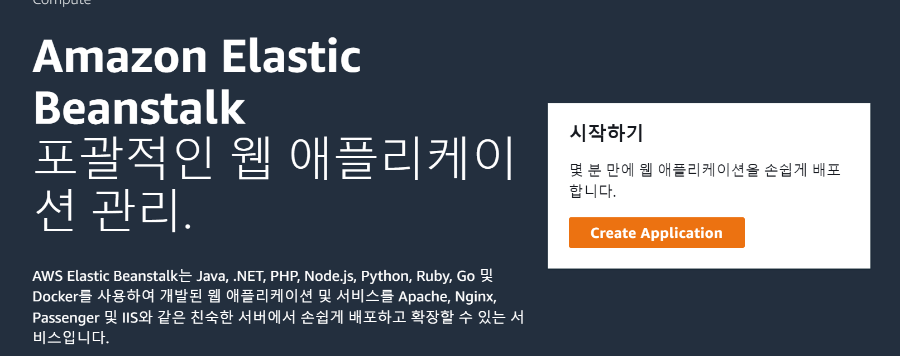
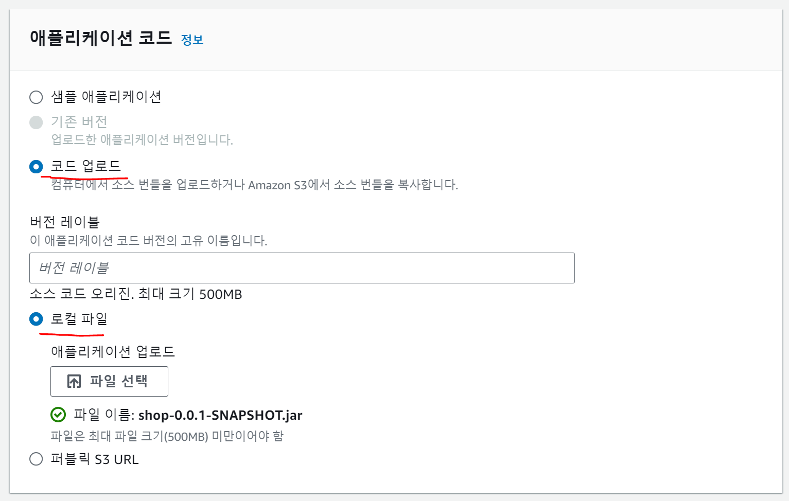
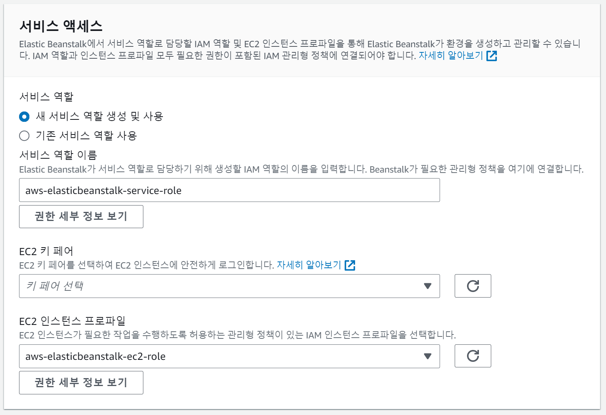
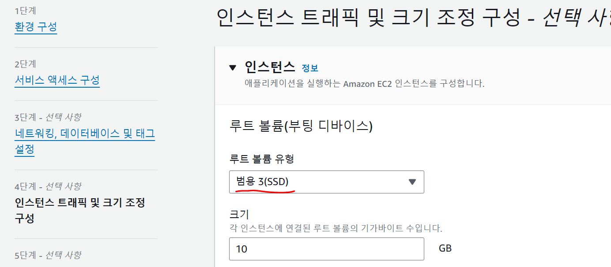
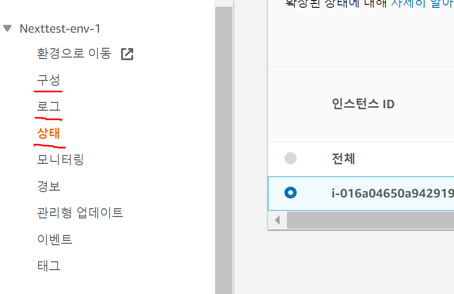

# AWS Elastic Beanstalk에 Spring boot 서버 배포
- 코드를 다 짰으면 gradle 도움을 받아서 buildJar 명령 수행

- 코드가 .jar 파일로 압축되는데 그걸 터미널에서 실행하면 컴퓨터에서 서버를 띄울 수 있음

- 브라우저 주소창에 http://컴퓨터IPv4주소:8080 치면 누구나 내 웹서버에 접속 가능

  - 클라우드 서비스 업체에서 컴퓨터를 빌려서 서버를 띄워놓는게 안정적

  - AWS 이용

 

---

 

AWS Elastic Beanstalk
---
- AWS에는 EC2 상품이 가장 유명한데 컴퓨터 한대를 빌리는 상품

  - 그 컴퓨터에 Java 설치하고 .jar파일 거기로 옮기고 그거 실행해서 서버띄워놓으면 끝

  - 터미널을 안다뤄봤으면 오래걸리고 나중에 이상해졌을 때 해결도 어려움

- 편하게 하려면 AWS Elastic Beanstalk 상품 사용

  - 코드 업로드밖에 신경쓸게 없음

    - 코드만 올리면 알아서 자동으로 EC2 인스턴스 빌려서 서버띄워주고 무료 도메인도 하나 연결해줌

    - 유저 많아지면 확장도 쉽게 가능하고 버전관리도 해줌

    - 서버죽어도 서버 자동으로 여러번 재시작해줌

    - Nginx로 reverse proxy도 알아서 넣어줌

  - 가격도 거의 차이없음

- AWS 가입 후 카드 등록하면 1년간 무료로 저사양 컴퓨터 한대 빌려주니까 AWS Elastic Beanstalk에 올려보기

 

---

 

다른 옵션
---
- 구글 클라우드에는 App Engine

- 마이크로소프트 Azure에는 App Services

- 대부분 비슷한 서비스를 제공하며 따라하기 쉬움

- docker로 만든 것들도 쉽게 올릴 수 있음

- 데이터베이스 호스팅받은 곳이랑 같은 곳에 올리는게 더 좋음

  - Azure에서 데이터베이스 호스팅받았으면 Azure App Service에 Spring boot 올리는게 나음

  - 지금은 연습용일 뿐이고 다들 AWS 좋아해서 AWS 사용

 

---

 

배포전 체크사항
---
### 1. AWS 컴퓨터도 DB에 접속을 해야 데이터 접근 가능
- 데이터베이스 호스팅받은 곳의 설정 들어가서 접속가능 IP를 모든 IP에서 접속가능하게 변경

  - 데이터베이스 처음 셋팅할 때 미리 해놓음

- 누구나 접속가능하게 만들면 위험함

  - 더 안전하게 하고 싶으면 나중에 DB와 서버 둘 다 같은 호스팅사이트에 올리고 VPC설정 만지기

 

### 2. AWS Elastic beanstalk 쓰다보면 8080포트가 아니라 5000포트로 접속되게 만드는 경우 존재
- 안되면 application.properties 파일에 server.port=5000 항목을 추가

 

---

 

배포방법1. 빌드눌러서 .jar 파일 만들기
---

| -                    |
|----------------------|
|  |

- 소스코드를 .jar 파일로 압축하면 아무데서나 쉽게 실행 가능

- Intellij 에디터의 경우 우측에 Gradle 버튼이 있는데 그거 누르면 여러가지 명령어가 나옴

  - 거기서 bootJar 만들기 누르면 .jar 파일 생성 가능

- 아니면 프로젝트 폴더에서 터미널 열어서 ./gradlew bootJar 라고 입력해도 .jar 파일 생성 가능

 

| -                    |
|----------------------|
|  |

- 위 경로에 .jar 파일을 만들어줄텐데 내 소스코드를 압축한 파일임

- 저게 들어있는 폴더에서 터미널 켜서 `java -jar 어쩌구.jar` 입력해두면 웹서버가 알아서 실행됨

- 이걸 서버컴퓨터에서 하면 되면 배포 끝

  - Elastic Beanstalk 사용해볼거라 자동으로 알아서 해줌

 

### 💡 참고
- 0.0.1 같은 버전 숫자를 바꾸고 싶으면 build.gradle 파일 열어서 수정

 

---

 

배포방법2. AWS 가입
---
- AWS 아이디 없으면 aws.com 가서 가입하고 카드등록

- 카드등록까지 해야 1년 간의 AWS 무료 이용 가능

- 로그인하면 우측 상단에 지역선택 가능
  
  - 사이트를 서울에서 운영할거면 '서울'로 설정

 

---

 

배포방법3. IAM 역할만들기
---
- AWS 사이트 상단 검색창에 IAM 검색

 

| -                    |
|----------------------|
|  |

- 좌측 메뉴의 역할 눌렀을 때

  - 목록에 aws-elasticbeanstalk-ec2-role 역할 이름이 없으면 역할 만들기 클릭

- elastic beanstalk이 ec2 맘대로 사용할 수 있게 만드는 과정

 

| -                    |
|----------------------|
|  |

- 1단계 : 신뢰할 수 있는 엔터티는 AWS 서비스, 사용사례는 EC2 선택

- 2단계 : 권한추가메뉴에선 아래 3개 찾아서 체크마크

  - AWSElasticBeanstalkWebTier

  - AWSElasticBeanstalkWorkerTier

  - AWSElasticBeanstalkMulticontainerDocker

 

| -                    |
|----------------------|
|  |

- 3단계 : 이름 지정부분은 aws-elasticbeanstalk-ec2-role 기입하고 끝내기

- 예전엔 자동이었는데 지금은 직접 설정해줘야 함

 

---

 

배포방법4. Elastic beanstalk
---

| -                    |
|----------------------|
|  |

- AWS 상단 검색창에 Elastic beanstalk 검색

  - 앱생성이나 환경생성 버튼 클릭하여 진행

 

### 1단계 : 이것저것 작성
- 애플리케이션 이름 아무거나 작명

- 환경 이름 아무거나 작명 (아마 자동생성)

- 플랫폼은 Java, 브랜치 버전은 내가 쓰던 자바 버전 선택

  - 까먹었으면 build.gradle 파일 확인

- 사전설정 선택하라고 나오면 '단일 인스턴스' 선택

 

| -                    |
|----------------------|
|  |

- 코드 업로드 눌러서 아까 만든 .jar 파일 올려주기

- 버전레이블은 방금 업로드한 소스코드 버전 기록용 

  - 작명하고 싶으면 하기

 

### 2단계

| -                    |
|----------------------|
|  |

- 위처럼 잘 되어있나 체크하고 넘어가기

  - 안되어있으면 위에서 IAM 설정이 안된 것

 

### 3단계 : 건드릴 필요없음

 

### 4단계

| -                    |
|----------------------|
|  |

- 루트볼륨 유형을 gp3 또는 범용3로 선택

  - IOPS 3000까지, 처리량은 125까지 무료

 

### 5단계

| -                    |
|----------------------|
|  |

- t3.micro가 프리티어에서 쓸 수 있는 기기라서 이거 설정

  - 돈내고 빠른걸 원하면 다른거 선택

- 간혹 배포이상하게 안되면 램 부족 이슈인 경우가 많아서 t3.small 이상으로 써보면 됨

 

### 5단계 : 모니터링을 기본 vs 강화됨 선택하라고 하면 기본으로 선택

 

- 나머지는 만질 필요 없고 다음 다음 누르면 배포 끝

- 몇분 기다리면 어쩌구.com 주소 뜨는데 거기 들어가면 내 사이트로 아무나 접속 가능

  - 까먹고 1년 냅두다가 요금청구되기 싫으면 안쓰면 애플리케이션 & 환경을 각각 삭제

  - AWS 검색창에 S3 입력해서 거기 있는 데이터 백업본도 삭제해야 요금으로부터 안전

 

### Q. 사이트 업데이트하고 싶다면?
- jar 파일 또 만들어서 다시 업로드

- 관리자 페이지에 업로드 및 배포 버튼 존재

- 배포 자주하면 1년 무료계정도 elastic compute cloud 요금 청구됨

 

### Q. 배포시 AWS elastic beanstalk 100.0 % of the requests are erroring with HTTP 4xx 에러 발생
- 메인페이지 접속이 불가능하면 보통 해당 에러

- DB접속 셋팅안해놔서 그런 경우가 많아서 DB 호스팅받은곳 들어가서 접속가능한 IP 셋팅 제대로 했나 확인

 

### Q. The instance profile aws-elasticbeanstalk-ec2-role 없다는 에러

- 위에서 IAM 역할 만든거 지우고 다시 생성

- 배포할 때 2단계에서 새 서비스 역할 생성 눌려있나 체크

 

| -                    |
|----------------------|
|  |

- 구성 메뉴에선 환경 설정 가능

- 로그 메뉴에선 터미널 로그출력이 가능 

  - 이상한 에러나면 에러메세지 확인가능

- 상태 메뉴에선 인스턴스 안쓰는게 있으면 끄고 재부팅 가능

  - 인스턴스는 가상 컴퓨터 한대

- 모니터링을 자동으로 해줌

  - 400, 500 에러같은게 너무 잦거나 접속이 안되는 페이지가 있으면 알려줌

- 환경마다 하나의 application을 실행해둘 수 있는데 application은 프로젝트 버전1개라고 생각하면 됨

 