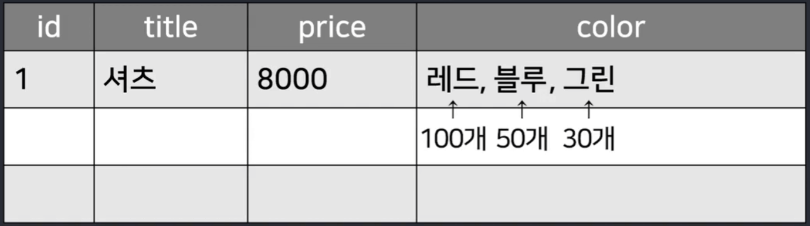

# 댓글기능 (정규화)   

- 상품리뷰 기능을 만들어보기

- 리뷰 : 상품마다 달린 댓글 

  - 그냥 댓글이라고 생각하고 만들기

<br>

댓글내용 어디에 어떻게 저장할지
---
- 댓글 작성시 DB에 저장해야하는데 어디에 어떻게 저장해야 좋을지 생각

<br>

|-|
|-|
||

- 댓글은 글마다 달려있어야하기 때문에 Item 테이블에 컬럼 하나 새로 만들어서 거기에 댓글 보관?

  - 댓글이 1억개 달리면?

    - 원하는 댓글 하나만 찾고 수정하고 삭제하는 작업이 매우 어려울 듯

- 여러가지 자료들은 한 칸에 밀어넣는 것 보다는 별도의 행에 하나하나 저장하는게 좋음

  - 여긴 Item 저장하는 테이블

    - Comment 테이블을 새로 만들고 거기다가 댓글들을 하나하나 저장

<br>

### Q. 그래도 행이 1억개 생기는거 아님?

- 인덱스 만들면 행 1억개가 있어도 하나 찾는걸 매우 잘해서 상관없음

<br>

|-|
|-|
||

- 다른 테이블에 저장하면 됨

- 별도의 테이블과 행으로 빼는 것을 정규화라고 함

<br>

---

<br>

정규화
---
- 항상 정규화하는게 맞는건 아님

  - ex) 한 칸에 문자를 대여섯개 정도만 들어갈 것 같으면 그냥 콤마로 구분해서 한칸에 문자로 다 넣어도 상관X

- 상품마다 색상종류 같은걸 상품마다 서너개씩 적고 싶다고 가정

  - 이런 데이터들은 어디다가 보관?

    - 정규화한다고 다른 테이블이랑 행으로 빼도 ok

    - 1억개 달릴 일이 없고 검색할 일도 없을 것 같다면 그냥 한 칸에 넣는게 효율적일수도..

<br>

| -                    |
|----------------------|
|  |


- 나중에 색상이 수백개 추가될 것이면 별도의 테이블과 행으로 빼는게 나을 수도 있음

- 색상마다 종속되는 다른 컬럼이 또 필요하면 (ex. 색상마다 재고수량이 저장되어야하면)

  - 별도의 테이블과 행으로 빼서 다른 테이블에 저장해두는 것도 나쁘지 않음

<br>

- 별도의 행으로 빼는 기준

  - 컬럼하나 만들 때 한 칸에 개별 데이터가 나중에 1억개가 들어갈 수도 있는 경우

  - 개별 데이터마다 종속된 다른 컬럼이 필요한 경우

- 정규화 완료한 테이블을 정규형이라고 부름

- 제1 제2 제3 정규형 이렇게 부르는 개념 존재

<br>

---

<br>

다른 테이블로 뺄 때 주의점
---

| -                    |
|----------------------|
|  |

- 별도의 테이블 만들어서 댓글들을 하나하나 보관하면 될 것 같은데

  - 이것만 봐선 어떤 글에 달렸던 댓글인지 어떻게 알까?

    - 알 수 없으므로 다른 테이블로 행들을 뺐으면 이게 원래 어떤 행에 달려있었는지 표기해주는게 좋음

<br>

| -                    |
|----------------------|
|  |

- 댓글이 어디 달렸었는지 부모 행을 표기해두면 됨

  - 나중에 id가 1인 글에 달린 댓글을 가져오고 싶을 때

    - `어떤글에달렸나 컬럼이 1인 댓글 가져오라`고 코드를 짤 수 있으니까 쉽게 가져올 수 있음

- 결론 : 다른 행과 테이블로 뺄거면(정규화를 할거면)

  - 원래 어떤 행에 있었던건지 이렇게 표시해주는게 좋음

<br>

---

<br>

댓글 저장용 테이블
---
- 댓글 저장용 테이블 생성

<br>

> Comment.java
```java
@Entity
@Getter
@Setter
@ToString
public class Comment {
    @Id
    @GeneratedValue(strategy = GenerationType.IDENTITY)
    public Long id;
    public String username;
    public String content;
    public Long parentId;
}
```
- 클래스 하나 만들어서 테이블 생성

<br>

---

<br>

댓글 작성 기능
---
- 로그인한 사람만 댓글 작성

  - 댓글 작성할 폼이 하나 필요하고 전송버튼 누르면 댓글이 서버로 전송

  - 서버는 댓글 확인 후 comment 테이블에 넣기

  - 상세페이지 가면 댓글도 DB에서 뽑아서 보여줘야함

<br>

### 1. 댓글 작성할 폼에서 전송누르면 서버로 전송
> detail.html
```html
<form action="/comment" method="POST">
  <input name="content">
  <button>전송</button>
</form>
```
- 댓글 쓸 폼 생성 후 전송누르면 서버로 요청날리게 작성

<br>

### 2. 서버는 댓글 받으면 DB에 넣기
> CommentController.java
```java
@PostMapping("/comment")
String postComment(@RequestParam String content) {
  var data = new Comment();
  data.setContent(content);
  commentRepository.save(data);
  return "redirect:/list";
}
```
- 댓글 수신하면 테이블에 넣으라고 코드 작성

- DB입출력하려면 3-step 필요

<BR>

---

<br>

작성자 저장
---

| -                    |
|----------------------|
|  |

- 작성자 컬럼도 채워서 저장

- 작성자는 auth 변수 출력해보면 나옴

> CommentController.java
```java
@PostMapping("/comment")
String postComment(@RequestParam String content) {
CustomUser result = (CustomUser) auth.getPrincipal();
  var data = new Comment();
  data.setContent(content);
  data.setContent(user.getUsername());
  commentRepository.save(data);
  return "redirect:/list";
}
```
- 악성유저들은 로그인 안한 채로 리뷰올리려고 할 수도 있음

  - auth 변수에 뭐가 들어있는지 아닌지 if문 사용해 로그인 검사

  - @PreAuthorize 붙여 로그인 검사

<br>

#### 💡 참고 
- CustomUser 가져와서 쓰는게 안되면 그 클래스를 따로 CustomUser.java 파일에 담기

<br>

---

<br>

어떤 글에 달린 댓글인지 저장
---

| -                    |
|----------------------|
|  |

- 어떤 글에 달렸던 댓글인지도 저장해야 하는데 그 정도는 어디에 존재?

  - 서버에서는 알 수 없음

  - 서버에서 알 수 없는 정보는 DB에서 꺼내보든가 아니면 유저에게 보내라고 하든가 택1

    - 별로 안중요한건 유저에게 보내라고 하면 됨

<br>

> detail.html
```html
<form action="/comment" method="POST">
  <input name="content">
  <input name="parentId" th:value="${data.id}">
  <button>전송</button>
</form>
```
- 폼에다가 \<input> 추가 후 댓글 달고싶은 글의 id를 적어서 보내라고 작성

- value 아니면 defaultValue속성 열면 `input에 미리 입력된 값`을 채울 수 있음

  - 여기에 현재 글의 id를 집어넣으면 됨

  - 타임리프 data 변수에 글정보들이 들어있음

    - data.id = 글 번호

- 유저가 수정하는게 염려되면 `display : none`

> CommentController.java
```java
@PostMapping("/comment")
String postComment(@RequestParam String content, @RequestParam Long parentId) {
  CustomUser result = (CustomUser) auth.getPrincipal();
  var data = new Comment();
  data.setContent(content);
  data.setContent(user.getUsername());
  data.setParentId(parentId);
  commentRepository.save(data);
  return "redirect:/list";
}
```
- 유저가 글id 보내면 그것도 테이블에 저장하라고 작성

<br>

---

<br>

상세페이지 들어가면 댓글 출력
---
- 상세페이지에 댓글도 보여주고 싶으면?

  - 상세페이지 보여줄 때 댓글도 출력해서 보여달라고 하면 됨

  - 상세페이지 보여주는 API에서 작업

<br>

> ItemController.java
```java
@GetMapping("/detail/{id}")
String detail(@PathVariable Long id, Model model) {
    (생략)
}
```
- 여기서 글 하나 가져오고 있을텐데 그 글에 달린 댓글도 가져오라고 하면 됨

  - 누가 /detail/1로 접속하면 그 parentId 컬럼이 1인 댓글들

  - 누가 /detail/1로 접속하면 그 parentId 컬럼이 2인 댓글들

- `parentId 컬럼이 X인 행만 가져와달라`는 식으로 코드짜려면 `findAllByParentId()` 함수 생성

<br>

> CommentRepository.java
```java
public interface CommentRepository extends JpaRepository<Comment, Long> {
    List<Comment> findAllByParentId(Long a);
}
```
- 함수 없으면 repository 에서 하나 만들어달라고 하면 됨

<br>

> ItemController.java
```java
@GetMapping("/detail/{id}")
String detail(@PathVariable Long id, Model model) {
    var res = commentRepository.findAllByParentId(id);
}
```
- 댓글가져오라고 코드 작성 후 html에 보여주기

<br>

---

<br>

응용
---
### 1. 리뷰는 주문한 사람만 작성할 수 있게 만드는게 좋음
- 댓글발행 전에 DB를 검사해보는 로직 추가

  - 주문기능 만들면 해보기

### 2. 댓글 작성자를 저장할 때 작성자의 username 말고 id로 저장하는 것도 괜찮음

- id는 보통 변하지 않기 때문 
  
- username도 변하지 않는다면 상관없음

<br>

### 3. 댓글도 너무 많으면 페이지네이션으로 기능 구현

- `/detail/1?comment=1` 접속하면 댓글 1페이지를 보여주기

- `/detail/1?comment=2` 접속하면 댓글 2페이지를 보여주기

<br> 

 

 