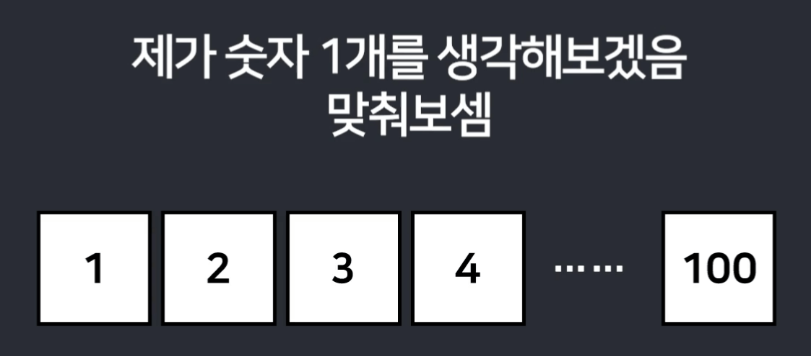
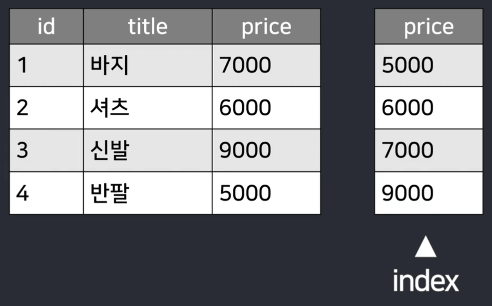
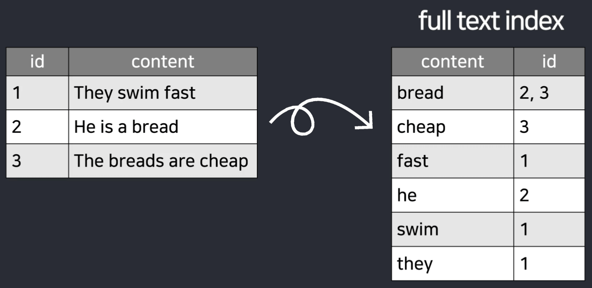
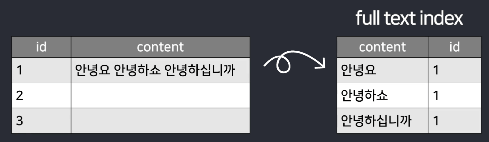
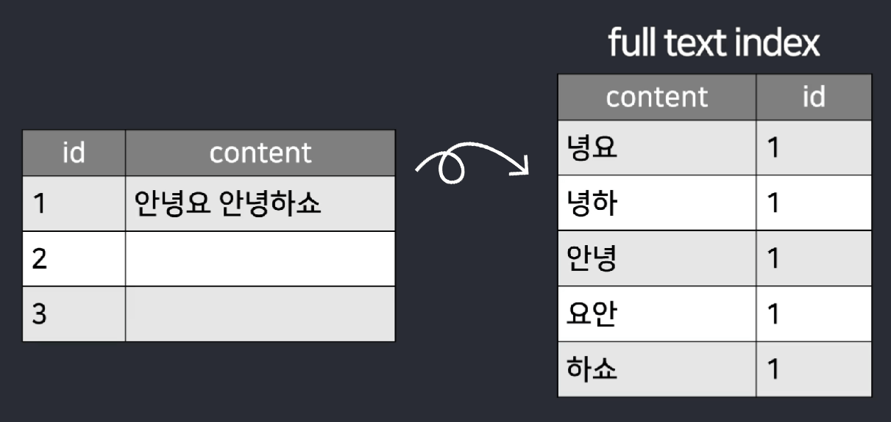

# 검색기능 1 (index)

- 상품명을 검색할 수 있는 기능

  - 검색창 만들고 거기에 검색어 입력해서 서버로 전송하면

  - 서버는 그 검색어가 제목에 들어있는 상품들을 찾아서 다 보내주기

<br>

## 1. 검색창 만들기
> list.html
```html
<form action="/search" method="POST">
  <input name="searchText" style="display:inline">
  <button type="submit">검색</button>
</form> 
```
- list 페이지에다가 검색창 UI 추가

- 폼 싫으면 ajax나 a태그 써도 서버로 요청 가능

<br>

---

<br>

## 2. 서버는 그 검색어가 제목에 들어있는 상품들을 찾아서 다 보내주기

> ItemController.java
```java
@PostMapping("/search")
String postSearch(@RequestParam String searchText) {
    // Item테이블에서 searchText가 들어있는거 찾아서 가져와주세요
    return "list.html";
}
```
- 서버에 API 생성

  - `검색결과 달라`는 기능이라 POST말고 GET이 더 어울리긴 함

- 제목에 특정 단어가 들어있는걸 찾아오라고 하려면?

- `itemRepository.findAllBy컬럼명("키워드");`

  - 특정 컬림에 "키워드"와 일치하는 행을 전부 찾아와줌

    - 그러면 안되고 "키워드"라는 문자가 포함된걸 전부 찾아와야 함

- `itemRepository.findAllBy컬럼명Contains("키워드");`

  - 이러면 특정 컬림에 "키워드"가 포함된 행을 전부 찾아와줌

- 결과는 List에 담기

  - All은 빼먹어도 잘 작동함

- 문제 발생 : 실행창 보면 SQL의 LIKE 문법이 실행됨

  - LIKE는 행 갯수가 몇백만개 넘어가면 극도로 느리다는게 문제

    - 모든 행을 다 까봐야하기 때문

  - 느린게 싫으면 index 만들어두기

<br>

---

<br>

index
---
- 테이블에서 특정 숫자나 문자를 매우 빠르게 찾고 싶을 때 사용

- index 미리 만들어두면 행이 아무리 많아도 쉽고 빠르게 찾을 수 있음

| -                    |
|----------------------|
|  |

- 1부터 100까지 적어놓은 숫자카드를 책상에 진열

  - 여기서 상대가 숫자하나를 생각하면 내가 질문해 맞춘다고 가정

- 방법

  - 1인지 2인지 하나씩 물어보기

  - 50 이상 여부 확인 후 다시 그 반절을 잘라 소거해가며 물어보기

    - 숫자가 아무리 많아도 매우 빠르게 원하는 숫자를 찾아낼 수 있음

    - binary search

- binary search 필수 조건

  - 카드가 1부터 100까지 미리 순서대로 정렬이 되어있어야함

  - 그래야 카드를 절반씩 소거 가능

<br>

| -                    |
|----------------------|
|  |

- 테이블의 컬럼도 미리 정렬을 해두면 binary search로 빠르게 데이터를 찾아올 수 있음

  - 컬럼들을 복사해와서 미리 정렬

- 복사해서 정렬한 컬럼 복사본이 index

- 만들어두기만 하면 SQL 실행시 컴퓨터가 알아서 index를 적절히 사용

- 숫자 뿐만 아니라 문자도 정렬해서 index 생성 가능

<br>

---

<br>

index 단점
---
- index는 컬럼을 복사해서 정렬해두는 것

  - index 만들 때 마다 DB용량 차지

- 원본테이블에 데이터가 추가되고 수정되고 삭제되는 식의 변화가 생길 때

  - index에도 반영을 해줘야하기 때문에 수정삭제에 걸리는 시간이 느려짐

- 검색이 필요한 컬럼들만 index 만들어두는게 좋음

<br>

---

<br>

index 만들기
---
- 테이블에 index 만드는건 JPA 문법으로도 가능

> Item.java
```java
@Entity
@Table(indexes = {
    @Index(name = "인덱스이름작명", columnList = "인덱스만들컬럼명1"),
    @Index(name = "인덱스이름작명", columnList = "인덱스만들컬럼명2")
})
public class Item {

}
```
- @Table 안에다가 소괄호 열고 인덱스만들 컬럼이랑 인덱스 이름 기재

- 여러 컬럼을 한꺼번에 합친 multi column index도 여기서 만들 수 있음

<br>

---

<br>

성능테스트
---
- 서버 끄고 재시작해보면 index가 생성되어있을 것

- 검색이 빨라졌는지 성능을 테스트하는 가장 쉬운 방법

> application.properties
```properties
spring.jpa.properties.hibernate.generate_statistics=true
```
- 설정파일에 추가하면 SQL 실행시 걸린 시간 확인 가능

  - 데이터가 몇개 없으면 별로 차이 없음

- 더 정확하게 보려면 데이터베이스 직접 들어가서 자료 검색하는 SQL 문법 작성

  - 그 문법 옆에다가 EXPLAIN 키워드 붙이면 컴퓨터가 검색할 때 index 사용여부 확인 가능

<br>

---

<br>

full text index
---
- `Contains()` 사용시 index 활용하지 않을 수도 있음

- `Contains()` 으로 검색할 땐 특정 단어가 문자 중간에 포함되어있는지 검색

  - index가 쓸모없기 때문에 index가 있든 없든 느리게 동작할 수 있음

  - `WHERE title LIKE %키워드%` 이런 쿼리 실행

    - %기호가 앞에있는 상황에선 컴퓨터가 index를 활용하지 못해서 느리게 동작

- 문자가 중간에 포함되어있는지 검색하는 일이 잦으면 문자 검색을 위한 특별한 인덱스 생성

  - full text index

<br>

---

<br>

# 검색기능 2 (full text index)

- 행이 아무리 많아도 단어포함검색을 빠르게 하고 싶으면 full text index 생성

- 약간 특별한 index

<br>

full text index
---

| -                    |
|----------------------|
|  |

- 컬럼에 있는 문장들에서 단어들을 다 추출해준 다음 그 단어들을 정렬해두는 식으로 동작

- 이 단어가 원래 어떤 행에 있었는지도 기록해둠

  - 쓸데없는 is are a the 같은 불용어들은 제거함

- "swim" 이라는 검색어를 입력했을 때 단어들이 정렬되어있으니까 그 단어를 빠르게 찾아올 수 있음

  - 이게 어떤 행에 들어있었는지도 빠르게 찾을 수 있음

- 문장이 길고 복잡해도 단어 검색이 매우 빨라짐

<br>

---

<br>

한글의 우수성
---
- 우리는 영어가 아니라 한국어를 주로 저장할 것인데 한국어는 이렇게 단어 단위로 뽑아서 정렬 X

| -                    |
|----------------------|
|  |

- ex) "안녕요 안녕하쇼 안녕하십니까" 이런 한 문장이 있다고 가정

  - full text index를 만들면 단어 단위로 쪼갬

  - "안녕요" 이런 문자를 검색했을 때는 빠르게 찾을 수 있음

  - "안녕" 이런 문자를 검색하면 아예 검색결과가 안나옴

    - full text index에는 "안녕"이라는 단어랑 일치하는 곳이 없음

- 중국어, 일본어도 이런 문제 발생

  - 띄어쓰기를 안하기 때문에 full text index를 만들면 아무 의미 없음

<br>

---

<br>

n-gram parser(bi-gram parser)
---
- 한국어, 중국어, 일본어 데이터들이 full text index를 만들 때는 n-gram parser 이용

- ngram 파서 : 문자를 n글자씩 추출해서 인덱스를 만들어주는 것

  - 기본적으로 2글자씩 추출

| -                    |
|----------------------|
|  |

- "안녕요 안녕하쇼" 이런 문자가 있으면

  - "안녕 녕요 요안 안녕 녕하 하쇼" 이렇게 2글자씩 차례로 뽑아서 정렬해놓는 식으로 인덱스 생성

- "안녕"이라는 단어만 검색해도 "안녕요 안녕하쇼" 이게 들어있던 행을 찾을 수 있음

<br>

---

<br>

full text index 만들기
---
- 직접 DB에다가 SQL문법으로 만들고 관리하는게 확실하기 때문에 DBeaver 에서 SQL 작성

- MySQL, Oracle, Postgres 이런 DB들 마다 full text index 만드는 문법이 살짝 다름

  - MySQL : 테이블에 ngram으로 full text index 만들려면 아래 코드 실행

  - PostgreSQL : bigm (바이그램) 플러그인 찾아보기

<br>

> MySQL
```mysql-sql
CREATE FULLTEXT INDEX 인덱스이름작명
ON 테이블명(컬럼명) WITH PARSER ngram;
```
```mysql-sql
CREATE FULLTEXT INDEX title_search
ON shop.item(title) WITH PARSER ngram;  
```
- 실행했을 때 에러 안나면 성공

- index 잘 만들어져있는지 확인하려면 

  - DBeaver 좌측메뉴에 index들 출력해볼 수 있는 메뉴 확인

<br>

#### 💡 스키마선택을 안했다고 에러 뜨면 

  - 코드에디터를 shop 데이터베이스에 우클릭해서 다시 열기 

  - 상단에서 스키마 선택

<br>

---

<br>

JPA에서 쌩 SQL 사용법
---
- full text index를 사용하려면 `full text index로 검색하라`고 코드 작성해야 함

- JPA 안에서 full text index로 검색하는걸 도와주는 함수는 찾아보면 없음

  - 직접 쌩으로 SQL 문법을 작성해야함

<br>

> interface
```java
@Query(value = "실행할SQL문법~~", nativeQuery = true)
타입 함수명();
```
- 쌩으로 SQL 작성해서 실행할 일이 있으면

- repository interface 안에 함수 생성

  - @Query() 열어서 SQL 문법 작성

- nativeQuery=true 기재

  - 앞으로 함수명(); 사용할 때 마다 그 위에 있던 SQL 문법 실행

<br>

> ItemRepository.java
```java
@Query(value = "select * from shop.item where id = 2", nativeQuery = true)
Item rawQuery1();
```
- item 테이블에서 id가 2인 행을 찾아오라는 SQL 문법

- rawQuery1() 사용하면 진짜로 id가 2인걸 찾아서 가져옴

- `Optional<Item>` 타입 넣는 것도 괜찮음

<br>

> ItemRepository.java
```java
@Query(value = "select * from shop.item where id = ?1", nativeQuery = true)
Item rawQuery1(int num);
```
- 함수() 사용할 때 파라미터로 집어넣은걸 SQL 문법 안에 집어넣어줄 수도 있음

- 파라미터로 집어넣을 부분에 `?1` 입력하면 첫 파라미터로 입력한 값이 ?1 자리에 들어감

  - rawQuery(2) 라고 사용하면 id가 2인 행을 찾아옴

  - rawQuery(3) 이라고 사용하면 id가 3인 행을 찾아옴

- 하나의 함수로 매번 다양한 기능 실행 가능

- 둘째 파라미터도 SQL 안에 넣고 싶으면 `?2`

- 셋째 파라미터도 SQL 안에 넣고 싶으면 `?3`

<br>

---

<br>

검색하는 법
---
- full text index 써서 빠르게 특정 단어를 검색하고 싶으면

- MySQL : `MATCH(컬럼명) AGAINST('검색어')` 작성해야 full text index를 써서 검색

> ItemRepository
```java
@Query(value = "SELECT * FROM shop.item WHERE MATCH(title) AGAINST('셔츠')",  nativeQuery = true)
List<Item> fullTextSearch();
```
- 여러개 찾을게 분명하니까 List에 담기

- '셔츠'말고 다양한 문자를 집어넣어서 쓰고 싶으면?

  - 이걸 고정값으로 주는게 아니라 파라미터 뚫기

<br>

> ItemRepository
```java
@Query(value = "SELECT * FROM shop.item WHERE MATCH(title) AGAINST(?1)",  nativeQuery = true)
List<Item> fullTextSearch(String text);
```
- fullTextSearch() 함수 가져다쓸 때 파라미터를 하나 입력 가능

  - 그 파라미터는 ?1 자리에 들어감

<br>

- fulltext index로 검색을 수행하면 관련도가 높아보이는 행을 가장 앞으로 가져옴

  - 관련도 순으로 자동 정렬해오기 때문에 편하게 사용가능

- 유저가 입력한 검색어의 검색 결과를 html에 넣어서 보여줘보기

  - 기존 list.html 페이지 재활용

- 결과가 너무 많으면 페이지네이션 구현

  - Page 타입으로 가져올 수 있음

<br>
