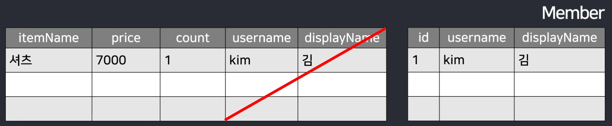
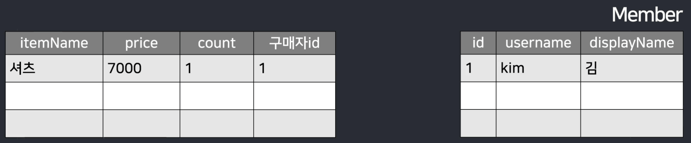
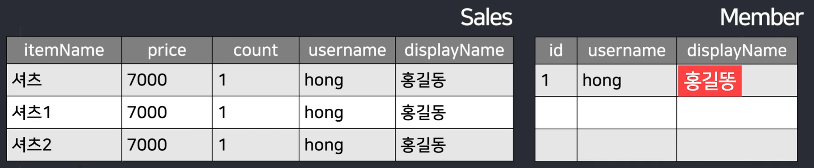
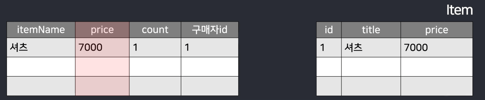
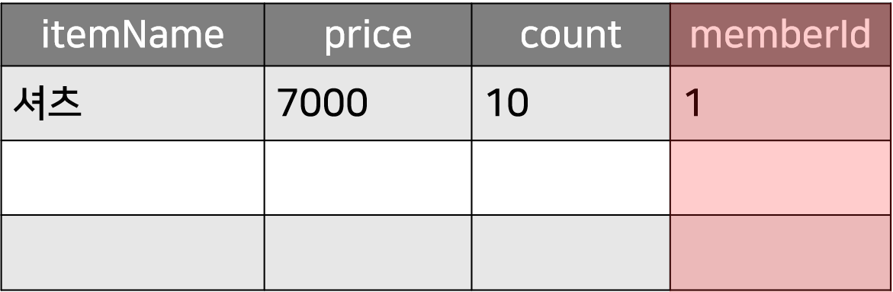
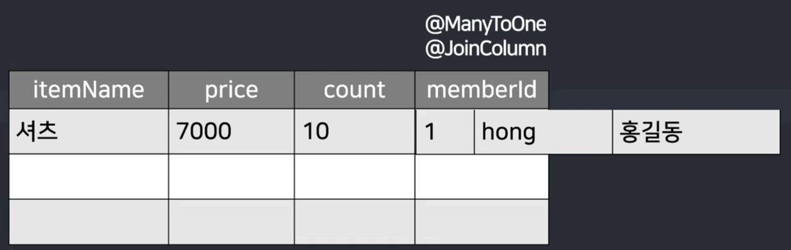
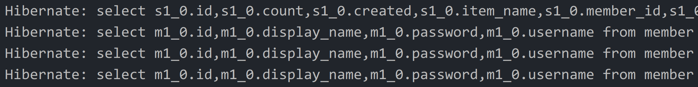
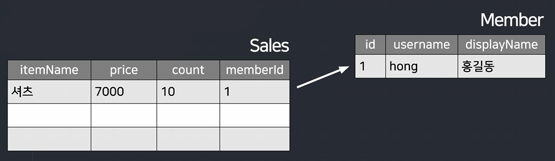
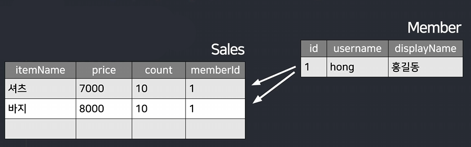
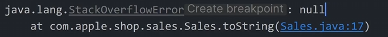

# 주문기능 1 (제2정규화)

- 웹상의 거의 모든 기능은 글발행 기능과 똑같음

- 주문기능 : 주문버튼 누르면 글하나 발행

  - 무슨상품 주문했는지, 누가 주문했는지, 얼마인지 들어가는 글

<br>

> 주문 기능 개발 순서
```
    1. 상세페이지에 수량 선택란과 주문버튼 만들어놓고
    
    2. 주문버튼 누르면 상품명 수량 주문한사람 이런거 서버로 보내서 DB에 저장
    
    3. 마이페이지 가면 주문내역 보여주기
```

<br>
 
### Q. 카드결제 방법
- 보통 20만원 내고 PG사와 계약한다음에 PG사 결제모듈을 사이트에 설치

  - 포트원 라이브러리 쓰면 복붙식이라 쉬움

```
    1. 유저가 결제버튼 누르면 PG사 결제모듈 띄워주면 유저가 알아서 결제하고
    
    2. 결제완료시 유저가 100만원 결제했다고 서버에 요청 보냄
    
    3. 서버는 그게 진짜인지 PG사와 요청주고받아서 확인해보고
    
    4. 진짜면 결제했다고 기록
```
- PG사 계약하려면 비용과 시간이 들기 때문에 무통장입금식으로 제작

<br>

주문 데이터를 DB 어디에 어떻게 저장할까
---
- 주문 데이터를 DB 어디에 어떻게 저장할지 고민

  - 테이블 하나 생성

    - 컬럼 : 상품명, 수량, 가격, 주문한사람, 날짜 

    - 저장하고 싶은 데이터들은 알아서 저장

<br>

> Sales.java
```java
@Entity
@Getter
@Setter
public class Sales {
    @Id
    @GeneratedValue(strategy = GenerationType.IDENTITY)
    Long id;
    String ItemName;
    Integer price;
    Integer count;
    
    @CreationTimestamp
    LocalDateTime created;
}
```
- 주문내역 저장할 테이블 생성

- 날짜를 저장하고 싶으면 LocalDateTime 타입

  - Date도 있고 Time도 있는데 이건 각각 날짜랑 시간만 저장

- `@CreationTimestamp` : 행이 추가될 때마다 시간을 컴퓨터가 자동으로 기록

  - 따로 시간을 집어넣을 필요가 없어서 편리함

<br>

---

<br>

구매자도 저장
---
- 구매한 유저가 누군지도 저장해야하니 아래 컬럼도 추가

> Sales.java
```java
String username;
String displayName;
```

<br>

| -                    |
|----------------------|
|  |

- 새로 테이블과 컬럼만들 때 생각해야할 것

  - 원래 다른 테이블에 있는 데이터는 굳이 새로운 테이블에 중복해서 기재할 필요 X

    - ex) 이름이 "김"인 유저가 샀다고 displayName, username 을 굳이 또 적을 필요 없음

      - 다른 테이블에 이미 있기때문

<br>

| -                    |
|----------------------|
|  |

- 다른 테이블의 X번째 행에 있다고 표기만 해줘도 OK

- 보기에는 힘들거같지만 장점 존재

<br>

| -                    |
|----------------------|
|  |

- 다른 테이블에 있던 데이터를 중복기재했다고 가정

- "홍길동"이라는 유저가 상품을 100만개 주문했는데 나중에 "홍길동"이라는 유저의 이름이 "홍길똥"으로 바뀌어야 하면?

  - 100만개의 행을 직접 다 수정해야함

- 나중에 데이터를 아주 정확히 유지하고 싶으면 다른 테이블에 있던 내용은 중복해서 여기다가 집어넣을 필요 없음

  - 빼버리고 다른 테이블의 X번 행에 있다고 표기만 하기

- 제2 정규화

  - 이 테이블의 핵심주제와 관련이 딱히 없는 컬럼들을 다른 테이블로 빼는걸 의미

<br>

---

<br>

안빼도 되긴함
---

| -                    |
|----------------------|
|  |

- price 부분도 Item 테이블에 이미 있기 때문에 중복해서 집어넣을 필요는 없음

- 가격정보를 정확하기 유지하려면 가격부분을 기록하지말고 빼는게 좋겠지만 데이터를 정확하게 유지할 필요가 없으면 안빼도 상관X

  - 쇼핑몰의 경우 주문할 때마다 가격이 매번 변하는게 정상

  - 가격을 정확하게 유지할 이유가 없음

- 비교적 정확하게 유지하지 않아도 되는 데이터들은 굳이 정규화해서 다른 테이블로 뺄 필요 없음

<br>

---

<Br>

결론
---
1. 컬럼하나 만들 때 그 컬럼이 다른 테이블에 이미 있으면 빼는걸 고려

2. 이 테이블의 핵심 주제와 큰 관련이 없어도 다른 테이블로 빼는걸 고려

3. 데이터가 아주 정확하지 않아도 되는 컬럼은 안빼도 괜찮음

<br>

---

<br>

| -                    |
|----------------------|
|  |

### 💡 정규화하면 나중에 데이터가져올때 보기 힘들지 않을까?

- 주문내역 출력하면 누가 구매했는지 유저 이름을 전혀 모름

- 해결책 존재

  - JOIN 기능 or DB 조회 2번

<br>

#### 참고 
- 다른 테이블로 빼는 정규화 하지 않는 것 = 비정규화

- 데이터가 정확하지 않아지지만 대신 입출력 속도가 빠르고 입출력 코드도 짧아짐

  - MongoDB처럼 비정규화를 권장해서 쓰는 데이터베이스들도 있음

<br>

> Sales.java
```java
@Entity
@Getter
@Setter
@ToString
public class Sales {
    @Id
    @GeneratedValue(strategy = GenerationType.IDENTITY)
    Long id;
    String itemName;
    Integer price;
    Integer count;
    Long memberId;
    
    @CreationTimestamp
    LocalDateTime created;
}
```

<br>

---

<br>

응용
---
### 1. 주문버튼 누르면 주문내역이 저장되는 기능

<br>

### 2. 쇼핑몰의 모든 주문내역을 보여주는 페이지 생성
- 정규화를 해놨다면 주문내역 뽑을 때 불편함

  - 테이블 조회를 여러번 하거나 JOIN 문법이나 @ManyToOne 같은거 찾아보면 쉽게 구현가능

<br>

---

<br>


# 주문기능 2 (@ManyToOne)
> 주문기능을 설명
```
  1. 상세페이지에 <form> 만들고
  
  2. 거기서 전송버튼누르면 서버로 뭘 얼마나 살건지 전송하고
  
  3. 그리고 서버는 Sales 테이블에 글 하나 발행해주기
```

<br>

상세페이지에 \<form> 만들고 뭘 얼마나 살건지 전송
---
> detail.html
```html
<form action="/order" method="post">
  <input name="title" th:value="${data.title}">
  <input name="price" th:value="${data.price}">
  <input name="count" placeholder="count">
  <button>주문하기</button>
</form>
```
- 상세페이지에 \<form> 생성

  - 상품명, 가격, 수량 보내라고 작성

- 누가 주문하는지도 글 발행시 필요

  - 그 정보는 서버에서 출력가능하니 굳이 보낼 필요는 없음

<br>

> SalesController.java
```java
@PostMapping("/order")
String postOrder(String title,
Integer price,
Integer count,
Authentication auth) {

  Sales sales = new Sales();
  sales.setTitle(title);
  sales.setPrice(price);
  sales.setCount(count);
  sales.setMemberId(???);
  salesRepository.save(sales);
  return "list.html";

}
```
- 누가 폼 전송하면 Sales 테이블에 저장하라고 작성

- 주문자의 username, displayName 말고 id만 저장하고 싶은데 id는 auth 변수에 들어있지 않음

  - 직접 DB에서 이 유저의 id를 꺼내보거나

  - 직접 유저정보 정의하는 곳 찾아가서 코드를 추가해주거나

<br>

### Q. 유저에게 보내라고 하면 되는거 아님?

- 유저가 위조하면 문제생기는 것들은 안그러는게 좋음

<br>

### Q. 유저가 상품명, 가격도 위조할 수 있는거 아님?

- 그것도 상품 id만 받아와서 서버에서 채우는게 나음

<br>

### Q. 유저가 상품 id도 위조할 수 있는거 아님?

- 위조해도 별 상관없는 정보

<br>

---

<br>

auth 변수 수정
---
- auth 변수에 들어갈 내용 수정

- `loadUserByUsername()` 여기서 return한게 auth변수에 들어간다고 했으니 그거 수정

> MyUserDetailsService.java
```java
public class MyUserDetailsService {
  public UserDetails loadUserByUsername(String username) {
    (생략)
    a.id = user.getId();
    return a;
  }
}
```
- `user.getId()` : DB에서 찾아온 유저의 id가 들어있음

  - 그걸 추가해서 return 하라고 코드 작성

- id변수는 CustomUser object에 못넣게 되어있어 CustomUser 클래스 수정

<br>

> CustomUser.java
```java
public class CustomUser extends User {
  public String displayName;
  public Long id;
  (생략)
}
```
- CustomUser 수정

- /order API 가서 유저 id부분 넣어 주문 잘 되는지 테스트

- 중간에 계좌번호 같은걸 보여주거나 주문완료했다는 페이지로 이동시켜주거나 하면 완성도 올라감

<br>

---

<br>

주문내역 보여주는 페이지
---
- 모든 주문내역을 볼 수 있는 페이지

  - 운영자는 그거 보고 포장하고 배송함

<br>

> SalesController.java
```java
@GetMapping("/order/all")
String getOrder(Authentication auth) {
  var result = salesRepository.findAll();
  System.out.println(result.get(0));
  return "list.html";
}
```
- API 하나 생성

  - 여기로 접속하면 Sales 테이블을 전부 출력하라고 작성

- 그걸 html 페이지에 넣어서 보내주면 끝

- 문제점 : 누가 샀는지 displayName이 안나옴

  - 정규화를 해놨기 때문

    - 테이블에 유저의 id 번호만 저장

<br>

- 유저의 displayName이나 username도 보여주고 싶으면

  - DB조회 2번

    - 구매자 id가 1로만 기록되어있으면 `Member테이블에서 id가 1인 유저도 가져오라`고 코드를 또 작성

  - SQL JOIN 문법 사용

    - JOIN : 테이블 2개를 가로로 이어붙이는 것

    - Sales 테이블 출력할 때 옆에 Member 테이블 내용을 붙여서 출력 가능

    - DB 조회를 1회만 해도 되어서 성능도 더 나음

<br>

---

<br>

@ManyToOne
---
- JPA를 쓰는 경우 JOIN문법 몰라도 테이블끼리 붙여서 출력 가능

<br>

|foreign key 컬럼|
|-|
||

- Sales 테이블의 이 컬럼은 다른 테이블 데이터를 가리키고 있는 컬럼

- 여기다가 1을 기입하면 Member테이블의 id가 1인 행을 참고하라는 뜻

- foreign key : 다른 테이블에 데이터가 있다고 가리키는 컬럼

- JPA 문법을 잘 활용하면 foreign key컬럼을 출력할 때 얘가 가리키고 있는 다른 테이블 데이터를 가져와서 붙여서 출력 가능

<br>

> Sales.java
```java
public class Sales {
  
  (생략)
  
  @ManyToOne
  @JoinColumn
  private Member member;

}
```
- foreign key 컬럼에 아래 내용 붙여주기

  - @ManyToOne, @JoinColumn

  - 가리키는 다른 테이블의 타입

- 앞으로 Sales 테이블 출력할 때 member 컬럼이 가리키는 Member 테이블의 행을 동시에 가져와줌

  - 가져와서 member 컬럼자리에 넣어줌

<br>

| -                    |
|----------------------|
|  |

- Sales 테이블 출력시 Member 테이블도 붙여서 가져와줌

  - SQL식으로 간단히 설명하자면 그냥 JOIN 비슷한걸 해준다 뜻

- 정규화해놓은 컬럼이 있으면 데이터가 다른 테이블로 쪼개져있음

  - 나중에 테이블들을 이어붙여서 출력하고 싶으면

    - foreign key 역할의 컬럼에 @ManyToOne이랑 @JoinColumn 사용

<br>

> Sales.java
```java
public class Sales {

  (생략)
  
  @ManyToOne
  @JoinColumn(
  name="member_id",
  foreignKey = @ForeignKey(ConstraintMode.NO_CONSTRAINT)
  )
  private Member member;

}
```
- `name=" "` 속성 열면 이 컬럼의 이름을 맘대로 정할 수 있음

- 그냥 @만 쓰면 Foreign key 제약 걸림

  - 데이터 무결성을 지키는 식으로 코드짜야함

  - 수정삭제 하는게 귀찮아져서 그걸 걸지 않고 싶으면 `foreignKey=" "` 열어서 위처럼 작성

- 테이블에 반영하고 싶으면 서버 껐다가 다시 시작

<br>

### 참고 
- 컬럼타입을 Member로 바꿔놨기 때문에 이 컬럼에 데이터넣는 것도 Member타입을 집어넣어야함

- new Member() 해서 id 정도만 설정하고 넣으면 됨

<br>

> SalesController.java
```java
@GetMapping("/order/all")
String getOrder(Authentication auth) {
  var result = salesRepository.findAll();
  System.out.println(result.get(1));
  return "list.html";
}
```
- 주문을 새로 다시 해보고 전체 주문내역 출력하는 API가서 주문내역을 출력

  - member라는 변수에 다른 테이블을 붙여서 가져온걸 확인 가능

- 뭔가 안나오면 Member테이블에 @ToString 붙여보기

<br>
 
---

<br>

# 주문기능 3 (JOIN FETCH)

@ManyToOne 저장
---
- `@ManyToOne` 붙인 컬럼에 저장하려면?

  - 그 컬럼의 타입을 Member 이런 식으로 바꿔야함

  - 그 컬럼에 데이터 저장할 때도 Member 타입을 넣어야함

    - `new Member()`

<br>

> SalseController.java
```java
@PostMapping("/order")
String postOrder(@RequestParam String title,
@RequestParam Integer price,
@RequestParam Integer count,
Authentication auth) {
  Sales sales = new Sales();
  sales.setPrice(price);
  sales.setCount(count);
  sales.setItemName(title);
  CustomUser user = (CustomUser) auth.getPrincipal();
  
  //member컬럼에 데이터추가하려면
  var member = new Member();
  member.setId(user.id);
  sales.setMember(member);
  salesRepository.save(sales);
  
  return "list.html";
}
```
- 주문기능 만든 API

  - member 컬럼에는 Member 타입을 넣어야하기 때문에 new Member() 작성

  - new Member()에는 username, displayName 이딴거 다 넣을 필요 X

    - id 값 하나만 저장하면 충분하기 때문에 유저의 id정보만 추가해서 저장

<br>

---

<br>

@ManyToOne 단점1. N+1 문제
---
- `/order/all` 페이지 접속해서 전체 주문내역 출력

- SQL 쿼리문 실행되는걸 보면 문제가 하나 보임

  - 쿼리문을 하나만 실행해도 될텐데 지금보면 2개 이상 실행됨

<br>

| -                    |
|----------------------|
|  |

1. sales 테이블에 있던거 다 출력하는 쿼리문

2. 1번 주문내역에 필요한 Member 가져오는 쿼리문

3. 2번 주문내역에 필요한 Member 가져오는 쿼리문

4. 3번 주문내역에 필요한 Member 가져오는 쿼리문

<br>

- 이런 식으로 동작하면 주문내역이 100개 있으면 SQL 쿼리문을 최대 101개 실행해야함

  - DB에 많은 부담

  - N+1문제

- `.findById()` 로 하나의 행만 가져오는건 이런 문제가 없음

  - `.findAll()` 등 여러개 가져오라고 할 때 주로 발생

- SQL의 JOIN 문법 쓰면 한 번의 쿼리문으로 위의 모든 데이터를 가져올 수 있음

  - JPA가 못해주는 것임

<br>

---

<br>

SQL JOIN 문법 쓰면 쉽게 해결
---
```mysql-sql
SELECT * FROM sales INNER JOIN `member` ON sales.member_id = `member`.id;
```
- 이런 식으로 코드짜면 한 방에 모든 sales테이블 + member 테이블을 가져올 수 있음

- 해석 : sales테이블이랑 member테이블을 양옆에 붙여서 출력

  - sales테이블의 member_id 컬럼과 member테이블의 id 컬럼이 일치하는 행을 서로 붙여서

<br>

---

<br>

정리
---
- @ManyToOne 붙여놓으면 일단 편리하긴 하지만 JPA 때문에 성능문제 발생

- 코드짤 때 SQL이 뭔가 많이 실행되는 부분은 없는지 자주 보는게 좋음

- 깊게 들어갈 수록 직접 SQL 직접 짤 수밖에 없음

<br>

---

<br>

JPQL로 JOIN을 해보자
---
> SalesRepository.java
```java
@Query(value = "쪼인해주세요~", nativeQuery = true)
List<Sales> customFindAll();
```
- SalesRepository 안에서 함수 생성

- `@Query()`를 위에 붙이면 쌩 SQL 실행 가능

  - 그 안에 JOIN 해달라고 SQL 작성 

    - but SQL 짜봤자 JPA가 맘대로 번역해서 실행하는 경우도 있음

- 확실하게 JOIN을 하고 싶으면 JPQL 문법을 사용

<br>

### Q. JPQL이 뭐임?

- SQL을 좀 더 쓰기쉽게 만든 문법인데 JPA에서만 사용 가능

- JOIN이 필요하면 JPQL에 있는 JOIN FETCH 문법 사용하면 정확하고 안정적

<br>

> SalesRepository.java
```java
@Query(value = "SELECT s FROM Sales s")
List<Sales> customFindAll();
```
- JPQL 문법으로 특정 테이블에 있는 모든 행을 출력하고 싶으면

  - `SELECT 별칭 FROM 테이블명 별칭` 작성

- 테이블명 작성할 때 `@Entity 클래스명` 잘 입력해야함

- 테이블명 오른쪽에 테이블을 다른 말로 부를 수 있게 별칭을 작명가능

  - 별칭을 s라고 하면 앞으로 s라는 단어는 Sales를 뜻함 

  - 별칭넣는건 반강제

<br>

> SalesRepository.java
```java
@Query(value = "SELECT s FROM Sales s JOIN FETCH s.member")
List<Sales> customFindAll();
```
- 위처럼 작성하면 Sales 테이블 전체 내용을 가져오는데

  - Sales의 member 컬럼이 가리키는 테이블의 행도 같이 붙여서 출력하라는 뜻

- SQL식 설명

  - s.member 와 연관된 다른 테이블 JOIN해오라는 뜻

<br>

### 참고
- JPQL에서 JOIN 이라는 문법도 존재하지만 JOIN FETCH를 써야 이 테이블과 관련된 다른 테이블의 컬럼도 다 가져옴

<br>

---

<br>

@ManyToOne 단점2. 모든 컬럼 다 가져옴
---
- 다른 테이블의 컬럼을 전부 가져옴

- `.findAll()` 기본함수 쓸 때도, JPQL JOIN FETCH 쓸 때도 Member 테이블의 모든 컬럼 가져옴

| -                    |
|----------------------|
|  |

- 유저의 패스워드 컬럼도 함께 가져옴

  - REST API를 만드는경우엔 이 데이터 그냥 보내버리면 참사가 일어남

- 패스워드 부분은 제거하고 보내고 싶으면?

  - Map자료나 DTO 만들어서 거기 넣어서 보내기

<br>

> SalesController.java
```java
@GetMapping("/order/all")
String getOrderAll(){
var result = salesRepository.customFindAll();

    var salesDto = new SalesDto();
    salesDto.itemName = result.get(0).itemName;
    salesDto.price = result.get(0).price;
    salesDto.username = result.get(0).getMember().getUsername();

    return salesDto보내기;
}


class SalesDto {
  public String itemName;
  public Integer price;
  public String username;
}
```
- DTO 하나 만들고 거기에 0번째 행에 있던 데이터들을 집어넣어서 보냄

- 1번째 2번째 행에 있는 데이터들도 DTO에 넣어서 한꺼번에 보내고 싶으면

  - ArrayList 하나 만들어서 거기 다 담아서 보내면 됨

- 여러개의 데이터를 한 곳에 넣으려면 List 아니면 Map 둘 중 하나 사용

<br>

### 참고
- 직접 자료변환하는게 싫으면?

  - Mapping 라이브러리

  - JPQL 안에 직접 new DTO() 집어넣으면 그걸로 자동으로 변환

    - 직접 DTO로 변환안해도 되어서 약간 더 편할 수 있음

<br>

응용
---
- API에 있는 것들 중에 적절한 것들은 Service 클래스로 옮기기

- 주문시 수량을 안적거나, 가격이 100조원이 넘거나, 로그인을 안하거나 하는 예외상황 발생시 대처가 가능한지도 확인

<br>

---

<br>

# 주문기능 4 (@OneToMany)

@ManyToOne에 FetchType 설정가능
---
- @ManyToOne 사용시 또 다른 성능적인 단점

  - @ManyToOne 붙은 컬럼이 가리키는 다른 테이블 내용도 항상 가져옴

    - 다른 테이블이 필요없을 때도 있음

<br>

> Sales.java
```java
public class Sales {
  
  (생략)
  
  @ManyToOne(fetch = FetchType.LAZY)
  @JoinColumn
  private Member member;

}
```
- @ManyToOne사용할 때 이런 fetchType설정도 넣어줄 수 있음

  - FetchType.EAGER : `이거 필요없어도 다른 테이블 항상 가져와달라`는 뜻

  - FetchType.LAZY : `게으르게 필요할 때만 가져와달라`는 뜻

- LAZY 넣으면 스마트하게 필요한 SQL 쿼리문만 생성

  - 공식문서에서도 이거 항상 채우고 쓰라는걸 권장

<br>

> SalesController.java
```java
@GetMapping("/order/all")
String getOrderAll(){
  List<Sales> result = salesRepository.findAll();
  System.out.println(result.get(0));
  return "list.html";
}
```
- .findAll() 써서 테스트

- EAGER를 채워놨으면 항상 다른 테이블도 가져오는 문법 실행

- LAZY를 채워놨으면 member 컬럼을 출력하는 등 Member 테이블 내용이 필요해질 때만 가져옴

- JOIN FETCH 쓰면 JOIN 써서 다 가져오라는 뜻이라 EAGER, LAZY 구분이 의미 없음

<br>

---

<br>

@OneToMany
---

| -                    |
|----------------------|
|  |

- @ManyToOne 붙이면 Sales 테이블 출력할 때 Member 테이블도 같이 출력 가능

  - foreign key 컬럼이 가리키는 테이블을 함께 출력하는 방법

<br>

| -                    |
|----------------------|
|  |

- 반대상황

- 내 id를 가져다쓰고 있는 다른 행들을 출력하고 싶으면?

  - ex) id가 1인 멤버를 출력하는데 이 사람이 기록된 Sales 테이블의 행도 전부 출력하려면?

- 직접 DB 입출력 문법 한 번 더 쓰거나 자동으로 가져오게 작성

- @ManyToOne 가 가리키고 있는 Member 테이블에 출력용 컬럼 하나 생성

<br>

> Member.java
```java
public class Member {

  (생략)
  @OneToMany(mappedBy = "member")
  List<Sales> sales = new ArrayList<>();

}
```
- 컬럼 하나 만든 다음 타입을 `List<다른테이블>`로 집어넣음

- `@OneToMany(mappedBy = "내 컬럼 훔쳐쓰고있는 다른 컬럼명")` 작성

  - 내 id를 훔쳐서 쓰고 있는 테이블의 행들 전부 출력

- @ManyToOne붙인 컬럼이 있으면 그거랑 정확히 반대로 하면 됨

  - @ManyToOne이랑 함께 쓰는 경우들이 많음

<br>

---

<br>

@OneToMany 에러
---
- 쓰다보면 이상한 에러 발생하기도 함

| -                    |
|----------------------|
|  |

- StackoverflowError : @ToString 때문에 무한 상호참조가 일어나서 발생

  - 해결하려면 `@ToString.Exclude` 를 @OneToMany 위에 추가

<br>

---

<br>

ManyToOne vs OneToMany
---
- @ManyToOne을 쓰는경우에 OneToMany를 꼭 써줘야된다는 사람들이 있음

  - Hibernate/JPA 공식문서에도 그렇게 나와있음

- @ManyToOne을 썼으면 그거 반대쪽에 @OneToMany를 꼭 기입하라고 함

  - 근데 둘 중에 뭐를 써야 하는지 헷갈릴 수 있음

- 암기법

  - 지금 Member 하나는 몇개의 Sales를 가질 수 있는가?

    - Member 하나는 Sales를 매우 많이 가질 수 있음

      - 그럼 Member는 One속성

      - Sales는 Many속성

    - `@현재테이블속성To상대테이블속성` 기재

<br>

---

<br>

잘 안씀
---
- @OneToMany 이런 기능은 어떨 때 쓸까?

  - 실은 쓸데가 별로 없을 수 있음

  - 유저 하나 출력할 때마다 유저의 Sales 내역도 동시에 가져올 일이 별로 없을 수도 있음

  - 있어도 `Sales 테이블에서 이 사람 주문내역 꺼내오라`고 코드짜면 더 간단하고 직관적

- 일부러 붙여두면 장점이 있음

  - 나중에 테이블간의 관계를 직접 눈으로 볼 수 있으니까 도움이 될 수도 있음

  - orphanRemoval 기능

    - 나중에 행을 하나 지우면 이걸 쓰고있는 다른 테이블도 자동으로 지워지게만들 수도 있음

<br>

---

<br>

정리
---
- 제2정규화 하면 데이터 정확도를 지킬 수 있다는 장점 

   - 대신 나중에 데이터 출력시 귀찮아짐

- @ManyToOne 쓰면 어떤 foreign key 컬럼이 가리키고 있는 다른 테이블 내용도 붙여서 가져올 수 있음

- @ManyToOne 성능문제가 있으면 JOIN 문법 사용

- @OneToMany도 사용가능

   - 내 테이블의 id를 훔쳐서 쓰는 중인 다른 테이블의 행들을 출력가능

<br>

---

<br>

### 💡 마이크로서비스
- 큰 기업들은 마이크로서비스라고 해서 서버 하나에 모든 기능을 개발X

  - 회원기능 담당하는 서버

  - 주문기능 담당하는 서버

  - 댓글기능 담당하는 서버

  - 이런 식으로 서버를 쪼개서 개발해놓고 각각 배포

- 서버마다 각각 별도의 데이터베이스를 사용하는 경우 존재

  - 물리적으로 떨어진 데이터베이스 테이블끼리 JOIN이나 그런걸 할 수 없음

    - @ManyToOne, Foreign key 등이 많이 필요 없는 경우

<br>
